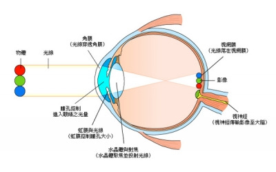
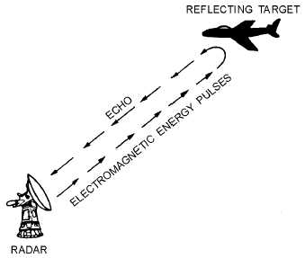
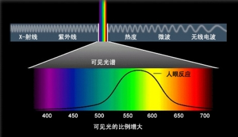
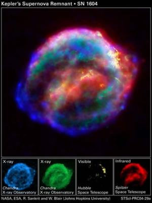
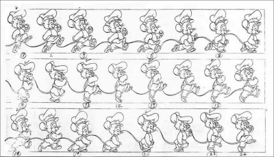
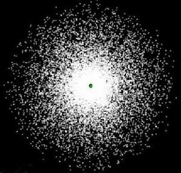
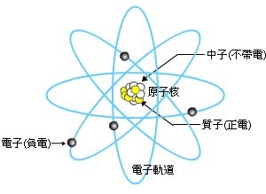
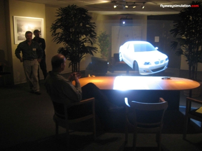
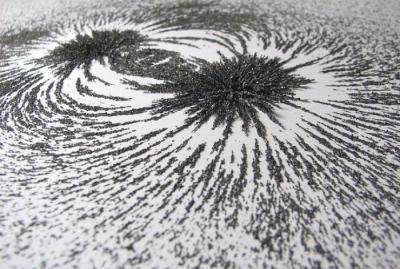

## 不实的“现实”，感官在“欺骗”！

作者: 美国大法弟子

了解了三维空间的人是如何看待二维空间的生物，那么更高维度的空间的生命如何看待我们三维空间呢？高维空间不容易形象描述，但我们可以做一个比喻。

这些模块玩具是和我们人类一样生活在这个三维立体空间里的，可是区别在哪里？它们的身体、房子、周围的一切事物都是由“模块”组成的，包括他们的思维和感知方式。

它们可能也会发明显微镜，但是由“塑料模块”制成的镜片能够看到人类的细胞吗？能看到人类空间的分子吗？不能。它可能会看到更微观，但它只会发现“更小的模块”或“更小的塑料”。因为它们是世界的构成基础。

所以，玩具的世界之所以比人类空间低级，就在于那个世界概念中的最基础粒子比人类的粗糙。我们可以举另一个例子，把 一支铅笔放在百米之外看上去是什么样子？只是模糊一点，这是零维；靠近50米，发现是个线段，这是一维。再靠近，就发现似乎是一支铅笔的形象，这是二维。 再走近拿起铅笔，会发现这是六棱柱状的木质铅笔，这就是三维。接下去，如果我们用显微镜观察铅笔的木质身体，是不是会发现更复杂的结构，通向了更高的维度呢？因此我们可以设想，维度增加的过程，就是观测分辨率增大的过程，就是从宏观走向更微观的过程。

对比玩具世界与人类世界我们知道，尽管玩具世界的“分子”要比人类世界的“分子”大得多，可是人类世界可比玩具世界要大得多。由此可以推想，比人类世界更细腻的更高维空间，可能比人类世界还要更广阔得多。

### 眼睛：“看”的本质是“扫描”

人产生视觉感受是由于光线经由眼球进入大脑，是视网膜感光。我们“看到”一样物体，是由于那样物体反射（或发射，本身是光源）的光体现了物体表面的凹凸特征，这种特征信息由可见光为载体传达给视网膜神经，大脑经过分析，我们就“看”到了物体。

类似的，雷达观测物体是通过电磁波，雷达站发出电磁波扫描物体，电磁波经由物体反射就携带了该物体形状的信息，雷达再接受反射电磁波从而得到物体的数据。雷达虽然不具备人眼的晶状体结构，不具备视网膜，但是也“看”到了物体。可见人眼和雷达“看”物体的原理是相同的， 是“扫描”，是一种信息的反射，这样我们就明白了“看”的本质。

所以要“看”一件物体，并不一定需要“人眼”，我们只要具备了“扫描物体，接受反射信息”这样一个过程，我们就可以看到。那么，这个扫描物体的“媒介”可以是“可见光”（人眼），可以是“无线电”（雷达），也可以是某种粒子——“电子”（电子显微镜）。

那么我们就能够解释一些人们难以理解的现象。经络就是人体内能量的通道，而穴位是能量的出入口。人体通过穴位发放能量“扫描”物体，能量经物体反射、经过脉络传回大脑，所以人就“看到”了。由此看来，那些修炼界所讲“天目”、“透视”等功能也许就不是迷信。

值得一提的是，人眼所能识别的只有电磁波谱的 390nm~780nm 一段，我们称之为“可见光”，而在这狭窄波段之上或之下都是看不到的。

光（电磁波）的本质也是“粒子”（波粒二相性），那么超越电磁波谱以外的粒子，比如电子也会形成“光”。而只能由这些特殊的“光”扫描（电子显微镜）才可见的物体，我们就不可能通过肉眼直接看到了。

宇宙中的一切都是由“粒子”所成，人眼所见的世界只是有限的、可见光波段的粒子所能反射出的世界。而其它波段，到各种粒子所能反射的世界对人眼都是不可见的。光子虽然被叫做“光子”，但是就粒子本身而言，是不具有“明”或“暗”的概念的。它只是粒子，明暗只是人脑带给人的感受。所以阳光下不一定真的“明亮”，黑夜里也不一定真的“黑暗”，这一切都是不同粒子的疏密给人带来的感受。那么，对于用其它电磁波段来“看”物体的生命而言，或用某种粒子、甚至用电磁波与多种粒子的组合来“看”物体的生命而言，人类世界就可能别有一番景象。

其实这是人类空间生命认识能力的局限。所以，有时具有感官缺陷的人有时反倒能客观看待事物，因为他承认自己“认识能力的局限”，会以谦卑的态度去接纳未知事物，不像健康人一样会因“能看”“能听”而自傲、而封闭住自己，拒绝进一步探索真理。

是人眼识别光谱的局限，限制了人对空间的认识。人眼见并不一定为实。

### “视觉”的幻象

众所周知，电影是由一帧一帧的图像连续播放而形成的，对人眼而言，大于或等于每秒24帧图像的播放就是连贯的动画， 少于24帧就会有跳动感。所以“每秒24帧”就是人眼区别图像与动画的临界，这就是人类分辨图像的极限。那么想象一下，是否有生命分辨图像的临界是大于每秒24帧？当然是有可能的。那么这样的生命看人类的电影，他看到的就可能只是一组不断变换的图片。

那么，原子便可以看作是一部每秒帧数极高的电影。人类可见的世界是由分子组成的，分子由原子组成，原子核外是电子 云。所以不难想象，我们所能看到的、摸到的一切，无论是光滑的表面、粗糙的表面，各种颜色、各种材质的表面通通都是由电子云构成的，只是由于原子过于渺小，所以我们看到的才是连贯的、各式各样的表面。当然我们知道，电子云被称为“云”，是由于电子在高速的绕核运转，几乎是随机快速出现核子周围的任何一个 地方，因此哪怕是“氢”（只有一个电子）的原子，看上去也是一个完整的球。由此我们可知，这个世界其实是由像无数的电子，以远远超过每秒24帧的频率闪动而形成的动画。

那么又有一个有趣的问题。假设电子的闪动频率是1000次（帧）每秒（其实不止），那么可能存在某些“高能生命”具 有这样的眼睛：每秒1500帧的图像变换才算是动画。那么这个高能生命看到的原子表面就是“镂空”的，那么他看到的人类世界也就是“镂空”的。那么在他的眼中，原子只是缓慢运动的几个点（原子核及电子），那么他所看到的人类世界就完全是空旷的，仅有星星点点的粒子分布各处。

由此我们就要反思，我们看到的世界是什么，是实物还是幻象？也许我们也只是一组可怜的玩具？在那幻象的背后是什么，是否存在一个更加真实的世界？

### “触觉”的本质

再来看看我们的“触觉”，当你和朋友握手时，你是否有意识到你触到的是什么？肉？皮肤？皮肤的表面是什么？是表皮细胞，细胞壁……追查下去其实还是是电子。准确的说，我们是以电子“触摸”电子，因为我们用来触摸的皮肤表面也是电子。但这还不是最后，我们实际上根本没有触摸到任何东西，因为电子是带负电荷的，两个电子同性相斥，我们所体会到的触碰的感受，实际上是带负电的电子间相斥的电场力。

推而广之，物体相碰撞的相互作用力是电场力，子弹撕裂苹果是克服电场力，只要是由分子构成的两个物体相撞，本质上几乎都是电场力。

我们还知道，原子之内是很空旷的，原子核的直径约为原子直径的十万分之一，相当于标准足球场中心的一粒大豆，电子相 当于足球场外围的几粒沙子。所以如果忽略电子及原子核的电场力的影响，两个原子相互穿越是只有极小的概率产生碰撞。那么设想，如果全世界所有的电子、原子核电性全部消失，那会怎样？——所有物体都会相互穿透。

由此我们就能够解释，为什么使用X射线可以透过皮肉看骨头，因为X光粒子没有电性，而且皮肉组织结构松散，X光粒子不必过多牵扯皮肉的分子就穿越了，而骨头组织结构密集且内含更多矿物质吸收光子能量，也就阻碍了X光粒子。

我们可以设想，如果有一种生命，他身体的组成粒子不与人类这个空间的粒子发生电磁力作用、且不与可见光相纠葛（可见光粒子直接穿越），那么这样的生命会不会与我们同时同地存在，却与我们穿身而过，而且不会被我们看见呢？

### 宇宙本是信息的存在

宇宙存在的本质是什么，是分子吗？是原子吗？夸克吗？人们还在用对撞机来搜索这些粒子之下更微小的粒子，可是每当我 们继续分解下去，总发现这一层粒子是由“空间”和“更微小的粒子”所组成，再深入，而那个更小的粒子又是由“空间”和“更更微小的粒子”组成的，看不到尽 头。那么这个世界的本质到底是什么呢？我们不得不接受这个现实，这个世界并不实在，它只是一种信息的存在。

这就好比套娃玩具，一层套一层，各层粒子都只有一个所谓的“边界”，追查下去却找不到实质的“内容”。

我们会问，那“质量”到哪里去了？可以给出一种解答，根据爱因斯坦的质能方程（E=mc^2），质量与能量可以相互转化，比如具有质量的一对正、反粒子相碰发生“湮灭”，质量会完全转化为光子（零质量）辐射，光是一种振动的存在，所以依然是信息。

另一种解释则完全颠覆了我们的思维：“质量”本来就是不存在的概念。回忆一下我们是如何感受“质量”的：当我们要移 动一个物体我们会感到阻力，移动“重”的物体比移动“轻”的物体要受到更大阻力。所以这种理论认为，所谓“质量”实质上是更微观粒子对物体的“粘性”作 用，这种更微观粒子遍布宇宙，弥漫在一切粒子的“间隙”中，物质内粒子越密集（如原子内质子中子越多，元素越重），它所携带的“羁绊”就越多，所以就越难 移动。

近日科学家声称发现的“上帝粒子”（希格斯玻色子，“玻色子”是指充当相互作用的粒子，如引力子）就是指上述起“粘 性”作用的微观粒子，所以基于这种理论，它又被解释成为“质量之源”，其实准确的解释应为“质量产生的原因”，因为这个发现实际上正是完全否定了“质量” 的存在。

### 一个“三维投影”世界！

有了上面认识的基础，我们就可以理解，宇宙中可能存在着一层（或多层）由微观粒子构成的世界，它无处不在，弥漫在表面物质粒子之下，是我们的物质世界更根本的组成，但却不与这个世界的物质相碰撞，仿佛是我们这个世界的幕后。

那我们这个人类空间算什么呢？它是一个更高维度、即更微观物质的“三维投影”，以已知的各种粒子为“像素元”组成的“立体影像”。

我们已经论述过，这个世界只是一种信息的存在。不同种类的原子（不同的元素）、原子间的排列组合构成不同物质，这其 实只是更微观世界向我们这个世界传递的一种信息的表达。作个比喻，那微观世界就像是一块磁铁，传递的信息就像磁场，白纸上的铁粉就是我们这个空间的各种粒 子，铁粉瞬间排列出了磁场的形象，为什么呢？是因为受了下面磁铁的影响。

人们不理解，为什么神话中神仙可以突然消失，又突然出现？为什么UFO可以来去无踪？因为它们的意识存在于多维空 间，他们身体的消失只相当于“撤掉了磁铁对铁粉的作用”，铁粉（粒子）不再组合成型，我们肉眼也就看不到了。可是他并没有死亡，因为任何物质的本质是“信 息”，由于信息没有消散，他随时可以依照信息对表面物质重建，即重新在三维空间里“投影”，重现于这个物质世界。

而对普通人类来讲，他的意识，他的思维方式都只存在于这个不实的“投影”当中。就像网络游戏，你身在人类世界，可是你的出生死亡、得失苦痛、喜怒哀乐却都在游戏的世界。忘记了生命本质存在的世界，无法看透这个“游戏世界”，所以无法理解更高维度空间的事情。

说人类今天发明的的东西很先进，其实一点都不先进，因为那只不过都是在表面物质粒子层面的“排列组合”，能够掌控微观层面粒子的科学才是最先进的。人类发明的粒子武器可以说是人类所能达到最先进的了，可是那只是野蛮的破坏，其实并不先进。因为“破坏”总是很容易的，只需把粒子从“有序”变为“无序”，而方法是任意多样的。可是“创造”就很难，因为你需要了解它，才能进一步控制、利用它。所以人类只有“裂变”核电站，而没有“聚变”核电站；可人类不但有了“原子弹”（重核裂变），也有了“氢弹”（轻核聚变）。这种人类眼中的“先进技术”（其实是将微观空间的能量释放到表面空间），实际上是一种野蛮的、不负责任的对时空秩序的破坏。

### 什么是“科学”？

“科学”本身不是真理，而是探索真理的一种手段。“科学”是一种猜想，科学家看到了身边发生的种种现象，就提出各种 “猜想”试图去解释这些现象。“猜想”或者叫“假说”（或一套“公式”，公式是阐述假说的另一种语言），如果一种“假说”能够合理解释一类现象，那我们就 姑且承认它是正确的，但又会发现一些特例，所以就需要进一步完善假说，使它能解释可见的一切。可是如果发现了“特例”无法解释，那就不得不推翻之前的假 说，而另立一套假说。人类以此方式取得进步，一点点靠近真理。

爱因斯坦讲：“想象力比知识更重要，因为知识是有限的，而想象力概括世界的一切，并且是知识进化的源泉，严格地说想 象力是科学研究中的实在因素。”爱因斯坦的认识是不是“唯心”呢？是不是“缺乏严谨”呢？不是。因为面对这个广阔无垠的，蕴含着无限未知的宇宙，渺小的人 类实在应该打开眼界，完全打开思维，只怕这还不够。因为只有这样，人类才有可能迈出“提出假设”这第一步，然后进一步实验验证，进而才有新的发现。

那么数学是什么呢？数学是一种语言，人们想要用它去描述真理，当然能够描述真理的语言也不只是数学一种的。而很多时 候，数学又像是“花瓶”，当我们头脑中已经有了答案，我们便用数学这种语言去尽力描绘这一答案。如果我们的语言功底很深，我们的话就会说得很漂亮、很动 听，人们便会信服。

相关推荐：[“清洁力”的假设和科学的误区](Qingjieli.md)

可是这种语言的描述能力却是有限的。比如数学无法描述“灵性”，可灵性却是人类及其他所有生命都具有的一种特征。那 么设想，如果宇宙不单纯是物质的存在，而又同时具有他“灵性”的一面，那我们又该如何用数学去描述他呢？那么我们的科学如果建立在数学之上，科学又该如何 去探索这样一个宇宙呢？

“公式”也是一种语言，它也不是真理，尽管它也在努力想要描述真理。举例来讲，牛顿的经典力学适用于“宏观低速”， 而爱因斯坦的相对论适用于“微观高速”，其实严格的说，牛顿的力学及其公式就是错误的，而爱因斯坦的公式则是全适用的，尽管他的公式应用在地表计算时会显 得笨拙而复杂。

可是爱因斯坦就是绝对正确的吗？也不是，科学家们又进一步发现了行为不遵循“相对论”的粒子，那么“相对论”也就会 成为一个更完备（更复杂）的公式的一个“特例”，就如同它代替牛顿力学一样。但是我们相信这宇宙中存在着一个“公式”，可以完美地解释一切，他就描述了真 理，但是他可能极为复杂，极为玄妙，甚至会超出“数学”这种语言所能描述的范围。

### 科学的态度

同样学习了科学，不同的人却会有不同的态度。有些人学了科学，他认识到宇宙的无穷与奥妙，这样的人是在求真。他知道 可能存在这样一位“造物之主”，是他设计了宇宙这部精妙的机器。而学习了科学就不愿再进一步探索，以已知否定未知的人，实际上只是“饥渴”。他只知道需要 东西来填补未知的空白，至于那是否是真理、能否圆满解释一切，这并不重要。这样的人不是在寻求真理，他只是在寻求情感的满足。

科学存在的目的，不是让人掌握了一点雕虫小技，就变得狂傲自大，盲目的否定一切。而是让我们知道，人类所无法企及的 未知是无穷尽的，从而明白自己感知与认识能力的局限，学会宽容、谦卑与尊重其他生命。只有这样的科学才是能够发现真理的，才可能是健康的、持久的，真正对人类有益的。