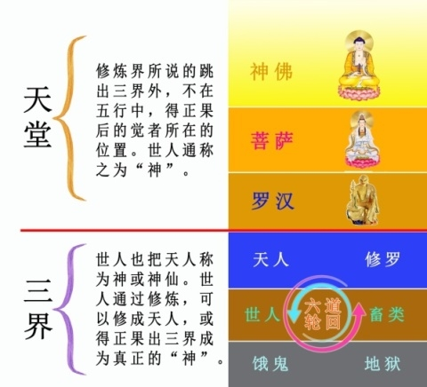

## 揭开“神用泥土造人”的秘密

文/掸封尘

### 引言

世界许多国家和民族中，世代流传着这样一个古老的传说——“神用泥土造人”。在中国，有女娲用泥土造人的故事；在西方，则是上帝耶和华用泥土造人；在非洲、南美、澳洲等地区的少数民族中，也都有神用泥土造人的传说，这是众多不同民族的一个共同记忆。

久远年前的古代，分布在地球不同大陆板块上的人类先民们，与我们今天的生存环境和状态是相差很大的。那时候，没有手机，没有互联网，没有飞机和高铁这些现代交通工具；高山、海洋、大漠、沼泽和丛林，使得先民们彼此隔绝，音信不通。那么，先民们对人类起源的说法儿为什么会如此一致，不谋而合？又为什么我们的祖先对这一传说视如命根儿，穿越浩渺的时空，一代一代传下来，直到传给了你和我？

遗憾的是，由于历史与时空的变迁，由于人类信神底线的不断下移，使人们对“神用泥土造人”这一古老传说的相信度越来越低。漫长的时空间隔，模糊了人们的记忆。

人类進入近代（宗教讲的末世）以来，无神论（唯物论）直接否定神的存在；现代科学（实证科学）给无神论帮腔，说神不存在；在中国大陆，科学成了中共手中打击信神的棍子；特别是达尔文《进化论》的误导，使人们对“神用泥土造人”的相信度变的更低了。

那么，“神用泥土造人”究竟是怎么回事呢？本文将对这一命题展开论证。

### 一、谈天说地话有神

要说清“神用泥土造人”，首先要回答的一个问题是：有没有神？

什么是“神”？亘古以来，在世界上不同国家和民族中，人们对神有着各种各样的认识，这些认识都公认：神是智慧和能力远远高出人类的高级生命。

我们这一次人类文明时期，几乎是在二千多年前的同一历史年代，东西方同时出现了几个大觉者（神）。东方出现了释迦牟尼佛和老子，西方出现了耶稣。

释迦牟尼佛能从一粒沙里看到三千大千世界，见人所不能见，他是神。老子把世人不可名状、玄之又玄的“道”说得头头是道，言人所不能言，他是神。耶稣被钉死在十字架上三天后复活，显现诸多神迹，为人所不能为，他是神。他们是背负天命从天上下凡，把天理传播人间，使人心向善，给人类留下修炼文化，为人类在末世得到创世主的救度铺路的伟大的神。

每一茬人类文明时期，都有背负天命的神佛从天国下世传法、讲道。释迦牟尼佛当年说过，在他前面还有原始六佛存在。就是说在他前面，曾经有六尊佛下世传法。就大洪水之后的我们这一茬人类文明而言，在释迦牟尼佛之前，印度有婆罗门教，而婆罗门教是上一茬人类文明时期宗教信仰的遗存。在老子传道之前，包括伏羲在内的中华远古先民们，早已开创了道在中国的辉煌时期，易经、八卦、太极、河图、洛书，都是史前修道者留下的文化结晶。西方在耶稣之前，也有犹太教。

需要说明的是，神佛从天国下凡人间，却不能以神佛的本相示人，更不能神通大显。而只能投人胎以人相来到人间，以人言传法、讲道。原始六佛、释迦牟尼佛、老子和耶稣都是这样。耶稣被钉死三天后复活，还是以人相形式跟门徒们相见；人们在峨眉山金顶等处看到的佛光，也只不过是能看见一个光影的昙花一现；身为天人的七仙女下凡嫁给董永，表面上也就跟一般的村妇没什么不同了。

古时候，修佛、修道都要進山、入林的；后来修佛進寺庙，修道進道观，都得远离人世，或与世隔绝。为什么要这样做呢？因为修炼人是可以出现超常能力的，比如佛教的“六通”等，但通常不允许用超常的能力干扰常人社会人的思维和状态。中国人有这样的说法：“小隐隐于山，大隐隐于世”；“真人不露相，露相非真人”。为什么高人要隐？为什么真人不露相，都是出于同样的原因。

宇宙中无量无计的从高到低的各种生命是等级森严的。我们常说“人是万物之灵”，人类在地球上的这一地位，不是什么進化而得来的，这是神赐予人类的权杖。其实，人不过是小小地球上最高级的生命，而在浩瀚宇宙中更高级的生命眼里，人类又是低级和低能的。任何空间的生命都有其特定的思维方式和生存状态，進到人类的空间，就得是人的生存状态，这是宇宙法理的制衡性所决定的。这与世人认同的“入乡随俗”、 “赶哪的集，随哪的斗”的道理很相仿。所以，我们看到的释迦牟尼佛、老子和耶稣，都是人相俱全的，但他们讲出的却是能使人成佛、成道、成神的法理。

我们翻阅古籍，上面有不少龙、凤、麒麟这些天上的神兽出现在人间的记载；日本大阪有个寺庙叫做瑞龙寺，寺里珍藏着一个真龙标本。但从来也没有过哪个神佛以其光焰无际的本相来到人间的记载，而只有过观音菩萨以老婆婆的形象在人间行善的故事。那些认为只有我自己亲眼见到神佛才相信真有神佛的人，也许是因为他不了解这些道理才那样认识吧？

然而，来到世间的神佛，他们生命的内在本质与使命毕竟不同于常人，所以，会有异于常人的超常之处。古书记载，圣人、大德、神佛下世，天必降瑞象相随。以释迦牟尼佛为例，佛经中记载说，释迦牟尼佛降生时，皇宫御苑中出现了八种瑞相，百鸟群集，鸣声相和悦耳，四季花卉一同盛开。尤为奇异的是：在宫内的大池塘中突然长出一朵大如车轮的白莲花，白莲长出之时恰是释迦牟尼佛降生人间。释迦牟尼佛降生之初，在舌根中闪出千道金光，每一道金光又化作一朵千叶白莲，每朵莲花中还坐着一位小菩萨，等等。

释迦牟尼佛、老子和耶稣，分别在人间讲法传道数十年。他们完成各自的使命后，离开人间返回天国的方式各不相同。释迦牟尼佛走了涅槃的路，肉体火化时烧出84000颗珠状舍利子；老子出函谷关西隐，世人不知道他到底去了哪里；耶稣被钉死在十字架上，肉身在痛苦的承受中，为弟子们赎了罪。在他们身后，留下了佛经、《道德经》和《圣经》，分别形成了佛教、道教和基督教，历经数千年而被信仰和崇拜，充分展现了神佛智慧超越时空的巨大能量；也体现出世人渴望被救度，返本归真，回归天国的悠悠宿愿。

中国人常说举头三尺有神灵；又有说神无处不在。天上的神佛有多少？释迦牟尼佛形容说：天上的如来佛就像恒河的沙子一样多！相对而言，能让人知道的却少之又少。即便如此，如果把本次人类文明中，东西方人知晓的神的名号罗列出来，也会是一串长长的名单了。这些名号可不只是单调的文字，而是个个活灵活现，每个名号的背后，都有一部感天动地的修炼故事，如密勒日巴、真武大帝；都有种种神迹展现，如八仙、济公；都有对红尘与众生的无量慈悲，如文殊菩萨、观世音菩萨、普贤菩萨、地藏王菩萨……史书记载，在人类先民们生活的历史年代，也就是人类纯朴、道德水平高尚的那个时期，信神、修神、祭拜神灵，是从朝至野的头等大事，是那个时候的主流文化。在中国，这一主流文化数千年一脉相承，直到清朝。我们从清朝皇帝到天坛祭天的庄重繁复的仪规中，是可以体察到九五至尊的清帝对上天的无限敬畏与感恩之心的。

因为人类先民们相信，神不仅造了人，而且在整体上庇护着人，人类的福分，都是拜神佛所恩赐。这可不象无神论宣扬的，说神是古人茫然无助时的想象，是什么虚幻的精神寄托。神对于古人是真实不虚的，古人信神是发自内心的，古人敬神是五体投地、至虔至诚的。那么，对这样敬神向善的子民，神就会把自己的形像展现给人看。于是，世界各族裔的先民中的匠人、画师们，就根据所见而雕塑、描绘了神的形象。无神论者说，那是人根据自己的样子想象了神的形象，这其实是无神论者反向推论、本末倒置的一种妄说。真正的史实是：神依照自己的形象造了人。所以，我们人的样子才跟神的外形相像。人与神外形的相似性，跟我们人类的儿女像父母是一个道理。所以，我们只听说过儿女长的像父母，没有反过来说父母长的像儿女的。那不乱套了吗？

现代人类的所有学科中，真正能为回答“人类起源”提供实证的，首推考古。世界各地大量的考古发现，证实着这样一个事实：地球人类的文明时期不只一次，而是一茬一茬的。

法轮功创始人李洪志大师在《转法轮》中也开示了这一点。

二十亿年前的核反应堆和三万年前的望远镜等等，越来越多的考古发现，都证明着地球上出现过多次文明。这一事实，直接推翻了无神论和《進化论》，间接证明了有神论和“神创论”。《進化论》的维护者们，本来想从考古中发现生物化石，来弥补《進化论》这一假说的证据缺失，结果却适得其反。几乎所有化石都证明着《進化论》是站不住脚的。无论是考古出土的五米高的巨人骨格化石，还是现存世间的几寸高的风干小人儿实物，都成了足以压塌《進化论》门庭的铁证如山。

迄今为止，关于人类起源的说法只有两种：一种是代代相传数千年的神造人，另一种是幼稚的假说進化论。如果進化论被无可辩驳的考古实证所否定，那么，神造人就成了唯一的选项——是的，我们的远古先民们没有欺骗我们，我们的历代祖先们没有欺骗我们：人是神造的，这是千真万确的。

### 二、“神用泥土造人”的“泥土”是指什么

现代人不能理解和相信“神用泥土造人”的障碍之一，就是人们觉得“泥土”与我们人的身体对不上号儿：明明我们是血肉之躯，为什么说是“泥土”呢？下面，我们就来说明这个问题。

中国传统文化从内涵和功用上，自上而下可以分为两大部分，即出世的部分和入世的部分，也可称之为修炼回天的文化和住世做人的文化。前者，以佛家、道家和基督教为代表，讲的是通过修炼而成佛、成道、成神的法门；后者以儒家为代表，讲的是修身、齐家、治国、平天下的道理。以无神论为立党基础的中共，称修炼文化是“封建糟粕”，其实，恰恰相反，那是中国传统文化的真正精华之所在。

纵观中国历史，历朝历代修炼者大有人在，谁不想上天呢？但并不是每个人都能走入修炼，因为那是讲根基和缘分的。《封神演义》虽然是文学作品，但正如我们平常所言，文艺作品来源于生活而高于生活。所以，书中的角色是有其真实原型的，很多是当时山中修道的人，也有的就是天上的神。比如，书中提到的广成子，相传黄帝当年曾進山访仙，向广成子求教修炼和为政安民之道。

我们知道，人类社会中的人，依据其社会地位和经济状况的不同，可划分为不同阶层。同理，宇宙中的生命，根据其生命状态、智慧和能力的不同，可划分为不境界。

!

*宇宙中生命境界示意图（合成图片）*

人为什么要修炼？就是为了提升生命层次与境界。佛家是为了修成佛，道家是为了修成道，基督教是为了修成西方人对应的天国世界的神。依修炼的方法和精進程度不同，决定了修炼人最后所证得果位的不同。一般而言，如果修的不错，但未得正果，可以上升到天人的层次，在三界之内的天界，享受几百年的神仙福分，等天年享尽，再進入六道轮回。如果一个人修得正果，就跳出三界，不再進入轮回了。出三界后，第一层生命是罗汉，都显男身；如果修的更好些，就可進入菩萨境界，这一境界的生命都显女身；如果修的更好些，就可达到佛的境界了，形象上都显现本相。直到修成更高境界的高级生命。

我们常听到这样一句话：“神在天上”。这句话其实不是现代人说出来的，这句话跟“神用泥土造人”一样，是从很古老时期流传下来的。中国古人说的“神在天上”的“天”，与我们现代人从自然科学中认识的天，其实不是一个概念。前者是指天堂，是指肉眼看不见、而天眼看的见的神佛世界，也就是现代科学家正在研究和探寻的另外空间；而后者只不过是指人类生存空间中地球表面以上的高空，两者有着本质的不同。我们知道，中国传统文化中讲“天上方一日，地上已千年” 、“天人合一” 、“天道酬勤”等等，这里的天，显然与今天自然科学中天的概念不是一回事。

举个例子吧。我们中国人有望月的习惯，站在地球上看月亮，我们会认为月亮在天上，我们不觉得这样认识有什么不妥。可是，如果我们有幸作为一名宇航员登上月球，当我们回望地球的时候，地球是不是也在天上呢？这给人的直观感受跟人在地球上望月亮几乎没有任何区别。那么，究竟哪是天哪是地？一时真有点说不清了。

我们现代人类把地面以上的高空称为天空，把大气层以上的天空称为太空，天空也好，太空也罢，说来说去，说的都是人类生存的这个空间范围。我们知道，人类生存的空间的一切物体，其最表面的最大的一层粒子都是分子，我们不妨称其为分子空间。在自然科学天的概念里，称月亮在天上，其实，更确切的说法是：月亮在离开地球一定距离的分子空间里，地球和月亮共处在分子空间的不同位置。同理，对太阳系的其它几大行星的所在位置，也都可以这样去认识和表述。

说到这里，我们就可以回答这样一个有趣的问题：传统文化说“神在天上”，为什么今天人类的宇宙飞船飞了那么高，天文望远镜望了那么远，却没发现神佛呢？于是，有人轻率的得出这样的结论：神佛根本不存在。殊不知，这是因为宇宙飞船飞的再高，天文望远镜望的再远，也没超出我们人类生存的这个分子空间。更直白的说，都没有超出人间！如果是这样的话，那么，宇宙飞船在人间转来转去，天文望远镜在人间看来看去，尽管飞的好像挺高，尽管看的好像很远，又怎么能发现神佛和神佛的天国呢？

那么，中国传统文化中的天与现代自然科学中的天有什么本质的不同呢？

如果我们对中国传统文化中的“天”稍加留意，就会发现，天是分层的。比如，佛家讲三十三层天，道家讲三十六层天；再比如俗话说的天外有天、九重天等等。不同门派、不同境界对天的认识上会有差异，这是正常的。这与“横看成岭侧成峰”的道理很相似。

我们再来看，不仅天是分层的，地也是分层的。比如十八层地狱、九泉之下等等。那么，对照本文中的《宇宙中生命境界示意图》，我们是否可以这样设想：宇宙中生命的不同境界，与天地的层级结构是不是有某种对应关系呢？答案是肯定的。

举例来说吧。古代宗教中将天分为三十六层，又细分为：欲界六天、色界十八天、无色界四天、四梵天、圣境四天。在各界的天里，分别有从低到高的各层生命。具体讲，就是所谓的六道轮回之说：天人道（天人）、阿修罗道（魔）、人道（人）、地狱道、饿鬼道、畜牲道。这也就是说，在传统文化中，生命的境界与天地的层级结构本就是一回事。

那么，生命的境界与天地的层级结构是如何形成的呢？或者说，境界与层级的物质基础是什么呢？其实，从一定角度上讲，生命的境界与天地的层级结构的物质基础，就是不同大小的粒子，就是不同大小的粒子构成的不同的宇宙空间，表现为一层又一层的地，一层又一层的天。

通过现代科学我们知道，我们人类生存的空间，一切物质的表面粒子都是分子，钢铁、石头、水、空气、人体等等，都是这样的，我们姑且把这个空间称为分子空间。我们又知道，比分子小一层的粒子就是原子，原子粒子并不是一个粒子的孤立存在，而是象分子粒子一样遍布宇宙空间的。原子粒子构成了另一层空间，那里面的一切生命与物体，其最表面的粒子都是原子。同理，比原子更小的质子、中子、电子、夸克和中微子等等，也构成了它们各自境界的那一层空间。

那么，宏观粒子构成的空间里的生命，与相对微观的粒子构成的空间里的生命有什么区别呢？下面，我们以分子空间的生命和原子空间的生命为例，来略作比较和说明。

首先，因为原子空间的一切生命与物质的最表面粒子是原子。通过现代科学我们知道，分子的体积比原子的体积大很多，是天文级数的差别。构成原子空间的人的大脑的表面粒子当然也是原子，那么，其大脑的组织结构比我们分子空间人类大脑的组织结构要精密无数倍。同时，他们的大脑是完全开放的；而现代科学研究发现，我们人的大脑有70%以上是被锁着的。这就是为什么神佛具有大智慧，而人与神相比，我们人的智力只能称之为小聪明。西方有一句犹太谚语叫做“人类一思考，上帝就发笑。”这不是说上帝怎么看不起人，而是人类带着自私和欲望的思考方式，在上帝看来也太小儿科了。

其次，因为分子的体积比原子的体积大很多，是天文级数的差别。那么，分子空间的生命体的皮肤，比原子空间的生命体的皮肤要粗糙的多。打个比方，如果分子空间的人的皮肤表面是鹅卵石砌成的话，那么，原子空间人的皮肤比玻璃还要光洁的多。这一点，正好与我们知道的神佛、菩萨、仙女的美好、圣洁的形象相吻合。这就是为什么我们形容人间最美的佳人为“美若天仙”。

第三，我们知道，现代研究发现，原子有放射性，也就是说，原子在分子空间是有能量体现的。这一点，正好和我们知道的神佛、菩萨显现到我们人类分子空间时会发出“佛光”相吻合。其实“佛光”就是能量的体现。

我们仅从以上三点就不难发现，微观粒子空间的生命特征，这些都是跟中国传统文化中说的高级生命——神的特征相吻合了。也就是说，微观粒子构成的空间里，存在着高级生命，那就是我们人类世代敬仰、无限向往的天堂。

当然了，微观粒子构成的空间的生命与我们人的差别还不止这些。比如，微观世界里的生命身体没有轻重，可以飘起来，可以变大和缩小，可以变化出各种形象；他对他以下的境界一目了然；他们的生命是用“劫”来计算的，可以活很长很长的时间；他想要什么伸手即来；他们没有人间的尔虞我诈、勾心斗角，活的大自在，等等。

人为什么要修炼？为了到达幸福的彼岸，那是生命的归宿，那是做人的真正目的。人为什么要活着、我是谁、我从哪里来等等这些人生的终极问题，在这里是不是都找到了答案？

老子在《道德经》中说：“有无相生，难易相成，长短相形，高下相倾，音声相和，前后相随。”也就是说，宇宙中的一切事物都是相对而存在的。同理，天与地也是成双存在、相对而言的。如果我们把宗教中所讲的天地的完整的层级结构比作一座万丈高楼的话，那么，一楼的天花板，就是二楼的地板；二楼的天花板，就是三楼的地板；三楼的天花板，就是四楼的地板，依此类推，一直到达万丈高楼的最高层。这个比喻虽然不是太恰当，大概就是那么个意思。

说到这里，我们可以揭开了一个谜底了，从李洪志大师的讲法中我理解到：在位居三界之上的天堂的众神眼里，整个三界相对他们的天堂而言，都可称之为地，都可称之为土。因为地就是土，土就是地。也就是说，“神用泥土造人”的真正涵义，其实就是说的“神用三界内的物质粒子造了人”这个意思。

### 三、神用什么方法造的人

现代人不能理解和相信“神用泥土造人”的另一个障碍是：如果说神用三界内的物质——土造了人，土是神造人的原料，那么，神是用什么方法，或者说用什么能力造了人呢？

人们发出这样的疑问是可以理解的。因为，按照我们人的思维和观念，造人的外形比较容易，就好比雕石像、烧瓷人、捏面人儿、吹糖人儿，这都是我们常见的技艺。可是人不只是有了外形就完事了，人的内在结构，大到五脏六腑，小到毛细血管，再到我们现在知道的DNA双螺旋结构，还有更微妙的经络呢，造化人体如此细微精妙的生物工程，神是怎么完成的呢？接下来，我们就说明这个问题。

正如前文所言，神是智慧和能力远远高出人类的高级生命。黄帝是人文初祖，也曾進山访仙，向广成子求教修炼和治世为政之道。孔子是人中至圣，也曾向老子问礼求教，敬谓老子为“龙”——神龙见首不见尾。黄帝和孔子尚切如此，就更不用说世间的云云众生了。人与神的这种差距，不是幼儿园与博士后的差距——这不过是人与人的差距，而是整个人类与高级生命的差距，是生命境界的差距，是天文级数的差距。表现在做事方式上：人做什么事情，得通过大脑支配肢体去完成；而神做事情是用佛法神通——神造人就是用的佛法神通。

为了把佛法神通说清楚，我们先从气功说起吧。

#### （一）全国气功热

上世纪下半叶，横跨七十、八十、九十年代，持续二十多年，在中国大陆出现了一个全国气功热。这是天象变化带动下，人间的一种表现形式。一时间，全国数千万人修炼气功；气功师受到明星一样的礼遇和追捧；出现了几十家气功报刊和大量关于气功的学术著作；随处可见气功医疗院、气功表演会等。

气功热得到了官方和科学界的高度认同。1986年成立的国防科工委所属中国人体科学研究会，由张震寰将军任理事长，钱学森任名誉理事长；1988年成立的世界医学气功学会，由卫生部崔月犁部长任会长。

中国气功科学研究会，主办召开过五届全国气功科学研究学术论文报告会，出版了四集《气功科学文集》，总数超过150篇的实验报告留下了珍贵的文献记录。

气功热中被公认的特异功能主要有六种：特异致动、非眼识别、遥视、预测、透视、心灵传感。这六种特异功能分别对应修炼界常识的搬运功、天目、遥视、宿命通、天眼通、他心通。

#### （二）气功师的能量场

上个世纪三十年代，原苏联科学家基尔利安夫妇研究发现，每个人的周围都存在一个微弱的能量场。而气功师的光场、电场、磁场要远远超过普通人。普通人体的磁场约为 0.25高斯，气功师可高出许多倍，可达4高斯。现代仪器的检测已经证明，当气功师发功时，其意念控制部位的穴位可测到超常的电磁波。

对气功师的外气研究表明，气功外气是一种十分复杂的能量场，现在的物理手段已经能从外气中测出各种高能粒子，包括γ射线、高低频电磁波、红外辐射、次声振动、微弱可见光等。还发现外气可以抑制癌细胞的增殖，改变物质内部组成结构，促進生物增长等效果。航天医学工程研究所王修壁教授的实验表明，气功师发功时，用8566A型频率分析仪進行连续扫瞄，检测到频率为10～360MHz、功率为30～65dBm的高频电磁波。

1986年12月到1987年1月间，清华大学陆祖荫、赵南明教授等，让气功师在距离实验室6公里处发功， 结果表明其能量可以使内腔式激光管发射的激光偏振面转动。

上世纪八十年代，气功热中红极一时的气功师严新，与清华大学、中科院高能物理所等机构的陆祖荫、李升平等研究者合作，進行了一系列气功科学实验，取得令人瞩目的成果。实验包括从广州发功，改变了位于北京清华大学实验室内的水等物质的分子结构。气功协会会长张震寰将军、著名科学家钱学森、贝时璋等，在确认研究报告真实可靠的情况下，对该报告進行了推荐。实验论文在《自然杂志》、《生物物理学报》上发表，《光明日报》等重要媒体作了广泛报道。

说到中国气功热，严新之外，还有一个人不能不说，他叫张宝胜。张宝胜在上世纪八十年代“耳朵识字”兴起的时候，即宣称自己有“非眼视觉”功能，并能進行“送物取货”表演，风靡整个京城，震惊中国科学界。中国科学院、包括高能物理研究所，以及一些高等学府，对张宝胜经过系统的研究，运用了非常严格的科研手段，包括双盲、封粒、对照，证实确实有这些现象。电影《赌神2》里面有特异功能的张宝成，就是以张宝胜为原型的。

1983年6月2日，经国防科工委批准，张宝胜被正式调入507所，由一个平头百姓，华丽转身成为国家核心科研管理机关的军队干部。从此，他的身影出现在包括政府要员等在内的单位或家庭寓所。通过表演，他赢得了“神人”、“国宝级气功师”等美誉，成为享受专车、专宅、专职服务员的中央领导级待遇的人物。

1984年3月11日，张宝胜给原国家副主席王震作表演。大约三个小时内做了十五项表演。包括隔着信封认字（透视功能）；打开信封后，里面多了五根火柴（搬运功）；从密封的玻璃瓶子里取出23粒药片（搬运功）；向三个走时准确的手表吹气后，一个慢了一个小时，一个慢了两个小时，另一个日历慢了两天……等等。

#### （三）佛法神通

从李洪志大师讲法中， 我们知道，所谓气功，是现代人起出来的名词，说白了其实就是修炼。这是我们中国的传统文化，也可称为我们的祖宗文化。为什么我们常说中国传统文化博大精深，源远流长？又为什么中国自古称为神州？因为它出世的部分是直接通天的。一个人把住一个法门精進实修，就可以上天、成神。下面对气功能量的认识，来自本人对李洪志大师相关讲法的认识和理悟。

一个修炼有素的气功师具有超常的能量，可以出现特异功能，这已经是科学验证的事实了。那么，气功师的能量以什么方式存在呢？主要有以下三种方式——

第一种能量存在方式是，能量储存在构成人体的细胞和分子、原子等等层层的粒子中。随着修炼功夫的加深，修炼层次的提高，其能量密度会越来越大，直到高能量物质完全代替了人的肉体细胞的原有成分，这就是历来修炼界说的“走出五行”。也就是说，他的身体已经不是我们这个空间的金、木、水、火、土这五行所构成的了，而完全被从另外空间采集的高能量物质给代替了。

第二种能量存在方式是，修炼人的体内会结丹。这个丹的能量密度，要远远超过第一种存在方式的能量密度。打个比方，丹就好比一枚“超能激光炸弹”，它起什么作用呢？在修炼人最后圆满的时候，这个丹要爆炸，“轰——”一震，把修炼过程中锁在命门里的各种功能全部释放出来。然后，他的元神带着这些东西圆满升天。我们知道，高僧圆寂后火化时会出现舍利子，那就是爆炸后的丹在肉身里的遗存。化验表明，舍利子包含着大量另外空间的物质。

第三种能量存在方式是，修炼人修炼到一定层次，会在头顶上出现一根功柱，随着修炼层次的提升，功柱也在不断向高层次突破。如果一个修炼人的功柱突破了三界的范围，能够达到得正果的境界，这就是修炼界常说的“跳出三界外”。那么，他将来的生命去向就超出三界了，修成了罗汉、菩萨、佛道神，乃至更高境界的高级生命，就不再進入六道轮回了

接下来，我们就重点说说这第三种能量存在方式——功。

我们知道，从一定角度上讲，宇宙的结构，就是从微观粒子到宏观粒子的排列组合。大千世界林林总总，生命与物体之所以千姿百态，甚至可以说是千奇百怪，其实就是因为构成它们的粒子的多少与排列组合方式不同造成的。换句话说，如果能改变一个物体（物质）粒子的排列方式，那么，这个物体（物质）就变成另外一个物体（物质）了。现代科学中的化学，是在分子、原子层面上研究物质的组成、性质、结构与变化规律，创造新物质的科学。其实，化学就是通过改变原子的排列方式从而形成新的物质。

功，作为宇宙之一物，它的结构也跟宇宙的结构一样，也是由从微观到宏观粒子构成的。从中国传统文化中我们知道，“万物皆有灵。”也就是说，一切东西，不管它多大和多小，其实都是有生命的，都是活的。只不过它的生命形态没有体现在我们人类的分子空间，人的肉眼看不见而矣。那么，构成功的所有粒子，也都是有灵性的，都是活生生的生命。

这些功的粒子跟修炼人是什么关系呢？因为功是修炼人一生吃了无数的苦修出来的，我们知道的《西游记》，用艺术的形式，展现了一个完整的修炼故事。唐僧历经九九八十一难，才取回真经，才修得正果。因此，这个功具有专属性，谁修炼出来的功，这个功就听谁的。如果我们把功比喻成一支军队，那么，修炼人就是司令官。司令官发出命令，指挥整个军队去完成任务。

修炼的最终目的，就是得道圆满，成佛、成道、成神。当一个修炼人修成一个真正的神的时候，就具有了比特异功能更高级的本领，修炼界称之为“佛法神通”。佛法神通的物质能量基础是什么？就是“功”。如果一个神佛想干成一件什么事情，比如说想把一个篮球变成一个西瓜，当他这样一想，他的功的所有粒子，从宏观到微观的粒子得到指令后，就同时行动，把构成篮球的从宏观到微观的所有粒子同时移动，使之变成西瓜粒子的排列方式。时间又是用神佛所能掌握的最快的时间，所以，这种变化一瞬间就完成了。

我们知道，空气也是由粒子组织的，如果一个神佛想以空气为原料变出一个西瓜，他只要这样一想，他的功也是瞬间就把这件事完成了——这就是成语词典里“无中生有”的来历与真实写照。因为空气对人的肉眼来说是不可见的，所以人说这是“无中生有”也不能算他错。

在中国所有的神话传说中，最震撼人心的，莫过于盘古开天辟地了。什么叫开天辟地？说白了就是造天造地。然而，天地之间也不能空空如也呀，所以，还得造大千世界的众生和万事万物。盘古用什么能力开天辟地、造大千世界的众生和万事万物呢？用的也是佛法神通。

八仙之一汉钟离想传给徒弟吕洞宾的点金术，包括前文提到的气功师从广州发功，改变了位于北京清华大学实验室内的水等物质的分子结构，其实都是这种能力的运用。

今天，世人都知道创世主。创世主用什么创的世？也是用的佛法神通。佛法神通是大觉者和高层次中的修炼人的通用本领，只不过是随生命境界的不同而本领的大小不同而矣。

那么，对于东方的女娲、西方的耶和华等等这些很高境界的神来说，用他（她）们的佛法神通仿照自己的外形和内在结构造人，岂不是比我们在北京大街上看到的捏面人儿、吹糖人儿还要容易吗？ 其实说白了就是这么回事。

### 结语

我们把“神用泥土造人”说明白，为的是清除无神论和《進化论》这两个邪说灌输给人类的误导和毒素；摘掉无神论和《進化论》这两个黑手扣在人类头上的“人是由动物進化而来的”这顶耻辱帽子；把“人类起源说”正本清源，厘清人类上承神佛的高贵血统，还“人是神的子民”的本来面目，让我们人类向神“认祖归宗”——唤醒世人尘封迷失的神性，与创世主接上得救的圣缘。

如果真能这样，生活在今天的我们这些后辈，也算对得起我们祖先们把“神用泥土造人”这个通天福音代代相传的苦心孤诣了吧。