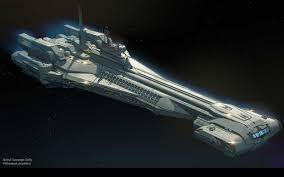

## 七印解封（1）：定下人类历史的七印书卷

> 本文内容为修炼人天目所见，因层次有限天理所定，故所见如管中窥豹，所言如树之一叶。历史已是最后关头，不管人是否愿意，回归神乃必然。信者自明，不信者且当神话陶冶性情！

人类历史在过去都是被安排的，按照天上定下的剧本在演。这本剧本是旧宇宙的安排，在过去是被七道封印封严了，一般生命无法打开，所以我们把这部定下人类历史的剧本称为七印书卷。这部书卷在很多不同层次空间都有它的存在形式，在人类空间就是贵州[藏字石](../../Truth/3t/cangzishi.md)。人类历史发展到今天，旧宇宙在解体，剧本已到尾声，眼看就要演完，它也算不上什么天机了，所以我们从今天开始会逐渐把这部剧本与今天相关的主要内容给大家揭示出来。

人类历史上有记载的看到过这部七印书卷的还有一位，他就是耶稣十二门徒之一的约翰，他根据自己从这部书卷看到的内容写下了《圣经・启示录》。天目看到，这位约翰现在转生在某个国家，具体是哪个国家不便说，以免造成干扰。他现在也是一位修炼人，和我是同门。东西方文明留下很多预言，例如西方的《诺查丹玛斯预言》，中国的《推背图》《梅花诗》等，这些预言是作者通过神通看到了人类历史的演化，所以里面描述的事情就直接是人类社会这个层面的东西，而《圣经・启示录》的内容则是直接从七印书卷看到，它涉及的深度可能就不仅仅是人类层面的了，例如《圣经・启示录》写了大红龙以及大红龙在天上的一场争战，那就是约翰从七印书卷看到了影响人类历史的大红龙它在另外空间的体现形式以及一场发生在另外空间的真实战争。人类是三界存在的原因，定下人类历史的七印书卷不仅仅是关于人类的，也是关于三界之内的天上的。《圣经・启示录》描写的大红龙在天上的争战，也是被七印封印安排的。

在离三界很近的一个层次上有一位王，他的宫殿里存放著这部七印书卷。因为修炼人所修炼法门的威德，所以当修炼人来到这位王面前时，修炼人站着也可以，坐着也行，反正那位王也是很尊重修炼人。当修炼人要翻阅这部书卷时，这位王就会把这部书卷放在一个类似中国古代的书案上给修炼人看。这个书案它有四条腿，但这四条腿不是立著的，而是和桌面平行的，所以外形上也很类似飞毯。书案颜色整体上类似于中国的檀木，四个腿是镶金的，它驮著书卷就直接飞到修炼人面前展开。书卷好像是有生命的，它会显现出天上的文字，也可以象放电影一样把里面的内容显示出来。当你想“读”时它就给你显示天上文字，如果你想“看”它就给你放电影。书卷的第一编内容记载的就是盘古开天劈地的故事，然后神造地球，然后很多神出现在地球上造人，然会人类社会一茬茬的产生又一茬茬地灭亡，就这样周而复始，直到今天这一次人类社会。毁灭上一次人类社会就是大洪水，这个故事大家也都知道了。因为这部书卷内容太庞杂，事无巨细，地上一草一木，每一个人的出生到死亡，他人生的每一件事都在书卷中写着。这些事情我们都掠过很多也不便说，我们就对应贵州藏字石所揭示的内容去说。因为贵州藏字石对应着天上的七印书卷，石头上写的内容就是人应该知道的天机。所以我们也就围绕这个允许人知道的天机来说。

藏字石道出了“中国共产党亡”这个终局。提到这个终局我们就要说到马克屎。马克屎在另外空间很多层次上都有它的体现形式。它在修炼人能看到的最高层次上体现的就是一团象垃圾一样的黑色的东西，这个应该就是马克屎的来源。然后来到靠近人类这个层面，它是一条绿色蛇，身上有黑色点。这条蛇在另外空间也很大，它是天上那条大红龙的使者。

《圣经・启示录》描写了天上米迦勒与大红龙的一场战争：“天上又现出异象来。有一条大红龙，七头十角，七头上戴着七个冠冕。在天上就有了争战。米迦勒同他的使者与龙争战。龙也同它的使者去争战，并没有得胜，天上再没有它们的地方。大龙就是那古蛇，名叫魔鬼，又叫撒但，是迷惑普天下的。它被摔在地上，它的使者也一同被摔下去。它的尾巴拖拉着天上星辰的三分之一，摔在地上。”米迦勒的形象并非西方神的形象，而是象东方的天将，和他一起打仗的也都是中国那种天兵天将的形象。现在世上有一本《魔鬼在统治着我们的世界》书中已经讲到了大红龙的来源，点出了大红龙在高层空间是一条蛇，低层空间就体现为一条大红龙。而对应着马克屎的这条蛇它是作为大红龙这古蛇的使者出现的。当大红龙体现出红龙形象时，将来转生为马克屎的那个生命就是带黑点的绿蛇的形象。当时这场战争发生在三界某个层次上，是一场很大的战争，几乎波及了整个这个层次的神。所以在大红龙一方被打败后，它们就被从天下打下来。和大红龙它们一同被打下来的神很多，《圣经・启示录》“它的尾巴拖拉着天上星辰的三分之一，摔在地上”这句话指的就是这些神。天上发生的这件事情其实也是被七印书卷久远年代就安排好了的，但是当时这个层次的生命都不知道。只有当这场战争结束了，这个真相可以被揭开的时候，众神才知道这个安排。但是那些随着大红龙掉下来的神却是真的掉下来了，那也没办法，虽然是安排，其实也是他们的选择！

这里我们要澄清一个认识，就是这里说“大龙就是那古蛇，名叫魔鬼，又叫撒旦”，于是后人就把这个等同于所有魔鬼了。其实不是，魔鬼对人来说可能是坏了，但它可能也不是真坏。因为人就是有生老病死的。只有这条大红龙它所代表的才是真的魔鬼，才是真撒旦。

> 编者注：生老病死从修炼角度看也是一种魔，维护宇宙规律的魔，而撒旦是真正的恶魔。

这条大红龙及它的使者从天下被打下来，不是就直接显现在人间，不是这样的。生命要在人间存在就必须符合人间生命存在的方式，或者投人胎成为人，或者投动物成为动物，或者以人间的公司、组织、政党、主义、学说等等社会形式存在等等。大红龙和它的使者是从天下被直接打到地狱里。关押它们的地方是在地狱里一个很深的洞中，所以《启示录》就说“无底洞”。洞外有门，有穿金盔金甲的天兵把守。大红龙是站立著被绑在洞里的，锁链缠绕着它的手和脚。将来转生为马克屎的那条蛇是横著被吊起来绑在洞壁上，锁链缠绕着它的身子。当人类历史发展到该马克屎出生时，这时从书卷中就看到一位黑色的象地狱中的使者，他手上有钥匙，打开洞门，把那条绿蛇放出来，然后领着它投胎到人间，也就是今天德国的特里尔，一个基督教的家庭里。

## 七印解封（2）：百年红祸的开端

上回说到当人类历史发展到该马克思出生时，就看到一个黑色的地狱使者打开无底洞门，把那条绿蛇放出来转生为马克思。从七印书卷看到，当绿蛇被从无底洞放出的时候，大红龙还仍然被绑在无底洞中。这个地狱的无底洞很热，不仅绑着大红龙和绿蛇，还有很多，有的是神的形象，有的是鬼的形象，也有麒麟形象，等等，它们都是天上当初与米迦勒之战中的大红龙的使者。这个关押着大红龙及其使者的地狱无底洞对应到地面就在中国的某个大山中。这里补充一下，米迦勒平时的形象是一位道。

在绿蛇转生为马克思前，这条绿蛇的所有记忆和能力都被消除了，就象中国人喝孟婆汤的故事那样。这是法的要求，不管什么来头，只要转生到人类社会，那么这个生命之前的记忆和能力就会被清洗。当马克思出生后，他在基督教家庭里成长，自然也成为了基督教徒，但是，即使每日诵读《圣经》也无法改变它作为大红龙使者的本质，所以当历史发展到马克思要打开“潘多拉”魔盒的时候，从七印书卷看到，另外空间很多鬼一样的东西就往马克思脑袋里打各种邪恶的思想，并且很多在马克思之前转生为人的恶灵，在社会上做着各种促使马克思写下“共产党”三字以及为后来共产主义的传播进行铺垫的事情。这里特别提一下达尔文，它外形上是一个象鬼的恶灵，它也是大红龙的使者，和大红龙一样是被锁链缠绕四肢立着绑在地狱的无底洞里，它在马克思之前被释放。当《共产党宣言》在人类社会发表出来后，达尔文就写下了《物种起源》为《共产党宣言》的传播提供思想上的传播基础。

为了给这场百年红祸营造一个外部环境，我们看到七印书卷还做了很多其它安排，其中之一的就是外星人。修炼人通过天目看到，在神造地球之前，地球这个地方也有一个星球，但是那个星球就象一个垃圾堆，没有水也没有树等生命东西，如果再细看，更象一堆大便。在一开始，这个球体上也并没有外星人，后来有一批外星人从遥远的星空坐着宇宙飞船来了，那个宇宙飞船有些象下图所示：

外星人的科技确实很发达。这批外星人形象很丑陋，它们有一个身子，有手有足，一眼看去它那个头部很大很长，但是那不仅仅是它的头，这个头的后半部分是它的屁股，有一根管子在后面连着这个屁股，大便就从这个管子出来，而且走路时它也会大便。修炼人看它，就象人看垃圾堆里的虫子一样。这是修炼人层次上看到的最早的出现在地球这个位置上的外星人。后来因为要开创三界，神要在这个位置上造地球造人以及地上万事万物，于是外星人以及所在的星球就被神移走到遥远的宇宙空间中，与地球这个地方隔绝开来，外星人即使技术再发达也无法来到地球这个地方。就这样过了漫长的岁月，当人类历史走到本次人类文明时期，在中国的黄帝和炎帝打仗之时，这时修炼人从七印书卷就看到一位道形象的神，他把当初让地球所在三界与外星人隔绝的一个空间打开了。这个空间一打开，那边外星人通过它们的科技就突然发现了一条能够到达地球的通道，于是它们就派了一艘宇宙飞船来到地球查看地球的情况，发现这个地球以及人体无比的完美，是它们无论用什么技术都造不出来，于是它们就制定了详细的用来操控人取代人的计划。人类社会出现的工业革命直到今天大家看到的电脑等人工智能产品就是它们在背后操控人搞出来的。

表面看是外星人自己想要操纵人最后占有人的身体，其实外星人的这些所为也是七印书卷写着的，但外星人并不知道。外星人的眼睛和技术也看不到大红龙存在的那个空间，更看不到神的空间。外星人和人几乎在同一个空间，只不过人因为有了这个肉眼和肉体，就比外星人更加表面。

七印书卷安排外星人出现在地球有多重目地，其中一个就是让外星人给人带来现代科技，给人带来一种依赖科技的社会形态和生活方式，以让人放弃神传文化和神订的生活方式，同时给《共产党宣言》的传播营造一个环境。当马克思出生时，本次人类社会正处于第一次工业革命时期，欧洲从家庭手工业向机器大工业转变，在工业带动下，社会形态、人的生活、行为、思想等等都处在脱离神的过程，激烈的冲击之中，人与人的关系更加紧张，社会矛盾更是到了要爆炸的边缘，人心思变。然后1789年爆发的法国大革命，推翻了传统的君主制，颠覆了传统的社会秩序。法国大革命领袖罗伯斯庇尔也是大红龙的使者，它在另外空间是外形如鬼的恶灵，它在马克思出生前就已经被提前从无底洞释放出来。法国原本是天主教会最大的支持者，但因为法国大革命的影响，1793年10月5日国民公会废除了基督教历，实行共和历。 11月10日，巴黎圣母院被改为“理性庙”，由一个演员扮演“理性女神”供大家膜拜。一个新的基于无神论的“理性教”迅速在巴黎铺开，一周之内巴黎除了三座教堂外的所有教堂都被关闭。宗教恐怖运动很快遍及法国，一批教士被逮捕，有些被处死。

这一切，都在促使着马克思，让它在人类社会写下“共产党”这三个字。当马克思在人间第一次写出“共产党”这三个字那一刻，修炼人就从七印书卷看到，那条被绑在无底洞的大红龙就自己挣脱了锁链，并且连带着很多被绑在洞里的使者也都挣脱了锁链从洞里逃跑出来，当时很多守卫的天兵天将试图阻拦它们，但最后失败。从此，一场延续至今的百年红祸正式登场。

## 七印解封（3）：拘禁在天安门的大红龙

上回说到当马克思在人间写下“共产党”三字的那一刻，被关在地狱中的大红龙及其众多使者就从地狱无底洞逃了出来。这时大红龙所在的空间是三界最低一层天所对应的地，按照中国传统说法，这个天就是玉皇大帝管的天，地类似于《西游记》所说孙悟空所在的地，这个天地是属于三界内直接影响人类空间的层次。大红龙带着它的使者，在这个天地的某个地方，纠集了许多那些被打下来的妖魔鬼怪，造了一座城，这座城的城墙很象中国古代的城。天帝也派出很多天兵天将攻打大红龙的城，其中一位领兵天将脸上长着三只眼，很象中国神话传说中的二郎神。天兵天将与大红龙之战在另外空间看也是很惨烈的，最后大红龙被擒获。从七印书卷看到，当时天上还有一场对大红龙的审判，天帝坐在宝座上，大红龙被捆绑受审要被销毁之时，天上出现一位西方神，他身穿白色衣闪金光，手捧金色匣子，里面放着金色信笺，递给天帝。从七印书卷看到，当天帝看了信笺后，它就把大红龙交给了这位神，而这位神并没有立即释放大红龙，而是直接把它带到北京天安门，在那个位置上对应的另外空间是一座山，半山腰有一块突出的空地，在那里有一间很小的房子，象中国古代带屋檐的房子，房子周围有看守的神，他们的任务是把大红龙拘禁在这里不能离开。此时对应到人间，正是《共产党宣言》成稿之时。

《圣经・启示录》写道：有一条大红龙，七头十角，七头上戴着七个冠冕。两千多年过去了，至今人们仍然无法理解它具体所指。修炼人从七印书卷看到，大红龙从产生它的那个层次被层层众神围捕来到三界附近的时候，经过的历史岁月是非常漫长的，远远超出了大红龙作为一个生命来说能够承受的。在这漫长的岁月中，大红龙因为衰老而多次重生，重生之后的模样和之前的就有所不同。七印书卷看到，当它被追捕来到三界附近时，它的形象并非一条龙，而是东方红龙长长的身子长着七个头。这七个头长的有些奇怪，每个头下面并没有脖子，它相当于在一个龙脖子上长着七个头紧紧挨在一起：中间两个头挨在一起，另外五个是紧紧贴着围着中间那两个头长的。每个头上有个冠冕，而外面那五个头的每个头的后面长着两只角，所以《启示录》就说“七头十角，七头上戴着七个冠冕”。这个有着七头十角的大红龙它来到三界附近时已经非常衰老了，而且后面还被天界众神追捕。从七印书卷看到，这条七头十角的大红龙在这次死亡重生是三个龙蛋，其中两个被众神获得，另一个蛋被特意保护进入三界，变成了一条我们中国人古书所写的那种正常模样的龙，红色的大红龙。就是这条大红龙后来在三界内被米迦勒打败，然后在人间掀起了百年红祸。

被拘禁在北京天安门的大红龙充满了毁灭一切的恨。它的本源在很高层次上被造就出来后就不被层层宇宙和空间所容，层层空间不同层次的神都想销毁它，但因为大红龙是被有意造就给地球上的人在末后末劫试炼准备的，所以每当它在不同层次出现危险将要被销毁时，就会有神出来保它不至于被销毁。从高层到低层，大红龙总是处在被销毁的危险境地，也总是处于逃命的状态。来到三界又被打下来关在地狱无底洞上千年，逃出来后又被天帝擒获，接着被神禁锢在这座小房子里。大红龙身体充满了对从产生它的最高层直到人间的所有层次的恨。所以《启示录》就说：“只是地与海有祸了，因为魔鬼知道自己的时候不多，就气忿忿地下到你们那里去了。”此时从七印书卷看到，大红龙它把自己的身体分成两条，一条就在天安门所对应的另外空间这个小房子里等待时机，另一条来到西方。从七印书卷看到，这条来到西方的大红龙所过之处，对应到人类空间就是一波波的共产主义运动或政权的建立，以及来自大红龙对一切生命的恨而导致的生灵涂炭。

大红龙来到德国，也就是马克思出生之地。但是德国这个民族在天上的王比较特别，他和我们人类所理解的神不一样。当大红龙一来到德国，德国这个民族的王并没有给它喘息的机会，马上带着他的将士围剿它，这条大红龙只好跑到法国。德国这位王显现到人间的形象很象德国一位后来非常有争议的人物。在赶走了大红龙后不久，这位王也从天上转生到德国，以不被人理解的方式继续着他要做的事情，在人类社会造下了从人的角度来看难以接受的罪恶。其实从德国这个国家的根源来看，这个国家是与大红龙为敌的，但因为七印书卷的安排，马克思必须出现在德国。

七印书卷很神奇，人看电影，如果快进，我们人看到的就是镜头在快速过，但看七印书卷则不同，如果想快速过，它会通过映像的方式把快进的内容浓缩出来给你看。例如当那条大红龙来到德国时，七印书卷首先给修炼人看到的是这样的映像：那位德国的王狠狠一脚把大红龙踢出了德国！但如果修炼人想放慢看，那么七印书卷就会把具体的事情展现出来，于是就会看到“踢”这个事情其实很激烈：德国王与大红龙在另外空间发生战争，而在人的空间就是共产主义在德国的演化、对社会和生命大肆破坏的过程。被德国王踢走的大红龙一到法国，于是人间对应出现了巴黎公社这场浩劫。大红龙它在法国最后也被“踢”走，但不是被法国的王“踢”走的，而是被法国的民众“踢”走的，因为七印书卷展现出来的是很多很多的脚一起把大红龙踢走这个映像。修炼人比较好奇，为什么法国踢走大红龙时看不到法国这个民族的王？他去哪里了？从七印书卷展示出来的映像来看，原来此时法国并没有王，他的王去了美国！

## 七印解封（4）：大红龙的来源

被法国民众“踢”走的大红龙来到俄国。在大红龙来到俄国之前，当初同被关押在无底洞的一些大红龙使者早已被从无底洞释放，被安排转生到俄国建立势力等待大红龙的到来。当另外空间的大红龙一到，在人间，就是俄国的十月革命。大红龙有很多使者，其中有五位能力特别强，用人的话来说它们是大红龙的“五恶上将”。而这五恶中又有一位排第一，它对应到人间就是“列宁”。从七印书卷看到，列宁在另外空间显示出恶灵形象，带着一个非常恐怖的黑色面具，头上黑色头盔有两个角，身穿银盔甲，右手拿锤，左手拿弯月形刀。全世界共产党的标记几乎都是锤子镰刀的形象，它对应的来源就是大红龙第一恶将手中的这两把武器。从此，共产主义对人类的全面杀戮正式登场！

为什么共产党国家漠视生命喜欢杀人？为什么大红龙不被层层宇宙众神所容？这与大红龙的来源有关。天目看到，在宇宙很高的层次上有一个世界，这是修炼人目前能知道的大红龙的最高来源。这个世界不是先天存在的，它是很高很高层次的一位神特意造就的。他造这个世界的最终目地就是为了给地球上末后末劫时生命是否能够得救准备的一个巨关巨难。 《圣经・启示录》说：“你既遵守我忍耐的道，我必在普天下人受试炼的时候，保守你免去你的试炼。”这个“普天下人受试炼”指的就是这个巨关巨难，它针对全人类。此时的人类怎么选择，就会成为这个生命未来的去向。在这个试炼下，如果选择了大红龙一方那么它就是选择了大红龙的死亡世界。至于这位很高很高的造就这个世界的神现在怎样了先不说，在后面时机成熟时我们会破开这个迷。这个世界和宇宙无量无计的其他世界都不同。宇宙中世界都是非常美好的，比人知道的天国都要美好，但唯独这个世界它由“死”构成。这里的地是死的，天是死的，树是死的，水是死的，连道路都是由各种各样死亡生命的尸体铺就的，修炼人看到也是毛骨悚然。从这个由“死亡”构成的世界里又出现了很多由这个世界死亡因素构成的生命，大红龙也出现了，它是这个世界的王，此时的形象就是七头十角七个冠冕。因此这个世界的生命从本质上喜欢“死”，“死”是它们的“生”。

这个世界的存在对这个层次的所有生命来说都构成了威胁，所以最后这个世界被众神解体，大红龙和它这个世界的部分生命，就被有意的保护着打下来，在下一层次转生。就这样层层被打下来，每到一个层次，每个层次就有一些生命被大红龙迷惑，死心塌地地追随着大红龙。就这样，越往下走，大红龙的势力就越来越大，当来到三界附近的时候，大红龙的势力就已经大到让那一层的众生都心有余悸。所以当大红龙被米迦勒领兵打败后，《启示录》写道：“所以诸天和住在其中的，你们都快乐吧。”

既然大红龙那么坏，为什么天上的神也会被它迷惑呢？每一层次的神他们也只知道自己这一层以下的事情，更高层次对他们来说也是迷。就象《西游记》里写的，玉皇大帝只知道孙悟空是从石头里出来的，但从石头里出来的孙悟空他又来自哪里？这是连玉皇大帝也不知道的奥秘，所以他们就说天地造化。大红龙及那些追随它的使者和生命在每一个层次出现也类似这样，直到人间也是这样。在人间，大红龙的很多使者和生命都转生为人，满口说为人类为人民为人权为自由，本质上它们是来毁灭一切的。而作为大红龙本身，在人间是以共产主义共产党这个学说这个组织存在的，把自己标榜着伟光正，本质上就是由死亡构成的生命，带着对所有层次所有生命的恨，也迷惑了地球上庞大数量的人类。

上回我们提到大红龙在靠近三界的时候显现出来的形象是一个七头十角的大红龙，它死亡后重生为三个蛋，其中一个蛋被保护着进入三界。那时候被保护着进入三界的还不仅仅有大红龙这个蛋，还有很多那些追随大红龙的使者以及生命，它们在这一层被处死后它们的灵也被保护着进入三界转生，这个数量非常庞大，这也是后来这条大红龙能够在天上纠结三分之一的力量与米迦勒争战的其中原因。这个龙蛋进入三界某个层次后，它经历了一个出生成长的过程，学了满身的本事。在这个层次的很多生命来看，它的形象、人生历程很正常，它出类拔萃，本事很大。这条大红龙心里的邪恶在它年轻时它自己也不知道，直到时机一到，它就象我们人类知道的马克思那样，邪恶的一面就完全支配它，几乎迷惑了这层次三分之一的生命，让这一层次的很多生命追随它。就在这个时候，大红龙看到了在靠近人间的一个层次上，也就是玉皇大帝所在的天地中，有一位妇人。

《启示录》写道：“天上现出大异象来。有一个妇人，身披日头，脚踏月亮，头戴十二星的冠冕。”约翰看到的这个大异象显现的就是这位妇人的来源–一位层次很高的神，她神一面的身体贯穿了三界。就如前面所说，天上这部七印书卷很神奇，它可以把内容抽象出一个形象展现给你看，也可以很详细的把细节放映出来，也可以象一本书一样展现文字让你读。当初约翰从这部书看到的这个“大异象”就属于这部书抽象出来的映像，用来告诉约翰，这位妇人在另外空间身体覆盖的范围以及她在天地间的地位很尊贵：所以说“身披日头，脚踏月亮，头戴十二星的冠冕”。

坏的来了，好的也在来。在大红龙及其追随者不断地从天上往地上来的时候，天上也有很多佛道神在创世主的指引下从天上不断地层层下走往地上来。

这位“头戴十二星的冠冕”尊贵的神进入三界时，七印书卷展现给修炼人看到的画像是一块长长的石头从宇宙飞来。也就是说这位神是以一块石头的形式进入三界的。在三界的岁月中她最后转生来到了玉皇大帝所在的天地，此时的她是一座城里的一位普通妇人，她怀了一个男孩即将生产。人类社会出现的很多生命或者事物或者事情和玉皇大帝这个天地中的地上生命或者事物或者事情有对应。或者我们可以这样说，玉皇大帝所在天地的地是人类空间能够存在的原因。玉皇大帝那个地上的生命或者事物或者事情一变化，人类这边就会变。这位妇人将要生下的这个男孩对应到人类社会，将对人类社会产生巨大的影响，所以《启示录》说：“是将来要用铁杖辖管万国的。”大红龙在天上本事非常大，有很多强大的神通，几乎是那个层次上最厉害的，它看到了自己不久就要在天界和众神有一战，也看到了自己最后会失败然后会被众神打到地上，它也看到了这位妇人的来源，知道她的孩子将来会成为它在地上毁灭众生的强大阻碍，于是它就想现在就害死这位妇人的孩子，于是它就指示妇人所在空间的一些恶灵去害她。所以《启示录》说：“龙见自己被摔在地上，就逼迫那生男孩子的妇人。”这个“见”是指大红龙运用神通在高层次上看见了自己的未来要被打到地上。

当大红龙想要害这位妇人时，七印书卷显示给修炼人看到，此时妇人做了一个可怕的梦，梦境中有一条红色恶龙站在她旁边，等她孩子出生后就吃她的孩子。七印书卷给约翰看到的应该就是这个映象，所以《启示录》就写道“龙就站在那将要生产的妇人面前，等她生产之后，要吞吃她的孩子。”这位妇人从梦中醒来非常的害怕，她知道这是真的，于是就跑了出来，来到一座山，这座山对应到人类空间的位置就是月亮所在，山里有个洞，然后她就在这个山洞里把孩子生了出来。当她把孩子生出来后，恰好看到一位道人路过，这位妇人就求道人收留她的孩子。这位道人是很高层次的神，本事很大，他就是特意来带走这个男孩的，所以《启示录》说“她的孩子被提到神宝座那里去了。”这位道人把男孩带到他的洞府，不仅养育他，还教给他各种各样的本事。

龙见自己的阴谋失败很生气，于是就指示恶灵追杀妇人，妇人就逃命，于是就有了约翰在《启示录》写下的妇人逃命的那些画面。

那位小男孩跟随师父在山中修炼，学了满身的本事。当他成年时，他额头上现出一个“王”字，于是师父就让他下山。修炼人从七印书卷看到，他经历了一番磨砺，那也是非常精彩的故事，我门就掠过了，最后他来到了一座非常大的、雄伟的、辉煌的城。他进了城，城里的王见到他后就把王位让给了他。修炼人从七印书卷看到，这座城对应到人间就是中国，这位男孩就是中国这个国家在另外空间真正对应的王。此时对应到人类社会，历史正好来到了中国三皇五帝的黄帝时期。

## 七印解封（5）：南赡部洲

当那位大红龙想要吞吃的男孩坐上中国那片土地的王位宝座后，对应到人类空间，历史也恰好来到了黄帝时期，也就是距今约4500年前。从此，在中国这块土地上，就是中国王所管辖之地，神用来拯救世人的神传文化开始依次登场，而这位王就成为了中国神传文化在另外空间的代表。而几乎同时，在中国的另一边，希腊诸岛那里有一个爱琴海，另外空间那里对应的也是海，那个海里有一位海王，他手拿三叉戟，就像世人知道的海王的那把武器，确实是这个模样的。与这位海王相连的陆地就是古希腊在另外空间对应那里也来了一位王，他也是在创世主的指引下从天上很高层次层层下走转生来的，他成为古希腊这个国在另外空间对应的那位王，然后古希腊就在他的保护下发展成为了当时欧洲大陆的王，并创造了辉煌的希腊神传文化。但是七印书卷写着，古希腊必须亡。于是在古希腊灭亡时，这位神就转生到中国。

与另外空间的希腊王对应，人类空间会出现很多世代相承的希腊王，但这个人间世代相承的王和另外空间那位王不是一体的，他们是两位独立的生命，但他们又紧密联系在一起。人类社会和另外空间就是这样纵横交错非常复杂，并非我们肉眼或者现代科学研究看到的那样。地球上每一个国家在另外那个空间体现出来的都是一座很大的很复杂的城，这座城有王，也生活着很多百姓，他们的形象大多数象古代人的形象，但其中也有其它形象的，对人来说甚至有些长的象怪物，但那里的人觉得很正常。当另外空间那座城没有了，那么对应到人类空间就是这个国家的灭亡。另外如果另外空间的那位王死了，那么对应到人类社会的那个国家也可能灭亡，或者这个国家虽然还在，但它已经和之前那个国家没有任何联系了，文化上或者种族上可能都已经不是一回事了。准确一些说，这个另外空间的王更象是对应到人类这边国家的文化特性，当人类这边的王死了，只要这个另外空间的那位王还在，那么人类这边还会有人做王继续着这个国家的文化命脉，那么如果这位另外空间的王死了或者他虽然没有死但却失去了他的城，那么人类空间这边体现出来的就是整个国家文化的断绝。就象现在的中国，中国对应到另外空间那座城还在，那位大红龙想要吞吃的代表着中国神传文化的那位王也还在，但他现在已经不在那座城了，那座城被大红龙占据了，他被迫迁移到一个很偏远的地方。

我们都知道本次人类历史有四大文明古国，分别是中国、印度、希腊和埃及。四大文明古国都在地球上，对应到另外空间，它们都在南赡部洲上。 《西游记》开篇说，感盘古开辟，三皇治世，五帝定伦，世界之间，遂分为四大部洲：曰东胜神洲，曰西牛贺洲，曰南赡部洲，曰北俱芦洲。按西游记的说法，孙悟空出生在东胜神州，他的师父菩提祖师在西牛贺州，人类在南瞻部洲。天目观之，四大部洲在三界范围内，如果在高层次上看，四大部洲在很多层次都同时存在，如果把这些层次堆在一起看，四大部洲就像汪洋大海中的一片孤岛。如果把这片孤岛拉近来看，就会看到原来这片孤岛不是一座岛，而是被海相互分隔的四座山，如果只看这四大部洲最低层，也就是到最大的分子层面，那四大部洲就是一片广阔的天地，它们之间被无边无际的大海相隔。至于佛教有些书说四大部洲中间是须弥山，那是不对的，四大部洲就是四大部洲，中间没有须弥山。须弥山之大不是四大部洲能够环绕的了的。相对于须弥山，四大部洲就象一粒尘埃。那么现在人类肉眼看到的地球，就是南瞻部洲的最表面。但是在4500年之前，人类看到的地球和现在是不一样的。在4500年之前的时候，东胜神州、西牛贺州几乎是和南瞻部洲在同一个层次上，那时候南赡部洲的水啊山啊生命啊也是很纯净的，几乎是和东胜神州、西牛贺州那里的山水生命一样纯净，所以南赡部洲的山、南赡部洲的水和东胜神州、西牛贺州它们是连在一起的。所以有些南赡部洲的人是可以飘扬过海到这两部洲，而这两部洲也有很多生命也会到南瞻部洲。而北俱芦洲则比东胜神州、西牛贺州、南瞻部洲这三部洲的层次高一些，或者说组成它的分子更加细腻些，所以这三部洲只有那些修炼的人到一定层次才可以到北俱芦洲。西方那个时候出现了很多神话人物，中国历史上也几乎在同时出现了很多这样的神话人物，也有很多奇珍异兽跑过来，例如龙、麒麟、凤凰、独角马等等，很多都是真的，因为那时候就是三大部洲相通的人神共通时期，《山海经》讲的就是那个时候的地理，这是真实的，指的就是当时这三部洲相通的情况。但是随着人类道德的败坏，当人类发展的一定历史时期，东胜神州、西牛贺州还是在那个层次上几乎没变，但唯独南赡部洲却变了，整个南瞻部洲它的层次很快地往下掉，或者说它表面的分子成分在快速地变粗糙，掉到今天，已经离东胜神州、西牛贺州那个分子层次很遥远了，再也不能与这两大部洲相通了，所以今天人类就什么也看不到，也变成了一个只重眼前的社会。

四大部洲归中国人讲的玉皇大帝管。管理南瞻部洲的还有很多神，情况最为复杂，对应着中国、印度、希腊和埃及还属于四位不同的神在管，他们又都属于玉皇大帝所管范围。

## 七印解封（6）：西方世界

七印书卷看到，宙斯和那些保护外星人魔军之战发生在公元前约1400年，这也是外星人开始大举进入人类空间的时间。当宙斯即将得胜之时，天上来了一位使者递给了宙斯一份书卷，修炼人从七印书卷看到，宙斯看后非常气愤，他猛地站起来，把书卷狠狠摔到地上，然后又垂头丧气地坐回宝座，这场保护古希腊神传文化的战争就这样委屈地结束了。这个时间对应到中国正好是秦朝，也就是约公元前200年，这场战争用人类时间来计算足足打了一千多年。这一场战争如果让七印书卷展开，那也是非常精彩非常惨烈的，我们这里就掠过了。

在三界之外很高一个层次上有一位主，他居住的世界是由各种宝石组成的，有绿的，红的，金色的，等等，各种各样。他世界里有众生，他们身上带金色光芒，非常美妙。七印书卷展现给修炼人看到这位主的其中一座宝殿，它是圆形的，用巨大的玉石柱子围成，它们组成了这座宝殿的围墙，它们是开放的，这一点和中国天宫的那种密封的墙不一样。这圆形的开放的墙有两扇巨大的门，前面一个后面一个。从前门进去，又看到一座椭圆形的宝殿，它是有盖的，周围有密封的墙，墙是玛瑙那样的，也有个大门。穿过大门就看到一个巨大的大厅，中间是红宝石铺成的地毯，地毯的边是红中带青的宝石镶嵌的。红宝石地毯两边站立着很多神，左边为文官，穿的全是西方神那种白色衣服，右边为武将，有穿盔甲的也有穿西方神的那种白色衣服。地毯的尽头是一个宝座，上面坐着的就是西方人知道的耶和华，他身体散发着耀目的金色光芒。七印书卷展现给修炼人看到，在久远历史中，古希腊王、摩西、耶稣、宙斯都是这座宝殿里的神，其中摩西、耶稣属于左边文官，古希腊王、宙斯属于右边武将。从殿上座次来看，古希腊王离耶和华最近，然后是摩西和耶稣，然后是宙斯。宙斯后来也转生到人间，现在是一位追随创世主的修炼人。

我们人类社会经常说东西方，西方有西方的神话人物和故事，东方也有不同于西方的神话人物和故事，这是因为他们对应来源的不同。整个西方相关的神话人物和故事，几乎都可以追朔到耶和华这座宝殿，或者我们可以说这是西方世界在某一个层次上的主要来源。当本次人类文明开始后，古希腊王离开了耶和华这座宝殿，带着他天国的使者来到地上，宙斯也几乎同时来了，带着他天国的使者，成为玉皇大帝管辖下南瞻部洲的一方神明，与古希腊王一起相互配合着给西方带来了古希腊神话。可是，神来了，邪恶也尾随而来。首先是外星人，它们在西方文化中插入了现代科学，然后是我们知道的大红龙，给西方文化插入了共产主义。

外星人虽然科技比人发达，但并非外星人在人类社会想干什么就能干什么，对它们来说，人类社会的一切都是不稳定的，随时变化的，它们很难控制。外星人的眼睛看东西和人的眼睛看东西是不一样的，例如我们看桌面上摆着的电脑，人眼看到的是稳定的电脑屏幕，但在外星人的世界里，它们眼中，人类空间造出的这台电脑在它们那里显现出来就是象波浪一样波动的东西，电脑屏幕上的文字对于它们来说就是波浪里的象水泡一样的电流，更不用说人类社会这里的水火风等等了。所以外星人是否能够影响人类社会，把它们的现代科学植入人的身体里，它们需要一个天时地利人和。如果没有这个天时地利人和，它们无法影响人，因为人是受神保护的。但也因为人是被神保护的，所以七印书卷就安排了很多事情给它们制造这个天时地利人和，从而就有些神或者魔被安排转生到人类社会，然后人类社会就会恰好出现一些人，这些人就恰好被外星人看到很符合它们的要求，于是这些人就会突发奇想发明了什么东西，或者发现了什么新理论，然后就慢慢有了人类关于现代科学的思想和技术，就这样一步步走过来。

根本上，外星人是被七印书卷安排出来为大红龙铺路的。邪恶的势力在人间为最后的那件让普天下人受试炼的巨关巨难准备时，神也在为末后众生的得救开路。在宙斯被迫结束驱逐外星人的战斗后，耶和华神殿里有一位神要下世了，他将在人类社会传下救主的福音。

## 七印解封（8）：巨人建造的埃及金字塔

上回说到埃及第二位使者即将败坏发出的求救象一把钥匙，层层宇宙都因此而打开了一个洞，直达他的主所在层次，这个情形恰好被摩西看到了。南瞻部洲虽然是宇宙中最低层的，但并非天上的神想来就能来，必须有那个机缘或那个特别的法力法器。例如埃及之主赐给第二位使者的那双鞋，或者在历史某个特殊机缘之下通向三界的门层层打开，或者象现在摩西看到的这个机缘。中国人常说机缘稍纵即逝，所以当摩西看到这个直通三界的通道，他知道自己下世的机缘就在此了，也来不及向他的主耶和华辞行，直接纵身一跃跳入洞中。只见摩西快速穿越，层层天宇的洞也在快速地关闭，惊心动魄。虽然层层被覆盖层层都在迷失自己，但摩西那颗想要救埃及第二位使者的那一念，却象金刚一样，无论层层物质怎么覆盖，也无法完全覆盖这一念所发出的光芒。最后就象现在人类知道的，摩西转生到了埃及。

故事到这里，我们就暂时把摩西放下，先说一说埃及金字塔，因为这个事情困扰了人类几千年。埃及吉萨金字塔群非常有名，被列入联合国教科文组织世界遗产，说那里是墓群，用来埋葬那些法老和一些王亲国戚用的。我们就说说这个吉萨金字塔群。

七印书卷看到，久远历史前，地球上曾经出现过一个巨人的时代，那时候地球上生活的是巨人，埃及这片地方在那个时候不是沙漠，而是有山有水有森林。吉萨金字塔群也不在沙漠里，它们是在一座巨大的城市里，城里生活着巨人。因为是巨人，所以这座城的所有尺寸那都是符合着巨人来建造，对现在人来说那就是巨大无比了。城里有宫殿，有街道和各种各样的房子，非常繁华。他们的房子很象中国古代那样带屋檐的房子，不同的是在屋顶那里他们房子很多都有一个三角形的顶。他们那个时代没有电，虽然没有电，但他们社会同样很发达，只是发达的方向和现代社会依赖电不一样，例如中国古代很多东西是现在人用电气设备也造不出来的，他们走的是和现代人类不同的道路。他们打仗的武器很发达，甚至超过了我们人类知道的枪。

这座城市外有森林，森林里那些树如果现代人看那是巨大，树和巨人的比例就象我们现在人看大树的比例差不多。

森林里有很多野兽，其中就有恐龙。那时的巨人看恐龙就象现在人看大象。

巨人有多高呢？他们大概是比现在人们看到埃及金字塔底座那里的大石头立起来还要高一个头那样的高度，目测可能是现在人4倍那么高。吉萨金字塔当时就在这些巨人居住的城市里。城里其实不止这些金字塔，还有很多。他们建造这些金字塔的时候，巨人时代已经来到了末后，到处都在打仗，互相攻击。他们建造金字塔有多种用途，有些是用来打仗的，有些是用来作为战争避难所的。吉萨金字塔群就是作为战争避难所用的。吉萨金字塔群三座大的金字塔是那时候巨人建的，而前面那三个小的是本次人类文明开始后埃及人模范着建的。因为他们是巨人，所以那些对现代人来说必须动用巨型起重设备才能搬动的石头，对于他们来说也就不是什么巨石了。因为吉萨金字塔是作为战争避难所建的，所以整个设计就要符合避难的作用，例如可以长时间存储很多食物、坚固可以防攻击、即使有些地方被敌人严重摧毁也还能继续呆在里面、以及如果很不幸敌人攻进来那么这个金字塔也可以让那些进入其中的敌人找不到北而被歼灭，等等。它们就是干这个用的。后来地球上整个巨人时代被毁了，这些城市连同金字塔有些被完全销毁，有些在地壳变动埋到地下。吉萨金字塔群以及它们所在的整个城市被埋到地下了。当历史来到本次人类文明开始的时候，埃及这个地方已经变成了沙漠，然后约在距今5000年左右，埃及这个地方发生了一场大地震，在这一次地震中就有些金字塔被从地下震出来，其中包括吉萨金字塔群。其实我们现在看到的吉萨金字塔群那三个巨大的金字塔还不是它们的全部，它们大概还有一半在地下没有被震出来，还在地下，那里还有巨大的空间用来躲藏，另外在地下这三座金字塔其实是相通的，有巨大的通道相连。因为是战争避难用的，地下有通道相连也是为了战争避难之用。其实现在埃及开罗这个地方，地下还埋着不少金字塔，它们被埋的深度约是现在我们看到的金字塔的高度乘以2。至于现代人发现金字塔里存放有法老的尸体，那是因为埃及人发现了这些金字塔，他们认为这个金字塔可以做什么那当然他就可以在里面做什么，既然金字塔能够用来贮存食物，那么用来放放尸体也就没什么稀奇了。

本次人类社会没有一件事情是偶然的，特别出现象金字塔这种影响人类对世界认识的事情。从七印书卷看到，约5000年前那场地震在另外空间展现出来的是一位败坏了的神，它的形象我们就不说了以免干扰了人的善恶认识，就说它是魔好了。这个魔在这个地方说了一句话，然后人间就地震了。这个魔并不属于为人类得救开路的这一方，它是属于为得救制造那个巨关巨难的，或者直白的说它是属于制造大红龙一边的。埃及对应的主想在这个地方开创信仰佛的神传文化，如果本次人类文明开始的时候，这个地方真的实现了佛的神传文化，那么人类历史可能要改写，中东那个地方可能也就不会是现在这个样子了。但是，制造大红龙的一方它们不这样想，它们就要破坏。埃及金字塔的出现配合了埃及第一位使者的败坏，当埃及人看到这座金字塔，他们非常震惊，他们觉得这只有神能造的出来，那么巨人在金字塔里留下的一些文化内容就会被他们视为神的信息，而巨人造金字塔又正好是巨人时代处于末后，一切都在败坏，从而导致本次人类文明一开始，埃及这个地方的生命就找不到他们对应的源头，从而失去与天上埃及之主的对应。失去了这个对应，埃及这个地方出现的文化就失去了它的根。