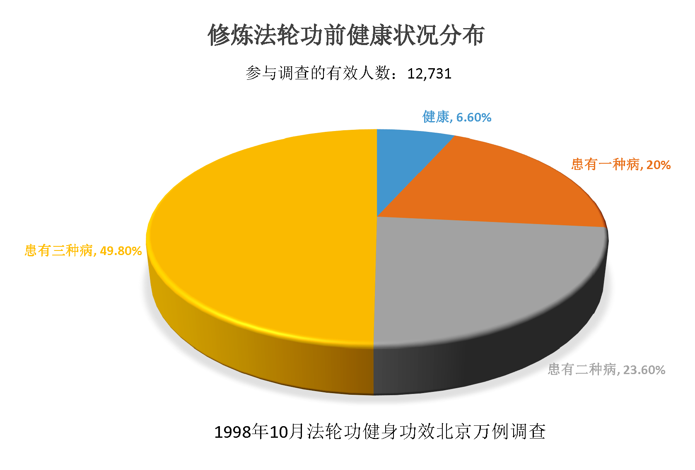
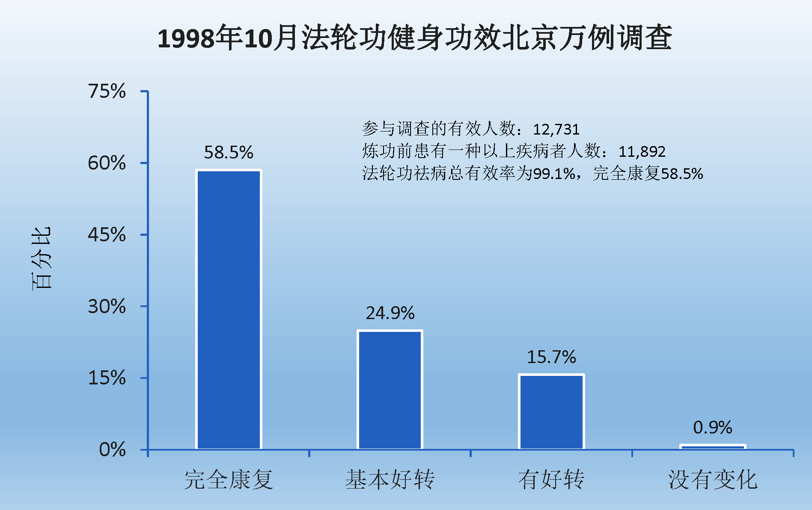

## 五份调查报告显示法轮功祛病健身效果

健康的身体是人美好生活的根本。著名男高音歌唱家关贵敏，演唱及录制过上千首歌曲，曾被评为全国听众最喜爱的歌唱演员，1983年，39岁的关贵敏歌唱事业正达高峰，却意外发现罹患乙型肝炎兼早期肝硬化。为了治病，他休养一年，四处求医，找偏方，并尝试各种气功，但都未见好转。1996年春天，在朋友的介绍下，关贵敏开始学炼法轮功，经过一年左右，身体痊愈了。

汪志远先生曾在美国哈佛医学院工作过，但身患世界五大绝症之一的“渐冻人”病，无药可医，但是参加法轮大法学习班的第一天时就全身舒畅，发生了一系列神奇的现象，如体内滚滚热流涌动，莫名的持续流泪，一路上多次找厕所大量小便等；修炼三个月的时间，身体状况完全恢复正常了，一度6克的血色素（不到正常男子的一半）也都正常了（而人的血细胞周期需要120天！）体重也从110多斤恢复到了150多斤。《波士顿环球报》记者听说此事来采访他，几乎不敢相信自己的眼睛，因为他看到汪志远正在跑步。

在修炼法轮功的人群中，上述事例不是偶尔听到的个别事例，1998年5月15日，当时的中国国家体育总局局长亲赴法轮大法发祥地吉林省长春市考察。1998年9月国家体总抽样调查法轮功修炼人12,553人，疾病痊愈和基本康复率为77.5%，加上好转者人数20.4%，祛病健身有效率总数高达97.9%。平均每人每年节约医药费1700多元，每年共节约医药费2100多万元。下面这几份调查报告或许能给您一个更全面的认识。

### 一、来自北京的调查报告

调查者对北京市五个城区（西城区、崇文区、东城区、宣武区及朝阳区）部份法轮功修炼群众的修炼效果进行了宏观的调查。此次调查共涉及北京五个城区的200多个炼功点，采集到14,199名法轮功修炼者的修炼前后身心变化的对比资料，有效调查人数12,731例。

调查结果表明，修炼前患一种疾病的有2,547人，占20%，患二种疾病的3,004人，占23.6%，患三种以上疾病6,341人，占49.8%，有病人数合计11,892人，占总调查人数的93.4%。修炼后健康状完全康复6,962人，占58.5%；基本好转2,956人，占24.9%，修炼后祛病总有效率为99.1%。

医疗费用节省情况的统计结果显示，被调查人群每年总共可节省医疗费约4,170万元，平均每人每年节约医疗费约3,270元。修炼后体质得到增强者9,871人，体质改善率80.3%；其中体力精力强盛者从修炼前3.5%增加到修炼后的55.3%。修炼前精神负担重和较重者占52.4%。修炼后12,287人精神得到改善，占总人数的96.5%；其中达到“乐观豁达”程度的有7,202人，占56.6%；“有较大改善”3,447人，占27.0%；“有一定改善”1,638人，占12.8%。

参与调查的法轮功学员中有839位修炼前健康无病，占总数的6.6%，修炼后486人体质状况增强，占57.9%。修炼后精神状况有改善者742人，占88.4%。

### 二、来自武汉的调查报告

1998年12月，调查者对湖北省武汉地区的法轮功修炼者进行了调查。涉及武汉三镇的三个地区，50余个炼功点，被调查人数为2,005人，调查方式是以团体普查，随机抽样等方式进行，调查内容分一般情况，修炼前患各种疾病的分类项，修炼后身体健康状况的改变，修炼前后医疗费用的比较，以及三大特殊嗜好（吸烟、饮酒、赌博）的改变。

被调查的法轮功学员遍及各个不同的年龄阶段，由7岁至85岁；遍及不同社会阶层，其中有工人、农民、干部、科技人员等等，包括专家、学者、教授和领导干部；来自各种不同的文化层次，其中以高中、中专、大专、大学、研究生等有文化的比例最大。

2,005名法轮功学员中修炼前患有各种疾病者为1,899人，占94.7%。而且大部份学员都患两种病以上，病案总数为5,323例，修炼后身体健康状况明显改善，症状消失率为75.15%，好转率为23.5%。

修炼前医疗费用有37人每年达到上万元，通过炼功后，身体达到了无病状态，因此绝大部份学员不需用药就医，据统计95.51%的人都没有使用医疗费，为国家和工作单位都节约了大量医疗费用。

2,005名学员中，修炼前吸烟377人，饮酒536人，赌博者420人，共计1,333人，（其中有人具备2-3项）修炼后仅有11人吸烟，10人饮酒，1人赌博共计22人占1%。

### 三、来自台湾的调查报告

2002年12月28日，台湾大学经济系助理教授胡玉蕙发表的一项调查报告显示：法轮功学员修炼后，一年只用一张健保卡者达72%，几乎是修炼前的一半；法轮功对于戒除不良的生活习惯有显著的效果，同时法轮功对心理情绪的帮助很大。

这项学术研究调查是以法轮功学员为例，针对全台法轮功学员，以部落抽样的方式，抽出五分之一的乡镇市区，共回收1182的有效问卷，并以统计分析方法所做成的结论。报告中指出，法轮功对于戒除不良的生活习惯有显著的效果。81%的戒烟率、77%的戒酒率、85%的戒赌率，还有85%完全戒除吃槟榔的习惯。

胡博士指出这项研究也说明了，法轮功对心理情绪的帮助很大：对自己健康状况满意程度，从修炼前的24%大幅上升到78%；对自己日常活动能力的满意度，从修炼前的36%上升到81%。此外有33%在修炼前有紧张、忧郁等倾向，修炼后只剩下不到3%的人有此感受。

### 四、来自俄罗斯的调查报告

2001年4月23日至2001年6月24日，由俄联邦内务部法医研究室的高级法医鉴定专家古罗奇金教授（医学博士）和司法医学检查处的主任鉴定医师-精神科医生斯明塔尼先生组成的调研组对俄罗斯部份法轮功修炼者进行了调查研究，调研项目包括：修炼者的有关医疗证明文件，修炼前后的健康指数，法轮功功法内容，修炼者的日常生活。

调研组采取随机抽样方法，从32名法轮功学员中选取12人进行了调研。调研组的鉴定内容包括：1.身体器官和系统的健康状况；2.调查对象的客观情况和主观意见；3.调查对象的动态精神状况。12名调查对象的状况：3人40岁以下，9人40岁以上；4男8女；修炼法轮功已超过一年的2人，超过2年的11人。

调查对象在修炼法轮功前均患有疾病，其中3人患有胃肠疾病（溃疡和炎症），1人内分泌失调，1人患有呼吸道疾病，8人在家庭和工作关系中有问题，精神抑郁，易疲劳。

调研组在开始调研和结束调研时，运用牛津分析测验理论对调查对象进行了测试，测试其对日常问题的客观反应，观察炼功对解决这些问题的影响。12人中，9人的测试结果是正的，8周的测试期内，测试曲线总增长超过100个点。

对调查对象进行的临床医学检查结果：无病诉，血和尿的化验指标正常，经全面身体检查无病理反应。所有调查对象的精神状况都很正常：精神稳定，积极，反应正确，负责任，容易相处。调查对象的主观意见：修炼法轮功使他们的身心健康得到了改善。

调研组的鉴定结论：1．修炼法轮功的祛病健身效果为75%；2．对法轮功学员的医学鉴定表明，修炼法轮功能使人的身体和精神状况得到明显的改善；3．法轮功对人的身体和精神没有任何危害，是一种可接受的保健方法。

### 五、来自北美的调查报告

受中国大陆1999年7月前的健康调查结果的启发，几位北美法轮功学员在北美做了小规模的法轮功修炼健康调查。调查者将调查表发给部份在美国和加拿大的法轮功学员，共收回235份答卷，其中202份来自美国，32份来自加拿大，还有一份未注明所在国家。参与调查者中有18例在修炼前有吸烟习惯，修炼后全部都戒了烟。从吸烟到完全戒掉所使用的平均时间为4.58天（标准误差值为9.72天）。103例在修炼前有饮酒习惯，100例修炼后戒了酒，2例每周饮酒不超过3杯，1例未填答案。

调查者中230人交回的反馈中有修炼前健康状况的完整资料，226人交回的反馈中有修炼后健康状况的完整资料。从两份完整资料中可以明显看出，224位反馈者在修炼后，健康状况得到极大的改善，占97%以上。并且可以从调查结果中可以看出，炼功时间越长，健康状况改善越明显。

现代医学认为，人的疾病是由社会因素、环境因素及生物因素三方面造成的；这三方面因素在很大程度上是通过精神作用对身体造成影响的，从而导致疾病和不健康状态。由此可见，精神因素在人的健康方面起着至关重要的作用。法轮功修炼的一个突出的特点是要求修炼者把提高思想境界放在首位，要求修炼者在工作、生活中按照“真、善、忍”为准则，从提高人的品德上真正改善人的精神状态，从而使身体达到理想的健康状态。修心加上炼功，这对修炼者身心健康的改善和增强是显而易见的。

除了上述祛病健身方面的神奇事例外，法轮功主要强调道德，使人变得诚实、善良、宽容、平和；还揭示出了人体、生命和宇宙的奥秘，为真正想要往高层次上修炼的人指明了一条光明大道。