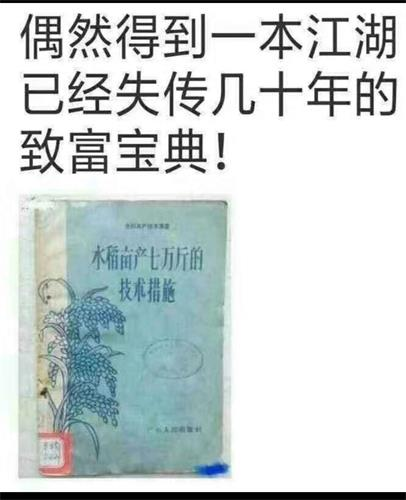
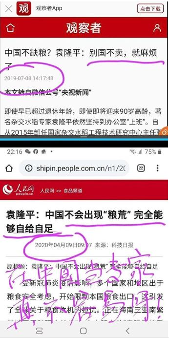
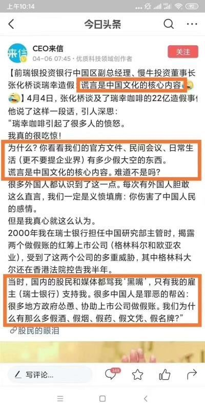

## 从瘟疫看历史 谎言是党文化的核心 

### ——中共不等于中国

“爱国”和“爱党”本是两个完全不同的概念。

文/一言

疫情之中，全球数十亿人口禁足在家，避疫。其中有人在研究料理，有人在偷闲，很多人在家工作，也有很多人在封闭中感到寂寞和焦虑。在中国大陆，各种在家躲避的人群，只有依赖微信群获取外界信息，与人互动、讨论、吵架……这时人们才发现，原来群组里存在那么多的三观分歧。 

通常人们所说的三观是指世界观、价值观、人生观。那么，诸多的讨论、严重的争论和冲突，都是围绕着哪些话题呢？清单比较长，其中比较典型的一部分如下：

1. 新冠是不是美国的阴谋？
2. （武汉作家）方方是好人还是坏人？
3. 留学生该不该回来？
4. 美国、欧洲是不是马上要完蛋？
5. 中国该不该帮美国？
6. 我们成为世界第一是不是指日可待？
7. 外国人不戴口罩是不是自寻死路？
8. 国家该不该发钱？
9. 国家公布的数据是不是真的？
10. 中药到底有没有用？
11. 最近要不要屯粮？
12. 是不是要趁机武装统一某岛？
13. ……

生活在自由社会的人看了这个清单可能会感到无语，不知从何说起，中国人的思维怎么这么奇怪？离谱？是非不分？

其实中国人民并非生来如此，这都是中共这个西来幽灵长期给中国人洗脑造成的。谎言是中共党文化的核心部分。

看两个围绕粮食的经典例子：

#### 1.“亩产万斤”的谎言

有大陆网友分享了一本名为“亩产七万斤的技术措施”的书，并调侃地称其为“一本江湖已经失传几十年的致富宝典”。经历过文化大革命浩劫的几代人，一看就知道，这本书是“大跃进”时期的产物，宣传党的“伟大、光荣、正确”。

中共1949年窃政后，一直处在执政合法性的危机中。中共通过思想改造、三反、五反、镇反、土地改革、肃反、反右等政治运动，给民众养成恐惧和不敢说真话的习惯之后，大跃进就在谎话连篇的党文化背景下发生了。

在1958年开始的“大跃进”运动中，中共搞“全民炼钢”，“亩产万斤，钢产翻番，十年超英，十五年赶美”的荒诞计划，轰轰烈烈，全民大炼钢铁运动造成了人力、物力、财力的极大浪费，严重削弱了农业。1958年8月，山东寿张县高额丰产报告中，提出了“人有多大胆，地有多高产”的口号。

那么当年谎言宣传和无人敢说真话的结果呢？全国大饥荒，不少地区出现了人吃人的现象。

根据香港大学人文学院讲座教授冯客在2010年9月出版的《毛泽东的大饥荒：1958—1962年的中国浩劫史》一书，他用了4年遍阅全国解封档案，查证了大跃进造成4500万中国人非正常死亡。然而直至今日，中共仍用“三年自然灾害”来掩盖大饥荒的真相，从未向中国人认错、道歉，更谈不上赔罪、赔偿。

#### 2.不缺粮的谎言

针对中国著名的杂交水稻专家袁隆平的言论，有人发出了“在中国当专家真不容易”的感叹和嘲讽。为什么呢？

2019年7月8日，在微信公号“央视新闻”中报导，针对“中国不缺粮？”这一话题，原国家杂交水稻工程技术研究中心主任袁隆平被引用道：“别国不卖，就麻烦了。”时光荏苒，光阴如梭，转年到了2020年4月9日，中共官媒人民网刊登了来自《科技日报》的文章，标题赫然写道：“袁隆平：中国不会出现粮荒 完全能够自给自足”。

因中共撒谎手法多端、毫无底线，一时难以求证是袁老先生自相矛盾呢？还是中共假借袁隆平的名义抛出又一个谎言？中国到底缺粮不缺粮？出版《水稻亩产七万斤的技术措施》这本书，缺不缺德？昧不昧良心？

#### 3. 中国为什么那么多假烟、假酒、假奶粉、假药、假名牌、假口罩？

可悲的是，每天浸泡在谎言中的中国人，在很多问题上已经失去了善恶、是非、正邪、道德与否这些基本标准了。从被强制受骗到主动骗人，那是一个个生命走向良心泯灭、道德沦丧的过程。“己所不欲、勿施于人”变成了“人不为己、天诛地灭”。

曾被誉为星巴克最强对手的中国咖啡品牌“瑞幸咖啡”，最近突然发布公告表示，已经成立特别委员会调查内部业绩造假问题，承认首席执行官和部分员工，伪造高达人民币22亿的业绩。消息传出后，很多中国人感到愤怒。

对此，一位前瑞士银行投资行中国区副总经理指出，“你看看我们的官方文件、民间会议、日常生活有多少假大空的东西。谎言是中国（中共）文化的核心内容。难道不是吗？”

中国人如何才能走出中共谎言文化，这是一个亟待解决的问题。困在里面，就会受骗而不自知，骗人而不知耻，骗来骗去把自己和中共混为了一谈；这在中共病毒造成的疫情中，可能就等于拿自己的性命打赌。