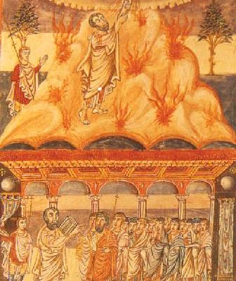

## 从《出埃及记》看退党

——神见羊血记号便“逾越而过”  神清算中共黑帮定会看有无兽记

（文/林风  来源：大纪元）

> 出埃及记的场面，来自英国杜尔的手抄本大型圣经，约9世纪，40.5 x 29公分，现收藏于伦敦大英博物馆

【大纪元2月17日讯】《圣经》的旧约部分，有非常多的历史记载与神谕，亦充满了神在人类的洪荒时代对于人的警告和劝导。

《出埃及记》，在以色列民族中要求每一个小孩必须在八岁以前会背诵的一章经书，其既充满了神的警示又可以说是一本记述以色列民族历史的史书，描述耶和华如何把以色列民族从埃及帝国的手中拯救出来，使他们从埃及的受难奴隶变成神庇护下享有幸福与自由的人的历史过程。见证了上帝耶和华与他的子民立约的详细过程，从中我们可以看到神的慈悲与威严。

历史是那样惊人的相似，当我重读这篇著作时，我感叹于今天的历史正在重复着昨天的故事！

以色列人寄居在埃及，成为了埃及人的奴隶，过着非常困苦的生活，埃及的法老为了控治他们，甚至不准以色列人的男丁存活，有个妇女生了一个男孩，偷偷长到了3个月，无法再藏下去了，最后将孩子放在蒲草箱，搁在河边的芦荻中让他从水里飘走。

命运的安排，这个孩子被法老的女儿收养了，他的名字叫摩西。摩西长大后，一次因为看到有埃及人欺负以色列人，就把那人打死了，这事传到了法老耳里，摩西就逃到了米甸并娶了祭司的女儿。

以色列人的叹息哀求被他们的神听到了，神决定拯救他们，因为耶和华曾经与他们的祖先有约（其实每个民族的祖先都曾与自己的神有约，接受神的恩典，所以至今仍留下许多敬祭神灵的传统节日和习俗）。

一日，摩西为岳父放羊到了神山－何烈山，耶和华的使者从荆棘的火焰中向摩西显现，经书上说“摩西蒙上脸、因为怕看神”实则因为神光焰无际，故不能直接显现。神对摩西说，我的百姓在埃及所受的困苦我看见了，也听到了他们的哀声，我要救他们脱离埃及人的手、领他们出埃及、并承诺把他们带到美好宽阔流淌着奶与蜜一般的富庶之地。故此我要打发你去见埃及的法老，让你将我的百姓以色列人从埃及领出来。

摩西开始还很怀疑，就对神说：“我是什么人竟能去见法老将以色列人从埃及领出来呢？”神说：“我必与你同在，我必伸手施行我一切的奇事。”即使这样，摩西还是没有信心，于是，耶和华在摩西面前教会了他行3种神迹，把手杖变成蛇，蛇再变成手杖；手长出大麻风，再变好；水变成血。即使这样，摩西还是非常胆怯，对耶和华说：“主阿，我是不善言谈的人，就是从你对仆人说话以后也是这样。”耶和华对他说：“谁造人的口呢？岂不是我耶和华么！现在去吧、我必赐你口才、指教你所当说的话。”

摩西听从了神的指示，从米甸回到了埃及，但是他还是反复的怀疑自己的能力，神多次的指导他，鼓励他。由此可见，神要拯救世人必定要选择在人间的使者，而使者也是在神的安排与指导之下一步一步的树立对神的正信。

在埃及，摩西告诉了法老耶和华的旨意，请法老允许他们离开埃及，但是法老非常固执，不肯让他们离开。于是耶和华晓谕摩西等人行奇事，希望法老明白这是神的旨意。《出埃及记》的第七章至十二章，是非常摄人心魄的，摩西在神的帮助下，显现了十次神迹，都是灾难，一次比一次严酷：

开始，摩西与他的哥哥亚伦将杖就变作蛇，法老不予理会。第二天，他们在法老面前举杖击打河里的水，河里的水都变作了血，鱼死河腥，埃及遍地都有了血，埃及人已不能饮河里的水，而法老仍然不予理会。在耶和华的安排下，摩西他们再行奇事，使青蛙遮满了埃及地，宫廷也不得安宁。这时候，法老召来了摩西等人，“请你们求耶和华使这青蛙离开我和我的民，我就容以色列百姓去祭祀耶和华。”果然，耶和华让房里、院中、田间的青蛙都死了，但法老一见灾祸松缓，就食言了，于是耶和华吩咐摩西“伸出你的杖击打地上的尘土、使尘土在埃及遍地变作虱子。”于是埃及遍地的尘土都变成了虱子落在人和牲畜身上。

法老没有动心，耶和华又让苍蝇成群进入法老的宫殿和他臣仆的房屋，埃及遍地因这成群的苍蝇败坏了。法老再次召来了摩西说：“你们去吧 ！”

摩西离开法老去求耶和华，耶和华就叫成群的苍蝇离开了埃及，一个苍蝇也没有留下。然而，这一次法老又硬着心食言了。

耶和华便吩咐摩西再去见法老，并且警告他说，你若还不肯容我们离开，明天耶和华将降瘟疫于你所有的牲畜，法老并不理会。第二天神让埃及的牲畜几乎都死了，而以色列人的牲畜一个都没有死。灾祸之后，法老的心仍然固执坚硬，不肯更改。

耶和华吩咐摩西向天扬几捧炉灰、灰在全埃及变作尘土，尘土落下，人和牲畜身上起泡生疮。法老仍不愿意改变他的决定。

耶和华让摩西告诉法老：“我若伸手用瘟疫攻击你和你的百姓，你早就从地上除
灭了。叫你存立是特要向你显我的大能、并要使我的名传遍天下。到明天这个时候我必叫重大的冰雹降下，这是埃及开国以来、从未有过的大冰雹，现在你要打发人把你的牲畜、和你田间一切所有收回家，凡在田间的无论是人畜，冰雹必降在他们身上、他们就必死。”

从这里我们可以看到，神一次一次的在食言的法老面前，用尽办法晓以利害，给予一切机会劝告他，希望他悔改。

果然，第二天摩西向天伸杖，立刻天空中雷电交驰，雹冰遍地，惟独以色列人所住的歌珊地没有冰雹。法老对摩西他们说：“这一次我犯了罪了，这雷轰和冰雹已经够了，请你们求耶和华，我不再留你们。”摩西离开了法老后，向耶和华举手祷告，雷和雹立即就止住了，法老见雨和雹与雷止住，就越发犯罪，他和他的臣仆都硬着心。于是神再次降灾，让蝗虫遮满地面，埃及遍地、无论是树木、还是菜蔬、连一点青的也没有留下。法老求饶了，但再次食言。神再让黑暗降临，三天之久人不能相见，谁也不敢起来离开家，惟有以色列人家中都有亮光。法老终于同意了摩西带走人，但要他们的羊群牛群留下。这无疑是一个花招，因为在旷野中，人必须有生畜一道才能够生存。

终于，最大的灾难降临了，耶和华决定严惩埃及，这是埃及前所未有的灭顶之灾。与此同时，耶和华还吩咐摩西通知所有的犹太人，当夜各家把羊羔宰了，在自家门框上和门楣上涂上羊血，作为记号，当神击杀埃及所有生命头生的时候，见到羊血时便逾越而过。

到了半夜、耶和华把埃及所有的长子，从坐宝座的法老、直到被掳囚在监里之人的长子以及一切头生的牲畜尽都杀了。埃及人夜间都起来了，举国哀号，连夜法老放行，以色列人都从埃及地出来获得了自由。那一天，他们住在埃及共有四百三十年。

自此，犹太人把每年犹太年历尼散月14日起的七天定为“逾越节”，这是他们最重要的日子。

法老不见棺材不掉泪的心态，那种出尔反尔，完全置国家与民众的生死存亡于不顾的铁石心肠，与今天反复无常、玩弄权术视国家民众利益前途为儿戏的中共当局嘴脸何其相似！更无耻阴毒的是中共明知覆灭在即，自己都不信所谓的“共产主义”了，却要用坑、蒙、拐、骗、逼的手法把一切人拖进党内，从当局目前不准退党，而不择手段逼人入党的局势看，他们其实深信不疑入党就打上了兽记是真的，而有兽记者将被神清算也是真的，邪灵的本性驱使着它们比那埃及法老的心更硬、更残忍、更歹毒，一切的目的都是为了让众生陪葬。

神是慈悲的，给了人最大的机会，用各种天象、预言示人、用人间的灾祸警醒人，如果我们从上面的历史看到当神见到羊血记号时便“逾越而过”，那麽可以肯定当神要清算共产党邪教的时候，是见无兽记者便“逾越而过”。

抓紧抹去邪恶的兽记，赶快退出邪党，别坐失良机，因为神的威严与慈悲同在！