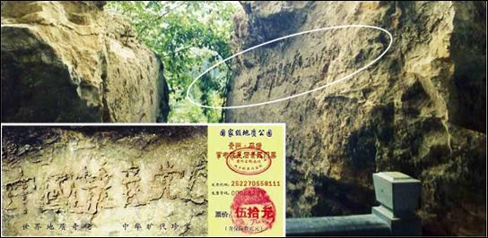

# 躲过大灾难的秘诀

描述人类大劫难的电影曾在全球热映，其中所呈现的灾难场景也许并不是天方夜谭。在人类历史上就曾经有高度发达的文明遭到毁灭的先例。近年来地球生态的剧烈变化，不得不引起我们的重视和思考，在不远的未来它是否还好发生？人类是否有能力脱离冥冥之中的安排？

## 诺亚方舟

> 2011年12月8日，诺亚方舟探索者──美国人丹尼尔‧麦格文 (Daniel P. McGivern)和他的团队在美国国家记者俱乐部宣布，他们在土耳其东部亚拉腊山靠近顶峰的海拔16600英尺的冰层下面发现了两块诺亚方舟的残骸。

这则新闻让“诺亚方舟”——这一个在西方家喻户晓、中国人对此也不陌生的名字，再次回到了人们的记忆中……

这是个古老的故事，述说着一个被遗忘的年代。

> 当时的大地，还是一片繁荣的景象，雄伟的建筑，忙碌的社会，以及那先进的文明。然而，在不久之后，这一切将发生巨大的改变。
> 
> 在繁忙的都市里，一位叫诺亚的市民正夜以继日的建造一艘与众不同的方舟。他一边造船一边搜集各种动物，并将它们安置及饲养在方舟里。
> 
> 除此之外，每当诺亚遇见了路过的人，便急忙的告诉他们：“朋友们，大灾难快要来了，请上我的方舟吧，他可以带我们渡过危难啊！”“大灾难？你…你吓唬人啊！哼，别闹啦。”诺亚急着想救人，但得到的却都是嘲笑与辱骂。
> 
> 就在这个时候，他又回想起当时天神给他的指示——“诺亚，人心的败坏已经到了无法挽回的地步，人们违反了自然及对神的不敬，更是让造物者痛心啊。人们将承受自己所造下的一切。你赶紧建造一艘方舟，为所有的生命留根吧，时间不多了……”这就是诺亚建造方舟的原因。
> 
> 他持续不断地赶工，生怕灾难来临时无法达成他的任务。就在诺亚的方舟刚刚造好时，大地突然风云变色、雷声大作，狂风暴雨从天而降，一场空前的灾难降临了，洪水迅速淹没整个大地，所有的一切都随着这场巨难沉入水底，这时只剩下诺亚的方舟在汹涌的波涛中飘荡着……

这就是西方世界里所流传的大洪水的故事。在世界各地出现的许多文明古迹以及现存的历史资料都见证和记载了人类文明曾多次发生大的劫难。无论是局部性的灾难还是全世界的大灾难，其发生时都有一个共同的特征：人类道德极其败坏。或许正是人类道德的堕落才引来了毁灭性的灾难。因为在神的眼里看这些徒具人的外形却没有人的道德的生命已经不再是人了。这样的生命面临的就是上天的淘汰。

## “危” “机“并存的当代社会

历史走到了今天，整日奔忙的人们可曾停下匆匆的脚步，审视一下当今的社会？

> “金银的光芒遮住了贪图名誉的双眼 处处可见被欲望熏昏头脑的男女 此种罪恶　天理难容 此种屈辱　无法忍受。”

几百年前的法国人诺查丹玛斯在《诸世纪》一书中对堕落的人类社会做了这样的描述。

在《佛经》、《圣经》、我国三国时期诸葛亮的《马前课》、唐朝李淳风和袁天罡的《推背图》、宋朝邵雍的《梅花诗》、明朝刘伯温的《烧饼歌》等都不约而同的提到了末法后期、世纪之交（20世纪末至21世纪初）人类会面临一场大劫难，会淘汰许多已败坏的人，留下好人。

然而，还有一件更大的事，在古代预言也明确指出了，那就是人如何在这场大灾难中获救的办法。

《圣经》上说，人类到末法时期，天上的万王之王要下世正法救人。《佛经》上也说，天上的转轮圣王要下世救人。释迦牟尼预言，当三千年才开一次的优昙婆罗花在人间出现时，就是转轮圣王已下世在正法救人。优昙婆罗花现已发现在世界各地竞相开放，这预示着转轮圣王下世在传佛法，正法和救度众生。（在网上输入优昙婆罗花就可查到）


## 大法弘传 道德回升

法轮大法创始人李洪志先生传出的以“真、善、忍”为最高法理的法轮大法，明确指出衡量好坏的标准是宇宙的特性：“真、善、忍”，让人知道怎样才能使自己的道德回升以及回升的标准，给迷中的人指明了得救的方向。 

自1992年5月法轮大法传出以来，在短短几年里中国有上亿人修炼法轮大法，并迅速传播到世界各地。修炼者身体健康、道德回升，并带动着整个社会精神文明的回升。

- 1998年9月国家体总抽样调查法轮功学员12553人：痊愈和基本康复率为77.5％。加上好转者20.4％，祛病健身总有效率高达97.9％。

- 法轮功所传之处，人心向善，道德回升。《大连日报》1997年3月17日载文“无名老者默默奉献”，报导了一位名叫盛礼剑的古稀老人，利用一年时间，默默为村民修了4条全长约为1100多米的公用道路。当人们问他是哪个单位的、拿了多少钱时，老人说：“我是学法轮功的，为大伙做点好事不要钱。”

- 1993年12月在北京东方健康博览会上，李洪志先生获博览会最高奖“边缘科学进步奖”，和大会的特别金奖，以及“受群众欢迎气功师”称号，在该届博览会上李洪志先生是荣获奖励最多的气功师。

- 1995年1月法轮功主要著作《转法轮》由中国广播电视出版社出版发行，同年1月4日在北京公安大学礼堂举行了《转法轮》首发式。《转法轮》自出版后一直供不应求，1996年1月被《北京青年报》列入北京市十大畅销书。

- 《中国经济时报》1998年7月10日刊载《我站起来了》一文，该文介绍一个曾被301医院诊断为脊椎损伤半截瘫，卧床16年的女士，修炼法轮功后恢复行走……

法轮功靠人传人，心传心，从1992年公开传出，到1999年7月之前短短的七年间，就有上亿来自各个社会阶层、各个领域的民众走入法轮功的修炼。如今法轮功已弘传世界一百多个国家和地区，同时获各国政府褒奖、支持议案和信函3500多项。


## 中共残酷迫害法轮功

然而，法轮功讲的“真善忍”这恰恰是以“假恶斗”为本性的中共邪党最害怕的。

1989年“六四”天安门屠杀之后，中共的意识形态彻底破产，中共已无法用马、列、毛的原教旨主义整合其党徒，而转向了用全面腐败来换取党徒的忠心。此时法轮功学员修炼“真善忍”，展示出来的道德风貌打动了民众尚存的内心善良，引来上亿民众的敬仰，参与修炼，法轮功这面道德的镜子照出了中共的一切不正。

中共邪党前党魁江泽民靠谎报简历起家，以镇压民众而飞黄腾达，以钩心斗角的党内斗争维持权力。在阴暗心理、独裁权欲、残暴人格和对“真善忍”的恐惧与嫉妒等因素的趋势下，1999年7月江泽民利用手中的权力发起了对法轮功的残酷迫害。

从表面上看，在这场迫害中首当其冲的受害者是法轮功学员，但实质上中共邪党是要毁了所有的人，正如被国际上誉为“中国良心”的高智晟律师向整个社会提出的质问：“中共对法轮功群体灭绝罪行是人类共同面对的问题，还是仅属于那些受害者所面临的问题？中共的反人类及群体灭绝罪行，是整个人类文明、人类伦理、人类尊严及道德所面临的威胁，还是仅属于那些被杀戮即被压迫者？” 

十三年来，在中共邪党的疯狂迫害中，据不完全统计：数百万的学员被强迫洗脑；几十万法轮功学员遭非法拘禁，其中有近万人被判刑、十多万人被劳教和秘密监禁、数千人被关入精神病院、强迫注射破坏中枢神经的药物；经确认被迫害致死的法轮功学员已达三千多人。

2006年3月，中共邪党活体摘取法轮功学员器官牟取暴利的罪行被曝光，震惊全世界，西方正义人士称之为“这个星球上从未有过的罪恶”。后据知情人士进一步揭露，在遍布全国的至少36个地下集中营里，中共残忍地活体摘取数以万计的法轮功学员的肾脏、肝脏、心脏和眼角膜等器官高价出售，然后焚尸灭迹，其残暴程度已经超过了“人”的行为。

## 中共罪恶滔天 遭天谴在即

中共是一个做恶没有底线的犯罪集团。它当年在发生大饥荒、饿殍遍野的时候，不但不予救济，反而派出军队封锁道路，禁止百姓逃荒要饭，致使3000多万人活活饿死；在天安门发生民主运动的时候可以用坦克的履带、毒气弹、开花弹来屠杀手无寸铁的学生；在镇压法轮功的时候，制造天安门自焚骗局；活体摘取法轮功学员的器官牟利。对于这个党来说，残忍嗜血、天良丧尽。从隐瞒萨斯病（SARS，大陆称为“非典”）到隐瞒四川大地震的预测不报，民众的死活从来就不是中共考虑的问题。任何苦难都无法唤醒这个本来就没有良知的中共邪党。

### 天降奇石 预言“中国共产党亡”

2002年6月，贵州省平塘县掌布乡一村民，在掌布风景区发现一块巨石，石面上有排列整齐的六个大字：“中国共产党亡”。经三路专家前往考察，这块巨石距今已有2亿7千万年，500年前从高崖上落下来，断成两块，字在右边那块巨石上，清晰可辨。又经鉴定，这些字都是天然形成的，没有任何人为加工的痕迹。当时国内一百多家媒体包括新华社、中央台都有过报道与专题，网上也能搜索到相关照片，当然，它们都不敢提最后那个字，但从照片上可以看出来。

千百年来的中国，在要出大事之前就一定有奇事发生，老天或以瑞兆示吉，或以凶相警世。今天，贵州平塘的“藏字石”是否也在向人们预示着天机呢？突现标语“中国共产党亡”，非同小可，绝非偶然。



### 天灭中共 与每个人息息相关

有人说：“我是个平民百姓，也没干中共那些坏事，所以中共灭亡和我没关系。”

中国共产党不是一个空壳，它是由加入该组织的党、团、队员组成的。中国大陆绝大部分人都加入过共产党、共青团或少先队等组织，自然就是邪党的一分子，而且中国人在加入中共党、团、队时，都对它发誓要把一生都交给它。中共一方面向人们强制灌输“无神论”，另一方面却让人们发誓效忠它，这说明了什么？由于共产党的统治是谎言政治，人们无从看到真相，所以很多人并不了解共产党的本质，并不知道这种党旗下的宣誓意味着什么，也有很多人认为入党宣誓流于形式，是无所谓的事。但是，宣誓的性质并不会因为人认为“无所谓”就变得“无所谓”了。

除了共产党，世界上没有第二个政党要求人在加入时发誓要把生命献给它。

因为共产党是魔鬼幽灵，那么在加入中共党、团、队组织时对共产党宣誓效忠、献身、牺牲，就是向魔鬼幽灵宣誓效忠、献身、牺牲。把生命献给共产党，就是把生命交给魔鬼幽灵的过程，是一个人放弃人性、放弃自由的过程，这个生命就从此成为共产党（魔鬼）的奴隶和工具。这样的宣誓内容是一个卖身的契约，是一个毒誓。

随着毒誓的发出，在人的右手和额头上就会被印上了一个魔鬼的印记，也称为兽的印记（“兽印”体现另外空间的身体上）。

古代预言中像西方的《圣经启示录》、《诸世纪》，中国三国时期诸葛亮的《马前课》、唐朝李淳风和袁天罡的《推背图》、宋朝邵雍的《梅花诗》、明朝刘伯温的《烧饼歌》、朝鲜南师古的《格庵遗录》等都不约而同地谈到了中共的灭亡以及天灭中共时其追随者被一同诛灭的可怕惨景。《圣经启示录》中称，能否抹去“兽印”，将是人人都必须面临的生死之间的选择。而当你声明退出中共“党、团、队”时，你的“兽印”就会被抹去，就不会在“天灭中共”时随它一块遭殃。

中共邪党在迫害法轮功的时候让每个人表态，我们每个人都不妨扪心自问，在善良和邪恶之间，在文明和野蛮之间，你是如何摆放自己的？救人的法轮大法被诋毁、信仰真、善、忍的人惨遭迫害，而许多人被中共邪党的谎言蒙蔽，甚至站到中共邪党的一边，直接或间接地参与对法轮功的迫害。这样的“人”会是怎样的结局？

这就是法轮功学员向世人讲真相、劝“三退”（退出中共党、团、少先队组织）的原因。

在真相面前，人是选择“相信”还是“不相信”；选择“维护”中共邪党、还是“抛弃”中共邪党，那不就是人在选择自己的未来吗。当预言中的大灾难真的降临的时候，这也许就是我们每个人能否平安度过劫难的真正原因所在。

## 平安秘诀

### 洪灾中的奇迹

二零一零年一场特大洪水淹没了吉林市的许多村庄、县城，受灾最严重的要属永吉、汪起两地，无数人瞬间失去了生命。

永吉县城县城附近有一家工厂，七月二十七日晚，老板全家及哥兄弟几人在厂里团聚，天刚亮，家人发现厂院里已经进水了，便大声呼喊：不好啦，长大水啦。老板正帮助家人尽快向高处转移，突然想起账本还在屋里，就告诉家人快跑，自己回去拿账本，当他拿了账本反身出屋时，水已经没腰深，而且还在迅速上涨，他一看自己出不去了，就急忙爬上吊车，这时水已没过了房顶，他被困在吊车上半个多小时，由于惊吓、疲劳，再加上没吃东西，他感觉快要支持不住了。

这时他突然想起以前有法轮功学员劝他“三退”保平安的事（他已“三退”），并且告诉在危难时刻喊“法轮大法好，真、善、忍”好就能逢凶化吉，遇难呈祥，于是他立刻高喊：“法轮大法好！真、善、忍好！”说来真是神奇，这时他就看见水中有三个香瓜向他漂来，他捞起三个香瓜赶紧吃了两个，觉得有精神了，也不饿了。

他想总在这里也不行啊，得出去呀，不一会就看见水中漂来一些成捆的玉米秆，他用手按了按看是否能撑得住自己，一按觉得没事，于是就趴上，一直漂到地势高的一座二楼跟前，楼顶没有上水，他就上去了，在楼顶呆了几个小时，后被家人接走。他告诉家人说：“法轮功太神奇了。”

### 山崩灭村 遇难呈祥

“那是2008年5.12大地震前的中午，我午睡得正沉，突然，有声音在耳边急切的叫醒了我：要地震了，快往村头跑！”重庆市璧山县某镇的一个鞋匠向朋友讲述他所经历的惊心动魄的大地震逃生经历。 

为了养家糊口，鞋匠远走他乡，到北川一个村子做皮鞋。村子坐落在两座大山之间的山脚下，进出村子都只有一条路。 

鞋匠回忆道：“这个声音叫醒了我，我睁眼一看，没人，心想，一定是神仙点化，我没有丝毫犹豫，翻身爬起来就往村头跑去。” 

“当我上气不接下气地跑到村头，就听身后传来震耳欲聋的巨响，我停下来回头一望，天啊！那村子两边的大山突然向中间一撞，好好的两座山居然撞成了三座山！中间那座山把整个村子压在了山底下，再没看见其他一个人跑出来。” 

“我吓得瘫坐在地上，庆幸自己大难逃生。这时回忆起法轮功学员在我回老家过新年时劝我退出中共的少先队组织，他对我说：‘你长期出门在外，退出遭天谴的中共组织，大难来时命能保！’我当时也没多想，就同意了，不想在关键时刻神佛真的救了我，使我遇难呈祥，逢凶化吉。”

### 长了眼睛的大火

【明慧网】三年前的一天下午，一位干部专程来找法轮功学员给他的妻子做“三退”（退出中共“党、团、队”），之前这位法轮功学员已经给他做了“三退”。他向法轮功学员讲述了近期发生在他家的一件神奇事。

他说：“在我‘三退’以后不久，我住的那栋楼房失火了，火从第一单元北边烧起，烧到尽头，拐了个弯，再从我妻子住的后间睡房经过，然后大火再席卷了第三单元，大火所到之处，连房顶都烧塌，一片狼藉。惊叹的是：大火从我的住房（二单元前面一间房）周围转了一个圈，而我住的睡房却丝毫无损。

围观的群众一片哗然：‘这场大火才烧得怪嘞，四周的房子烧得精光。夹在中间的连门都不进。这场火怕是长了眼睛，会认路吧。喂，某某，你是不是会施法呀？……’

别人是不知道其中的奥妙的，可我心里明白：我的睡房可供着大法‘护身符’呢！这也是我‘三退’给我带来的福报。

看着烧毁的其它房间，妻子后悔不已：早知道是这样，悔不该没听法轮功学员的劝告早退出来，喂，你快去帮我退了吧，早退早远离晦气。”

### 遭遇爆炸 安然无恙

二零一零年七月二十八日上午，南京百江液化气站大爆炸，爆炸后方圆好大的区域都是受伤的人，人们哭天喊地的，受伤的人把南京各家医院都住满了。离爆炸最近的地方尸体遍地，都被大火烧焦了。

我的一个朋友告诉我说，她家有个亲戚，那天上午正好到爆炸的地方去办事，由于之前法轮功学员帮他做了“三退”（退党、退团、退队），退出了中共邪党的一切组织，他也相信法轮大法是正法，是救度众生的法宝，并常念“法轮大法好、真善忍好”，身上还带着“法轮大法好”护身符。 

爆炸发生时，他正走在离爆炸不远的地方，只听轰隆一声响，感觉身体好象被人猛地推了一把，摔了个大跟头…… 

等他回过神来可吓惨了，身边都是受伤的人，身上都流着血，可他一点也没有受伤，只是感觉膝盖碰在地上有点痛。他赶紧掏出手机告诉家里发生爆炸的情况，并给那位法轮功学员也打了电话，感谢她让他明白了真相，又给他护身符，感谢大法师父保护了他。

### 当货车冲向了山崖

二零零九年九月二十三日晚七点左右，辽宁省凌源市佛爷洞乡的一位妇女风风火火地来到法轮功学员家，刚进屋她就扑通一声给法轮功师父的画像跪下了，并连连磕头，泣不成声地说：“是李洪志师父救了我男人的命，没有大法师父，今儿我男人就摔死了。谢谢救命之恩！”弄得法轮功学员一时摸不着头脑，赶快把她扶起，问清缘由。

原来这妇女的丈夫叫王福（化名），今年53岁，常年合伙跑运输做买卖，他九月二十三日这天一大清早开车去河北拉货。途经河北磨盘岭盘山道时，货车突然刹车失灵，车体急速地向下滑，前面几百米处就是大深沟，眼看一场车毁人亡的惨祸就要发生，车上三个人都傻眼了，只有抱着脑袋紧闭双眼等死。 

这时王福突然想起平时法轮功学员告诉他在危难时刻喊：“法轮大法好，真善忍好”，就能救命。于是在这千钧一发之际，他使出全身力气大喊：法轮大法好，法轮功师父快救命！ 

话音刚落，急速下滑的车体就像被人推了一把，掉头就往旁边一棵大树撞去，瞬间被大树卡住了。坐在车里的王福刚好是在大树一侧，是最危险的位置，可他浑身上下没受一点伤。另两个人从车下爬了出来，一人撞断了一只胳膊，一人被挡风玻璃碎片划伤了脸，但都没有生命危险。 

单说这个王福，平时法轮功学员向他讲真相他都接受，知道炼法轮功的都是好人，也早就退出了中共党团队组织（“三退“）了，所以在这次车祸当中他平安无事，两个同事也跟着受益了。 

事后这三个人宴请亲戚朋友，庆贺大难不死。在酒桌上，三个人抢着述说全过程，都说是法轮功师父救了他们的命。席间，王福还给亲戚朋友做了“三退”。

### 工地塌方 被埋七天 安然脱险

我是贵州人，那天我在工地上做事，老婆从外地打电话来，叫我记住“大法好”。我还不知是啥意思，就说：“好，我记住了。”

过不久，工地发生了塌方，我和一辆大车被压到地底下去了。没有空气我好难受，心想，我只有四十岁呀，死得太可惜了……昏昏地睡过去了。后来醒了，突然记起“大法好”几个字。就感觉有一线微微的风从我鼻子下流过，象氧气一样，闻了好舒服呀。然后我又睡过去了，不知经过了多少次这样睡醒过程。 

后来我被救出地面，当时人事不知。有人告诉我在地底被埋了七天。七天没吃没喝，连气都没吸的，我还活下来了，那是“大法好”为我输送氧气救了我这条命呀！ 

醒来后我第一件事就是打电话告诉老婆：我被埋在地下七天，今天我还活着，是我念“大法好”才得救的，我身体没受大伤，放心吧！

后来直到我和老婆见面，才真正知道“大法好”是啥意思。 

我以后会永远记住“法轮大法好，真善忍好”，还要让更多的亲朋好友、同事、熟人真正懂的“法轮大法好，真善忍好”是救命的法宝。

```
为什么只要诚念“法轮大法好”、“真善忍好”就会得到大的福报呢？就是因为“人心生一念，天地尽皆知”，在法轮大法遭到诬蔑迫害时，您还能明白是非、支持善良，这就是最珍贵的一念，就会得到上天的庇佑。全国各地因为相信“法轮大法好”，危难时刻化险为夷的例子比比皆是。
```

### 渤海湾遇险记

陈林（化名）是一名海员，妻子因为生孩子落下了一身病，

绝望中炼起了法轮功，谁知一炼竟将病炼没了！从此夫妻俩对法轮功由衷地敬重。

二零零三年七月，他休假期满又要上船了。临行前，妻子象往常一样叮嘱他：“千万记着法轮大法好，关键时刻喊李老师帮助。”

日子过得飞快，转眼三个月过去了。十月十一日，他们的船在渤海湾遭遇了台风袭击。十二日凌晨，风力增强到11─12级。全体船员同心协力，全力以赴，与台风作战，用舵控制船体偏荡。黑夜里，船体遭受着台风猛烈的袭击，同时巨浪强烈地拍打着船体。就在这时，意外发生了：舵机突然失灵！船体随即在飓风骇浪中剧烈摇晃起来，灾难随时会发生！恐怖笼罩着每一个人。

船长让大家做好弃船准备。在这巨浪滔天的茫茫大海上，即使弃船也是难以逃生。求生的欲望紧紧揪着每个人的心。眼前的海况令人毛骨悚然，船员们已失去了冷静。

在这生死关头，陈林猛然想起妻子的嘱咐，双膝跪下，鼓足劲高喊 “法轮大法好！”“法轮大法是正法！”“李老师救救我们！”吼声过后似乎一片沉寂。大家被陈林的举动震懵了。瞬息间，似乎一切都静止了。

突然有人惊喜的喊了一声：“看，风小了！”是的，风浪真的小了！大家开始活跃起来。一小时后，舵机修好。就这样，一场灾难化险为夷。

两天后，他们得知另一艘兄弟船“华源顺18”轮在沧州海域遇难，经沧州市海上搜救中心全力组织营救，全船17人，2人获救，15人失踪……

晚饭时，大家除了为遇难的兄弟船员感到悲痛外，更多的是庆幸和感叹自身的脱险。这时，船长让电报员取来一张打印纸，用记事笔恭敬地写上：“感谢李老师的救命之恩，我们相信法轮大法好！”并签上了自己的名字。随后，全体船员们都郑重的签上了自己的名字。他们把纸折叠好，密封在一个空瓶子里，放入大海。让蓝天作证，大海作证，这是二十二名船员的心声：法轮大法好！

### 救命的一句话

我的丈夫是森林防火护林员，面对的是较艰险的工作，疏通砍伐护林带。

去年五月初一（日食）上午十时，丈夫所在的护林队在组长的带领下正用电动锯砍伐护林防火带，突然天地黑暗下来，骤然刮起一阵旋风，飞沙走石中，大树把高压电线砸断了落在地上，这可是要出人命的大事啊。当时组长拔腿便跑，跑出几步，便大叫一声扑倒在地，组员小刘跟着跑几步也倒在地上。丈夫看到此情景呆住了，急呼：“师父救我！”刚试着跨出半步，脚还未落地，就觉得有一股逆流随脚上下强烈感应，他收回脚，原地站着，却没事。丈夫和另外两名组员小王、老赵吓得一动不敢动。这时丈夫听到一个亲切的声音在耳边说：“不要跑，跳出来！” 

丈夫定了定神，按照声音说的，试着独脚跳出来，跳累了，双脚并着跳出来。这下真神了，越来越感到轻松，没事了，得救了！小王和老赵一看，也一步一步跟着跳了出来，都得救了！丈夫热泪滚滚，哭喊着：“是师父救了我的命！师父救了我的命！法轮大法好！” “法轮大法好！”“得救了！”三个人抱在一起号啕大哭！

后来他们叫来救护车，切断了高压电源，可是组长和小刘浑身乌黑，再也醒不过来了。 

丈夫回家和我说了他经历的生死劫，我真是感慨万千。我修炼法轮功十多年了，从原来的病痛缠身、脾气暴躁，变成身体健康、性情温和，丈夫看在眼里，喜在心里，很支持我炼功。一九九九年七月，中共开始迫害法轮功后，丈夫也曾迷惘、怀疑过。我经常给他讲法轮功好的真相，又有我这个真实的例证在身边，他终于明白了法轮功是好的。后来，他还退出了中共党、团、队组织。

去年春天，丈夫所在五人一组护林队中，组员小王和老赵在丈夫的劝说下明白了真相，退出了中共党、团、队组织，但是组长和组员小刘不相信，也没退出中共组织。一个月后，生死劫难就发生了。（文/秀华）

## 借古明今

### 求雨

1800年春，中国普天大旱，当时清朝的嘉庆帝亲自三坛求雨，虔诚祈祷而雨未至。

嘉庆帝畏天敬神，想到了那个因直言进谏，却被自己借助皇权发泄私愤的洪亮吉。洪亮吉被抓捕、承受牢狱之灾后又被流放新疆伊犁。洪亮吉一片忠心却因言获罪，是被冤枉的。持续大旱，难道是苍天在谴责自己不内省，还加罪于忠臣？难道是失政失德才招致天谴殃及百姓苍生？嘉庆帝开始重新思考对洪亮吉一案的处理，决定还洪亮吉一个清白。于是嘉庆帝降旨释放洪亮吉，并亲自将圣旨手抄一遍，当抄到最后一个字时，嘉庆帝潸然泣下，泪珠掉在圣旨上。就在此时，一声惊雷响彻天空，大雨倾盆而至，旱情顿解，这就是《清史稿》中有名的“诏下而雨”。

相似的历史故事还有很多。《后汉书》中记载：东汉某年发生了大旱灾，皇帝召集太尉、司徒等大臣，亲自来到洛阳的监狱中审查出许多冤案、错案，马上下令予以重新审理，并将罪魁洛阳县令陈歆绳之以法。随即，天降甘霖，持续了三天三夜，旱情终于得到缓解。

还有朱元璋当吴王的时候，江南发生了一场旱灾。当时刘伯温掌管天文，对朱元璋说：天旱是因为有冤狱。后来朱元璋平反了冤案，把错抓的人放了。果然不出几天就下了一场透雨。

临灾自省的文化在中国延续了几千年。天人合一、天人感应是中国古人最基本的宇宙观，如果天垂异象、地现灾兆，古人认为是人间有巨大的冤案，君主刑罚妄加，滥杀无辜所致，帝王都要反省自我、顺应天意。

## 选择未来

### 中共中央党校25名官员退党震惊中南海

2005年5月16日，中共中央党校25名不同部门的官员集体向大纪元声明退出共产党，事件震惊中南海。他们在集体退党声明中说：

> “我们是来自中共中央党校各个不同部门的官员，我们中间有‘老革命’、‘老干部’、‘老党员’，还有中青年在职官员，有正副部级、局级、处级官员，有一般科员和普通官员，也有博士生、研究生等。我们大家都同意借你们的《大纪元时报》退党专栏，刊登我们众多官员的退出共产邪灵的声明。
>
> 其实据我们知道，中央党校2千多职工中，90%党员如果条件允许都会退党。为什么要退党，《九评》讲得很清楚，中共从起家就是以欺骗，谎言，暴力杀人为基础，各种运动杀人、致残少说也有1-2 亿中国人, 确实是邪党、邪教、流氓党。我们其实都是被邪灵附体。为了自己的利益，我们做损人利己的事，使用下流手段，抢夺少数的官位。89年6.4中共残暴无情地大开杀戒，镇压天安门民主运动，我们欠下中国人民的血债。99年7月镇压法轮功修炼者，同样我们欠下亿万中国人的血债。可是我们却获得了邪党邪教的重重奖赏，有了官位，更大住房，轿车、情人，有了更多的老百姓的纳税钱供我们无尽享乐。然而几乎我们每个人都做过噩梦，被五马分尸，被碎尸万段，几乎不能呼吸。我们明白，不能再做这样的恶事了，不能再被中共邪党、邪教、邪灵操控了，我们要从心灵上彻底铲除中共邪恶势力，重新做诚实、善良、正直、勇敢、乐于助人的好人。
>
> 所以我们正式宣告，完全退出中共邪教。我们还呼吁其他的中共各级官员，像我们一样勇敢退党，退出共产党，让中国更早跨进民主、自由、人权、法制的美好富强的国家的行列。”

## 大纪元郑重声明

广大的中国民众：共产党的末日就要到了。但是这个邪恶的党（魔教）在历史上却对众生、对神佛犯下了滔天大罪，神一定要清算这个恶魔。 

如果有一天，神指使人类的谁对共产党清算时，也一定不会放过那些所谓坚定的邪恶党徒。我们郑重声明：所有参加过共产党与共产党其它组织的 (被邪恶打上兽的印记的)人，赶快退出，抹去邪恶的印记。一旦谁对这个魔教清算时，大纪元储存的记录可以为声明退出共产党和共产党其它组织的人作证。 

天网恢恢，善恶分明；苦海有边，生死一念。曾被历史上最邪恶的魔教所欺骗的人，曾被邪恶打上兽的印记的人，请抓住这稍纵即逝的良机！ 

大纪元

2005年1月12日

## ”九评“掀起”三退“大潮

二零零四年，大纪元发表《九评共产党》系列社论，从历史、政治、经济、思想、文化、信仰等层面深刻揭示了中共的欺骗、暴力、邪教和流氓本性，在民间引发了一场波澜壮阔的精神觉醒运动。

到2018年1月24日，已有二亿九千五百万中国民众明白真相后选择了退出中共党、团、队。

据全球退党服务中心信息，有很多中国大陆人士通过境外旅游方式退党，其中有相当一部份是中共各级官员。各大军区的现役和退伍军人也纷纷来函、来电要求退党。

茫茫天意不可违，天灭中共在即，这必将祸及仍然追随中共的人，愿您顺应天意，快快“三退”（退党、退团、退队）保平安！

## 当代预言

### 道人之语蕴天机 七十年后终解迷

我今年八十一岁，这里讲的是我亲身经历的一桩往事。

我娘家住在济南市南部山区。七十年前我很小的时候，就记着家里住着一位修行的道人。此人四十开外，与我父亲年岁相仿。人很善良谦和，他称我父母为小爷爷、小奶奶，称我为小姑姑。 

农忙时，他就帮我家中干些活，闲时就外出行医、化斋，晚上回来也不点灯，在屋内不知做些什么事情。经常说一些古怪离奇的话，我们都听不懂是什么意思。 

在我十二岁那年，记得最深的几件事情：有一天是晴空万里，他却不让我家人外出，但不说为啥。快到中午的时候天气大变，即刻狂风四起，飞沙走石，大树拔起折断，房子揭盖，对面伸手不见五指。大约一个小时左右，天才慢慢放亮，出来太阳。道人说：如果正面碰上这风头，人就会生场大病和扒几层皮，严重的甚至连命也难保。 

这一年大旱，入伏的头三天才下雨，村里人都赶快抢种，道人却不让我们家种，他说：“咱家播种用的东西先借别人使用，他们用完后，咱们再用也不迟。”原来是三天后，又下了一场更大的雨，种上的也白种了，全让雨给冲坏了。大雨过后，地里很湿，他却催着赶快种，再不能耽误，否则种的庄稼就不好出苗了。

还有一次我家叔叔结婚，道人跟我爷爷商量：“家里大喜的日子，能不能叫我师父也来喝个喜酒？”爷爷说：“你来家这么多年了，也未见过你师父，快让他来吧！”到了结婚的那天，直到客人都走了，家里人也没见到他的师父。爷爷问他：“你怎么没把你的师父请来？”他说：“早来了，只不过人看不见他。” 

过了几年，道人对我父母说：“我要走了，我不能在这里修行了，家里如果有事需要我帮忙的时候，可点上一根香叫我的名字。”家里人似信非信。 

又过了一年，父亲背后长了个恶疮，花了很多钱也治不好，这才想起了道人，想起了他说的话：“点一根香叫我的名字，我就到……”但他毕竟是个人，能有这么灵验吗？家里人也顾不得这么多了，试试吧。晚上奶奶拿了一把香在院子里点上后，叫着道人的名字快来。当时是寒冷的冬天，天还没亮的时候听见有人敲门，开门后一看是道人，只见他满头大汗，棉衣都被汗浸透了。第一句话就问家里出了什么大事？母亲把父亲的病情说了。他看了看父亲的恶疮后说没事，好治。然后把恶疮挖掉，上了药。第二天，父亲就能下床了。吃饭的时候他对我父母说：“以后你们再不能给我打信了（就是烧香），我可承担不起一把香这样的礼仪。”

他临走时父亲问他什么时候再回来看我们？道人说：“等山上有了楼、井里水淌到家、灯头朝了下、山剩半边、人死后没人埋的时候，我再回来看你们。那时大变样，恐怕小叔叔和小姑姑能不能见着面还很难说。”父母听完后，脸色都变了，说人死没人埋，这不是场人间大灾难吗？就没有解此难的办法吗？经父母多次追问后，道人才说：“脸上有印看不见，抹去印记度劫难。”全家都深深记下这些话来，就是难解其中的意思。

七十年后的现在，道人说的前四句话都一一实现了，现在山上山下都有楼房，井里的水也淌到了家（因以前都是到水湾里、井里去挑水喝），灯头朝了下是指的电灯，以前都是用的油灯，所以灯头是朝上的。因为我们这里是山区，但过度开采，山没有完整的，多数是半边。只有“人死后没人埋”这句还没应验。可我也始终没有解开“度劫难”那两句话，还是迷。我经常给孩子们说这件事，他们都不信，还不让我说这些话，说到时候人家怎么办咱们就怎么办。 

不久前有一天早上开门时，门缝里夹着一张单子，我就让孩子们念给我听听上面写的是什么。当我听到“大纪元”三个字时，我忽然想起了道人原先常说大纪元是研究天象变化的。当念到上面写着：“老天要灭共产党，凡是举手入过党、团、少先队及作恶多端的人，脸上都带有印记，眼前面临一场大灾大难，要想度过这一场大劫难，可用小名、别名、化名，向大纪元声明退出即可，就能抹去脸上的印记，保平安。”我又想起了道人说“脸上有印看不见，抹去印记度劫难”的话来。这一张法轮功真相的单子一下子给我解开了七十多年解不开的“迷”，怪不得法轮功的传单让大家退党、团、队，原来是在救人，让大家保平安啊！ 

我们全家明白后，都一一照办退出了党、团、队。我今天也为了救人，才叫孩子们写出这桩事来。别错过时机，当灾难真的到来，后悔晚矣！不要拿自己的生命开玩笑啊！ 

七十年前的道士预见了现在的人和事。我已经是八十多岁的老人了，如今也是子孙满堂。也希望各位父老乡亲们都能平安无事，明白“宁可信其有，不可信其无”的老话。