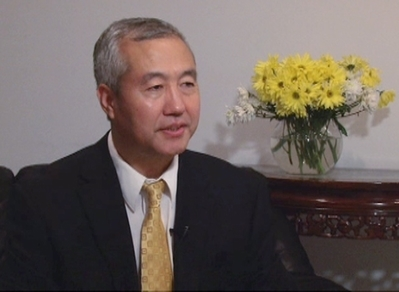

## 哈佛医师的医学神话：“渐冻人”神奇康复

在世界著名的学府哈佛医学院有一位身患渐冻人症的学者，他叫汪志远。他没有藉助任何现代医疗方法，轻而易举地战胜了这种疾病。图为汪志远先生近照。（大纪元资料室）

---

“上世纪80年代初，我不幸得了一种绝症，叫“肌萎缩性脊髓侧索硬化症”，也就是最近大家都在谈论的‘渐冻人’。不到3个月，体重就降了32斤，上楼走几 步就头昏乏力，记忆力严重减退，经常想不起自己住哪儿。我四处求医，有幸碰上了法轮功，修炼才几天，各种不舒服的症状就消失了，从早到晚总感觉自己被一股 热流包着，暖暖的、特别舒服。大概3个月后，身体完全恢复了。”昔日的“渐冻人”病患、哈佛大学学者汪志远先生如是说。

在全球流行“冰桶挑战”大接力、为渐冻人协会筹款的今天，发生在汪志远先生身上的奇迹，再次引起人们的关注与好奇。

### 渐冻人 人世间绝症之一 医学无解

渐冻人，学名“肌萎缩性脊髓侧索硬化症”，是一种因运动神经功能受损、造成进行性肌肉萎缩的罕见疾病，与癌症等并列世界五大绝症之一。现今的医疗手段，只能减缓肌肉萎缩的速度，却无法治愈，患者平均寿命才3～5年。

对于许多人，“渐冻人”或“肌萎缩性脊髓侧索硬化症”是个非常生僻的医学名词，但如果提到只能靠移动眼球控制电脑的著名物理学家霍金，人们就不陌生了，他就是一个“渐冻人”。

### 患绝症 汪志远痛苦万分 求医无效

那么本文提到的汪志远先生是如何神奇地摆脱绝症，一直健康快乐地生活着呢？采访中，汪志远先生颇为感慨地说：“要不是修炼了法轮大法，我可能早就不在人世了，即使活着，也肯定是生不如死。”

上世纪80年代初，汪志远先生不幸患了渐冻人症。得病后，150多斤的体重，不到三个月就降到118斤，从一楼走到二楼都头昏疲乏，出门就要坐车。记忆力严重减退，连自己家的地址都经常忘记。

身 为医生的汪志远非常清楚自己患的是绝症，但求生的欲望，还是使他四处求医。“我造访了当时中国有名的医院专科和专家，”他说，“比如北京的301总医院、 四川的华西医大，军队的三医大、四医大等。我本身是四医大毕业的，我的很多朋友、同学大部份当时已经做到主任、副主任以及教授、副教授，我太太又是从事这 方面研究的神经内科主治医师，应该说医疗条件很方便，但都没有办法。除了这个之外，我还求助于中医和气功，也都没有结果。”

随着病情的发展，汪志远的身体越来越差，先后患了十二指肠溃疡、肠炎、尿路结石等，1994年、1997年两次上消化道大出血。尤其是1994年那次大出血，出现了休克，血色素只有6克，不到正常标准的一半。汪志远先生游离于生死线上。

### 到美国 哈佛大学无有良方 大法救命

1995年，汪志远先生到了美国，在哈佛大学的一个心血管研究中心工作，同时期望找到医治方法。他认为哈佛医学院是世界一流的医院，很多最尖端、最新的成果都是从这儿出。但是令他失望的是，这里也没有根治渐冻人症的办法，他感到没有希望了。

然而，就在他感到绝望的时候，一个崭新的天地展现在他眼前。“1998年2月份的一天，”汪志远先生回忆说，“一个朋友告诉我法轮功很好。我很快找到了法轮 功的义务教功点，参加了九天学习班。在第一天看李洪志老师讲法录像时反应非常明显，后背不时感到有一股股的滚滚热流通遍全身。听课前忙碌工作了一天很疲 倦，头脑昏昏沉沉的。听课中有时打瞌睡，可是听完课，回家的路上，才发现眼睛是那么的亮，头脑是那么的清晰，全身感到一种多年不遇的轻松舒畅。”

炼功才4、5天，令他非常痛苦的胃肠症状就消失了，而且身体其他不舒服的症状也没有了。对于当时的身心感受，汪志远先生说：“从早到晚总感觉自己被一股热流包着，暖暖的、特别舒服。大概三个月后，身体完全恢复了。不只是说症状消失了，而且体重增加了，精力恢复了，记忆力各方面都恢复了。精力、体力出现了20 多年没有过的良好状态。法轮大法给了我新生。”

汪志远先生红光满面地对记者说：“我修炼法轮功之后的血色素从6克恢复到正常。想想看，从医学上来讲，这个血液的红细胞地生长周期是120天，我才炼功90多天，还不到100天，就完全恢复了，真是奇迹。”

自从修炼法轮功后，汪志远先生的身体越来越好，精力充沛。他说：“我现在每天只睡4、5个小时，工作时间超过10个小时。我今年63岁，身体感觉越来越年轻，走路、爬山都不输年轻人。”

谈到最近流行全球的“冰桶挑战”慈善活动，他表示很好，对人们了解“渐冻人”很有帮助。“但是，”他说，“现代医学还有很大局限，对于许多病还是素手无措。如果人们能通过修炼法轮功获得一个健康身体、达到一个高尚的精神境界，那就再好不过了。”

### 法轮功 祛病健身效果超常 不胜枚举

除 了汪志远先生，类似的奇迹也发生在许许多多的法轮功学员身上。比如，著名男高音歌唱家关贵敏先生。39岁时，他被诊断出乙型肝炎兼早期肝硬化。为了治病， 他休养一年，四处求医，找偏方，并尝试各种气功，均未奏效。1996年春天，在朋友的介绍下，他开始修炼法轮功，身体很快痊愈。至今，已经70岁的关贵敏 先生仍是神韵艺术团的男高音歌唱家。

另一个典型例子是原北京301医院（解放军总医院）院长李其华。他的妻子患重病几十年，但身为医学专家 和医院院长的他，一点办法没有。但自他妻子修炼了法轮功后，很快疾病全消。李其华惊讶于法轮功强身健体的神奇效果，于1993年也开始炼起了法轮功，而后 他自己一身的病也不药而愈，身体越来越好，亲身经历了这一切，李其华深有感触：法轮功是真正的更高的科学，愿人们平心静气地读一读《转法轮》，炼一炼法轮 功。

1998年9 月中共国家体育总局抽样调查法轮功修炼者12,553人，调查报告显示：疾病痊愈和基本康复率为77.5%，加上好转者人数20.4%，祛病健身有效率总数高达97.9%。

这 份调查报告在结尾处写到：“法轮大法修炼人群中的这些奇特的现象与事例，已远远地超出了现代医学所能认识的范畴，法轮大法这一超常的科学现象值得我们医学 界和科学界的深思和探讨，这对于提高全人类的健康水平和文明进步有着十分积极的意义，也为科学的进一步发展提供了一个全新的方向。”

### 结语

现代医学认为，人的疾病是由社会因素、环境因素及生物因素三方面造成的。而这三方面因素在很大程度上都是通过精神对身体造成影响，从而导致疾病和不健康状态。那么如何解决这个问题呢？

对 此，汪志远先生说：“法轮功修炼的一个突出特点是要求修炼者把提高思想境界放在首位，要求修炼者在工作、生活中以‘真、善、忍’为准则，提高人的思想品 德，从而使身体达到理想的健康状态。修心加上炼功，这对修炼者身心健康的改善和增强是显而易见的。”不仅如此，修炼法轮功还可以使人戒除不良嗜好，改善人 际关系，从而产生良好的综合社会效益。