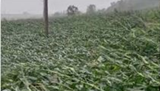
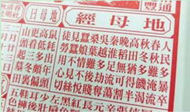
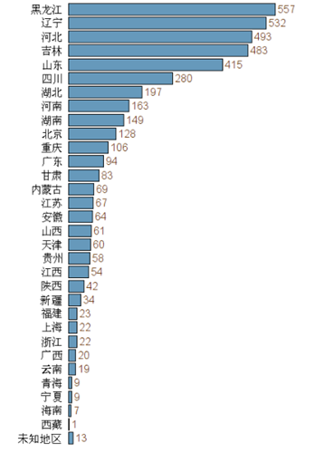
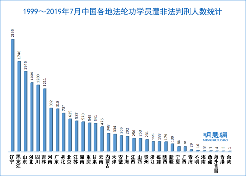

# 台风暴雨席卷东北意味着什么（图）

文: 山林　　

【明慧网二零二零年九月十三日】最近，东北地区在半个月内三次遭遇台风侵袭，“巴威”、“莎美克”、“海神”相继登陆，风力达到八九级，从黑龙江省鸡西市经过时，瞬间风力达到12级，居民屋顶被掀翻，连大树都被成排刮倒。

法广等媒体都报道，今年的台风行踪诡异，它们过去几乎每年都在台湾和中国东南沿海一带肆虐，但今年却纷纷改道——今年到目前为止还没有任何台风侵袭台湾，反倒是10天内三个强台风都直接北上，侵袭过去几乎与台风无缘的东北地区。网络上，有人诧异地说，台风难道长了眼睛？！

9月3日推特上民众发布的两个影片显示，黑龙江省海林市发生洪水，桥梁被冲毁，很多房屋被淹；狂风在吉林省延吉市掀翻大厦屋顶、折断大树，暴雨使路面积水；黑龙江多地学校停课，哈尔滨机场班机延误，107个航班被迫取消。

由于东北地区正处在农作物产量形成的关键阶段，狂风暴雨导致农作物倒伏、农田积涝、农业设施和经济林果受损，对今年粮食等农作物的收成会造成重大打击。

**粮食将减产**

中时电子网9月4日引述台湾气象专家吴德荣表示，“海神”的台风眼正在变得越来越清晰，其强度也在快速增强中，可能会成为今年第一个超强台风，香港天文台预测其中心风力会加强至时速220公里。时事评论员陈云指，届时产粮区东北的农作物将再次被摧毁。

东三省是中国粮食主产区，稻谷、玉米产量在全国占比超过1/3.这次台风经过的地区，稻谷、玉米成片成片地倒地，而且有些是根茎折断，不能再生长了。

更糟糕的是，多日连续暴雨把土地都泡松了，收割机进不了田里，玉米泡在地里会被捂、发芽、发霉，不能再用。眼看就要秋收的粮食烂在地里也没什么办法，很多农户今年种粮会赔本。

 

> 台风暴雨侵袭　粮食成片倒伏

网上有不少台风侵袭的视频，拍摄者称：“看我这地，完了，彻底完了。我家房后面的地全部趴窝，没有一家剩下的。”“一场台风来了之后就这样了。农民苦农民累，农民忙了一春又一夏，最后结果是这样，真心寒啊，全倒了。全倒了，没剩下的。白忙活了一年，老百姓真不容易。”

遗憾的是，至今很多人还没意识到这场灾难和自己有什么关系，因为灾难没有发生在自己身边，更没发生在自己身上。

7月新疆发生疫情的时候，人们觉得和自己无关，结果西瓜涨价了，因为疫情后封路，新疆的瓜果运不出来；8月山东大雨，人们觉得跟自己无关，结果蔬菜涨价了，因为山东是华北地区主要的蔬菜基地；现在东北刮台风，人们觉得和自己无关，但是玉米和小麦的批发价格已经上涨，只是粮食问题还没有到每家每户的门口。

**《地母经》预言：秋冬季将出现饥荒**

那么，今年的秋粮会减产到什么程度呢？中共官方数字向来是乐观的，即使南方洪灾、河南旱灾，官方依然称粮食丰收。但与此同时，官方也在不断释放节约粮食的信号，人们该相信什么呢？

让我们来看看中国古代的预言。黄历是古时的中国农民历，又称为黄历通书，是非常亲民的“日历”，伴随中国人走过了几千年。黄历里普遍都有春牛图和《地母经》，也称《黄帝地母经》，它是一种预言诗。《地母经》是以六十甲子循环排列，每一年配一诗一卜，主要预言该年农作物生产情况，也旁及该年的时运。

《地母经》对2020庚子年的预告是：诗曰：太岁庚子年，人民多暴卒。春夏水淹流，秋冬多饥渴。高田犹及半，晚稻无可割。秦淮足流荡，吴楚多劫夺。桑叶须后贱，蚕娘情不悦。见蚕不见丝，徒劳用心切。卜曰：鼠耗出头年，高低多偏颇。更看三冬里，山头起墓田。

开头一句“太岁庚子年，人民多暴卒”指出了庚子2020年整个年运，这一年民众会突然死亡，死亡的人数很多。“春夏水淹流”预言了今年的洪灾，“秋冬多饥渴”则预言秋冬将发生饥荒。

 

> 《地母经》对2020庚子年的预言

那么，灾难何时是个头儿呢？《地母经》预言，在2020年望不到灾难的尽头。预测明年辛丑年如下：诗曰：太岁辛丑年，疾病稍纷纷。吴越桑麻好，荆楚米麦臻。春夏均甘雨，秋冬得十分。桑叶树头秀，蚕姑自欢欣。人民渐苏息，六畜瘴逡巡。卜曰：辛丑牛为首，高低甚可怜。人民留一半，快活好桑田。

 

> 《地母经》对2021辛丑年的预言

大意是：2020年底接2021年初，另一波疫情将卷土重来，会有很多人死于疾病。活下来的人将迎接新的纪元，长江下游地区的农业将有好转，春夏时节雨水充足，农作物成长将良好。百姓们终于能够缓口气，但是家畜可能会有一波大淘汰，流行病将在家畜中流行，届时会有很多动物死亡。

**东北为何遭大灾**

庚子年灾害不断，从疫情到洪灾、旱灾、蝗灾、台风，其严重程度都是几十年不遇的。东北在秋季能连续遭受台风暴雨也是极为罕见。其实，没有什么事情是偶然的。

我们讲“天灾人祸”，往往把“天灾”与“人祸”分开，比如说这场台风是天灾，并非人祸。其实，这二者是有关系的，这就像说人的精神与物质一样，看似不同，其实都有连带关系。古人讲：七分精神三分病，就是说物质和精神是一体的。灾祸也是一样，万物有灵，瘟神有灵，风神、雨神也有灵。

所谓福祸无门，唯人自招。人做不好的事情就会造业，招致灾难。中国古代讲：民为贵，君为轻，社稷次之。推行德政、爱民保民是帝王的天职。帝王若不能保民而致四海困穷，帝王的天禄就要被上天神灵永久终止，就会招致天灾人祸，百姓也会跟着遭殃。

那么，东北的政府做得如何呢？大家都知道这样一句话，投资不过山海关，这是很多人吃亏之后得出的结论，足以说明东北的政治环境、法制环境有多糟糕。政府前面招商引资，背后“关门打狗”，振兴东北成为一句空话。公开声明退党的前黑龙江省鸡西市副市长李传良认为，民企不敢去投资，最主要的原因还是在于中共体制从上到下都腐败。

2016年9月辽宁省人大代表贿选案震惊全国，成为中共建政以来查处的第一起发生在省级层面的重大恶劣案件。在当辽宁省委换届、省人大常委会换届、省全国人大代表换届的三次选举中，连续出现违规提名、身份造假、拉票贿选现象。辽宁省政法委书记苏宏章、省人大副主任王阳、郑玉焯等都是通过拉票贿选当选。最终， 955人被查处，45名辽宁省全国人大代表当选无效；454名辽宁省人大代表被终止代表资格。这种官官相护的黑帮政府怎么能代表人民的利益，顾及人民的生死呢？

**迫害法轮功造大业**

东北的这种恶劣的社会生态是怎么造成的？任何事情的发展，都不是一天形成的，而是有一个过程。在数十年前，东北曾是中国重工业基地，素有“辽老大”之称，一度是国内就业、人口流动的热度省份。

然而，从1999年开始，东北的整个法制环境、社会生态被破坏与撕裂了，一位中共体制内的人士说，从2000年开始，东北公检法以及官员都明白一个事儿，要想有政绩往上走，就得打击法轮功。

沈阳马三家劳教所成为司法部转化法轮功基地，成为全国学习的样板，而法轮功的发源地吉林，更是成为迫害最严重的地区。

东三省是迫害法轮功的重灾区，辽宁、黑龙江对法轮功学员非法判刑的人数最多，黑龙江迫害致死的法轮功学员人数最多，开办的洗脑班数量全国第三。对法轮功学员酷刑迫害、强制转化、强迫但奴工，犯下了不可饶恕的罪业。

 

> 各省市被迫害致死的法轮功学员人数，黑龙江最多

[ 

> 非法判刑人数，前三位是：辽宁、黑龙江、山东

法轮功是佛家上乘佛家大法，1992年从吉林传出，后传遍全国。1999年7月20日镇压之前，法轮功学员大约1亿人，比中共党员人数还多。江泽民集团出于嫉妒，开动国家机器对法轮功进行诬陷诽谤、镇压迫害。

臭名昭著的辽宁马三家看守所、黑龙江女子监狱、吉林女子监狱对法轮功学员进行了惨绝人寰的迫害。法轮功学员于松江自述他在黑龙江省建三江青龙山洗脑班的遭遇时说：“警察说要用对付间谍的办法使我精神崩溃！”

于松江在自述中描述：金言鹏用牙签支着我的眼皮，我不自禁地闭了一下眼睛，牙签折了。盛树森这时进来叫喊着：“不能叫他睡觉，今天就是不能让他睡，不写就不许休息。”莫振山也说：“不能让他休息。”盛、莫叫几个人打开手机放音乐。莫来到我的面前说：“小于子，你写了三书就可以回去了。不然你是过不去的，就得判刑。”这一夜我被迫害休克了三次，但是休克的过程中他们始终不放过我，就是连踢带打、带踹，金言鹏骑在我后背上，上下颠……

金言鹏、盛树森、莫振山是谁？用黑龙江省某负责人的话说：“这都是一群人渣，共产党用这帮玩意，倒台快！”盛树森曾对女法轮功学员说：“如不放弃信仰就扒光衣服，找几个老光棍强奸你。”还有一个叫付彦春自己说：“我是牲口，不是人。”他还说：“我这里就是流氓集团！”中共就是在用这些人中败类来迫害修炼“真善忍”的法轮功学员。

 

> 律师们呼吁取缔建三江黑监狱

2014年3月，因建三江公安局警察将多名法轮功学员被绑架到黑监狱——青龙山洗脑班，被害人家属、亲友与聘请的律师到青龙山洗脑班要人时，四位律师及七名法轮功修炼者、家属遭到绑架、酷刑折磨，这起案件引起国际媒体关注。后四位律师被非法拘留十五天，王燕欣、李桂芳、孟繁荔、石孟文等四位法轮功学员被非法起诉。而中国外交部发言人则否认中国存在“黑监狱”。

类似的迫害案例不计其数。近期以来，东北一些地区，加重了对于法轮功学员的迫害，声称举报法轮功学员者可奖10万元奖励等等，大连地区出台的文件把干部政绩考核与迫害法轮功挂钩，整个社会的法制、执法的底线，就这样被摧毁了，连修佛的人都敢残害，还有什么事不敢干呢？

这些不明真相的人在江氏集团的错误命令下迫害好人，冥冥之中已经犯下大罪，有些人已经遭到恶报。这次疫情当中，东三省虽然没有遭到湖北那样严重，但是这三场强劲的台风暴雨波及面甚广，造成的损失非常大。只是受灾的形式不同而已，本质上都是上天在警告世人，三尺头上有神灵，人在做，天在看，作恶就会遭到天惩，只有信奉“真、善、忍”才能得到神佛的保护。