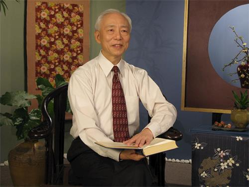

## 医者的修炼之道：完全相信大法（图）

【明慧网二零二零年九月十九日】（明慧记者沈容采访报导）银白的发丝、从容的姿态，鹤发童颜，笑容可掬，他是已过古稀之年的胡乃文医师，心安理和全写在脸上。胡医师视病人如亲人、医术精湛，许多病人四处寻医后，才在他的诊断下找出真正的病因。多年来，慕名求诊、远道而来的病患纷至沓来，但胡医师却表示他在法轮大法面前，只是个幼儿园的学生，完完全全相信大法，听师父的话。

图：胡乃文在不断实修中体悟到修命与修心、道德和健康的直接关系，他表示整个看病的过程就是我修炼的过程。

胡乃文的人生之路在念高中之前仍很模糊，他从没想过未来的有一天会步入杏林。“以前还不知道自己要走哪条路，读高中时分甲乙丙组，我连自己要读哪一组都不清楚，只是随着要好的同学来选择，你读丙组那我就读丙组，慢慢的，也就越读越有兴趣了。”

大学时，胡乃文研读生物学，研究所主修神经科学及内分泌，毕业之后则投入药理学，并被单位派去美国史丹佛研究院（SRI international）从事生命科学领域的研究。他回忆道：“我在美国的研究院里那段时间，常在图书馆里查询当季最新的研究资讯、科学文献，发现中国医学提到了一种治疗方法叫针灸，我是学西方神经科学的，心想神经和针灸一定有所关联。”

回到台湾后，胡乃文开始钻研针灸，并进一步深研中医，从针刺之术到黄帝内经，望闻问切，经络气血，仿佛踏进一个崭新的天地，收获五千年神传文化的奥秘。当他考上中医执照时，胡乃文已届不惑之年。

“其实我自小身体就不好，即便是青壮年最有活力的阶段，也总是脸色蜡黄、空虚乏力，常因心情紧张以致肠胃不好而苦恼。学西方医学时，曾摄取很多营养药剂、健康食品，常常吃也没啥用处。当上中医后，也开始服用中药调理，表面上好像维持得还不错，但我很清楚自己的身体状况是非常差的。”

在中西医皆感无效之下，胡乃文转而接触各门各派的气功，希望借此自我锻炼、提高身体素质。“我就到处去转，四处去看，终于在接近五十岁的时候，听到当时一个气功班上的同学提到了‘法轮功’这个名词。当时人们几乎不知道有法轮功在传，我不断地打听询问，终于在一九九六年时，找到一位学过法轮功的老先生。”

**从一个好人做起**

一九九七年初，胡乃文上完法轮大法九天学法教功班，十一月，他第一次亲眼见到了李洪志师父。“那一年，师父来台湾三兴国小讲法，我看到师父在那么忙碌嘈杂的环境当中，一直不愠不恼、平静祥和。师父叮嘱我们不管在生活当中、工作当中，都要按照‘真、善、忍’的标准做一个好人，要从好人做起、按照高层次的法修才能修成。”李洪志师父慈悲宽厚、浩然正气的风范一直烙印在胡乃文的心中，自此之后，他便时时刻刻要求自己做一个好人，一个实践“真、善、忍”的修炼人。

渐渐的，他发现自己过去时常犯的毛病不见了，因紧张烦恼、发怒焦虑导致的肠胃宿疾也消失无踪，不仅精神越来越好，智慧更仿佛涌泉般源源不绝，对许多艰涩的医学古籍也有了更深的理解和领悟。

“一直到学了大法之后，我才明白不管是针灸也好，中医也好，都是中华古老文明的智慧结晶，完全领先最尖端的西方医学。而法轮大法则远远超越这一切，不是气功，不是宗教，而是‘修炼’。”“修炼”是人类文明中一个渊源久远、奥妙无穷的领域，法轮大法明白揭示人体、生命及宇宙的深奥法理，更使胡乃文在不断实修中体悟到修命与修心、道德和健康的直接关系。

**病由心造　境随心转**

胡乃文表示：“在我刚得法没多久，就遇见一位老太太来找我看病，她是一位基督徒，每天都要祷告，我问她祷告忏悔时都说些什么？她说我和上帝讲今天和谁发脾气了，明天又和谁不好了。当时我立刻想到师父讲的一段话：‘有人说：这个忍很难做到，我脾气不好。脾气不好就改嘛，炼功人必须得忍。’[1]”

要想治病，得先治心，抒开心结，再谈病情。“于是，我和那位老太太说，我们讲的忏悔啊，您是不是每天忏了却没有悔呢？忏而不悔，悔而没改，就等于零。没想到老太太把我的话听进去了，流下许多眼泪；下次回来看诊时，包了一个好大的红包，告诉我她回家后改了乱发脾气的坏习惯，竟然让她的病完全好了。这个真实案例让我证实，所有的病如果都能用大法法理来实践衡量，那么人所称之为的‘病’，其实什么也不是了。”

病虽由心造，境也随心转，若能在苦中修去人心、升起正念，也就能从病痛中破茧而出。胡乃文说道：“有一些病情，包括闻之色变的癌症，从中医理论来讲，可能是情绪过度喜、过度怒、过度惊、过度恐造成的，这些喜怒忧思悲恐惊的波动，也都是因为人的名利情放不下，进而牵引万病丛生。所以当和病人谈及病情时，在低层次上我会告诉他们是生活习惯不当、养身方式不对所导致，但若能在高层次上让他们放下内心的欲望和执著，病人的‘病’反而就好了。”

病痛的本身不是问题，面对病痛的心境才是关键，胡乃文也提到自己经历过的“病业关”。他说：“有一天我睡觉醒来时，发现一只手一只脚不能动了，又麻又没有力量。若照医学常识判断，这当然是很不好的状态了。刚开始，我的确很害怕，但我努力清除这些感受，大喊师父救我、师父救我！一阵子过后，这样的状况便消失了。之后再发生同样情况时，我体会到不能让师父操心，就想到师父在法中说：‘欠债要还，所以在修炼的路上可能要发生一些危险的事情。但是出现这类事情的时候，你不会害怕，也不会让你真正的出现危险。’[1]于是便想着没事、没事！这个状况也平安过去了。”

**相信大法　就找自己**

胡乃文悟到，在严峻的过关中，考验的是修炼人的正信，那些担忧和恐惧是属于常人的却不是修炼人应该有的，无论表面上遇见再不好的情况，第一念一定要想到师父、想到法，而不是想找什么人如医师或爸妈的帮助；提高心性、正念对待，修炼路上信与不信，不得有半点虚假。

“修炼之初，有位年轻人每个星期都要来看我一两次，有一天我严肃的和他说，你身体的状况我用药已没法治了，你最好去学法轮大法。原先，那个年轻人怕冷怕到什么程度呢？怕到连家中的窗户都要用胶带紧紧封起来，但他才上了九天班第二天，竟然会流汗了！之后他的身体完全康复，没有再来诊所看过我。”

“还有一位红斑性狼疮的患者，每周一定坐飞机从台南来台北找我，有一次我问他要不要在台北住几天，顺便来上法轮功九天学法教功班，他很快就说好，上完九天班过后，这位病患再也没来找过我了。可是，我也遇过一些病人，放不下固有的宗教及观念，不愿试着相信大法，二十多年来仍在病痛中载浮载沉。”

不同人心反映出不同的状态，不同人心也造成不同的后果，胡乃文表示：“我一直记得师父告诉我们：‘如果第三者看见了他们俩个人之间有矛盾，我说那个第三者都不是偶然让你看见的，连你都要想一想：为什么叫我看见了他们的矛盾？’[2]所以我在看病当中，也是这样来思考的。对方为什么会得这样的病？他有什么放不下的心？我是否也有同样的执著？每天我都这样找自己，一天看五个病人，五个病人心里放不下的东西，都在我脑袋里转过一遍，五十个病人就向内找五十遍，一百个病人就向内找一百遍，我知道这一切都是让我来检讨自己的，整个看病的过程就是我修炼的过程。”

尽管人生过去了大半辈子，但对胡乃文来说，自己仍是单纯相信师父的幼儿园学生，无论遭遇什么都在修炼的路上，不管发生什么都有师父在身边。“我现在的想法很简单，对修炼人来说，每一件事情都是有原因的，遇到了我就把事情做好，遇到了我就把自己修好。”

行医济世三十五载，胡医师除问病看诊之外，也录影直播，写文出书，他以七十五岁的高龄四处巡讲活动，唯一的心愿只有一个。“年轻时接触人群，目的是希望得名求利，但修炼之后那种执著已经没有了，我现在不为名利而来，为众生而来。我所做的任何一件事情，都是希望看到我的人能和大法牵上那根线、结好那份缘，进一步了解‘法轮大法好’！”

注
[1]：李洪志师父经文：《转法轮》
[2]：李洪志师父经文《美国西部法会讲法》