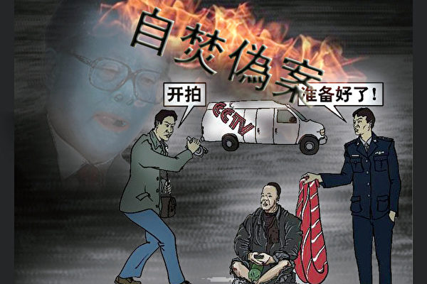

# 明慧期刊：“天安门自焚”真相

## 写在前面的话

法轮功明确指出：炼功人不能杀生，自杀有罪。

法轮修炼大法是由李洪志先生创编的佛家上乘修炼大法。在李洪志大师的著作《转法轮》中明确指出：“炼功人不能杀生”，李洪志先生还在 《悉尼法会讲法》中指出：“自杀是有罪的。” 真正的法轮功学员不会去自焚。

***

## “天安门自焚事件”回放

2001 年1 月23 日（除夕），在北京天安门广场，发生了震惊世界的自焚事件。

事发两个小时后，新华社以超乎寻常的速度向全世界发出英语新闻，声称：自焚者是五名来自开封市的法轮功学员。

但是，美国之音记者打电话向北京公安局和公安部查证，他们答复说不知道有此事发生。

随后，央视在全国反复播出自己制作的“自焚新闻节目”，矛头直指法轮功。一周之后，又抛出十二岁的小学生刘思影被焚烧后的悲惨镜头，煽起民众对法轮功的仇恨，在全国对法轮功掀起了文革式的“大批判”。

事实真相究竟如何？为什么新华社在事发两小时后，一反“层层请示、迟迟不报”的常态，以惊人速度报道了自焚事件，并一口咬定他们是法轮功学员？自焚者真的是法轮功学员吗？法轮功的书中明确写着“炼功人不能杀生”“自杀是有罪的”。那么，自焚者不是法轮功学员，这重重迷雾后究竟又是怎样一个“庐山真面目”？

***

## 自焚疑点重重剖析

在“自焚”事件发生一个星期之后，央视的“焦点访谈”播出了自焚专题节目，里面引用了很多自焚现场的录像。但是，通过对“焦点访谈”的自焚录像进行慢镜头播放和分析，发现了大量疑点。

- **被当场灭口的刘春玲**

  中共称：刘春玲是被烧死的。但央视录像表明：刘是在自焚现场被人用重物击打头部致死。

  （因中共封锁原因，图片或录像请下载[翻墙软件](../../fq/Software.md)访问[明慧网](http://package.minghui.org/mh/packages/zifen/)查看）

  通过慢镜头可以看见，刘春玲身上的火焰已基本熄灭，突然，有人用重物猛击她的头部。（见上页图1）刘随即倒地，一条状物快速弹起，飞出。（见上页图2）谁是出手之人？如果把镜头止住，可以看见挥动的手臂接近刘的头部，穿军衣的武警正走向镜头前，他身后，一名身穿大衣的男子正好站在出手投掷重物的方位，仍保持一秒钟前用力的姿势。（见上页图4）我们还可看到，刘倒地时，左手不自觉抬起来触摸被打击部位。（见上页图3）

  自焚事件发生不久，世界著名媒体“华盛顿邮报”记者菲力蒲•潘（Phillip Pan），亲自到刘春玲的家乡开封实地调查，邻居们说，从来没有人看见过刘春玲炼法轮功，而且刘春玲生前在夜总会靠陪吃陪舞谋生，还不时殴打老母和幼女。这与“打不还手，骂不还口”的法轮功学员相差甚远。

- **三个长相完全不同的王进东**

  在央视“焦点访谈”节目中，曾先后出现了三个王进东，他们的长相完全不同。究竟有几个“王进东”？谁是真的？谁是假的？

  王进东的坐姿是军人标准坐姿，手是双拇指重叠；而法轮功学员正确打坐盘腿动作是双盘，结印是拇指尖相对。 

  这个所谓的1996年开始修炼的“法轮功老学员”，却连最基本的法轮功炼功动作“双盘”“双手结印”都不会做！

- **采访不穿隔离衣**？

  根据医学常识，为防细菌感染，危及生命，大面积烧伤病人要住隔离病房，探视者需穿戴隔离衣帽、手套、鞋套。而“焦点访谈”记者李玉强直接穿便服近距离采访刘思影，分明是在演戏！

- **头发和塑料瓶子烧不坏**？

  央视录像中，被大火烧过的王进东，面部严重烧坏，腿上的棉衣烧烂，但他两腿间盛汽油的塑料雪碧瓶却翠绿如新，最易着火的头发也还完整。

- **气管切开4天能唱歌？**

  央视称，12岁的刘思影做了气管切开手术。手术切口在声带的下方，此时人通过插入切口的管子呼吸，气流不过声带，根本无法正常说话。但刘思影术后4天接受记者李玉强采访时，不仅说话底气十足，还对着麦克风唱歌！被海外医学界人士戏称中央电视台“创造了医学奇迹”。

- **喝汽油最多的人**？

  “焦点访谈”节目报道了一个自焚未遂者刘葆荣。刘自称在天安门广场喝了半瓶（大雪碧瓶）汽油。据医学资料，口服汽油每公斤体重7.5克即致人死亡。刘喝半瓶汽油竟没有一点中毒症状，显然是在骗人！

- **大量灭火器材从何而来**？

  天安门广场上没有灭火器材，也从没有见过背着灭火器巡逻的警察。“自焚”发生后，仅一分多钟的时间内，现场警察就拿出了十几个灭火器。按照天安门广场的横、纵向距离计算，根本不可能在这么短时间内取到灭火器；而且现场显示的两辆警车，平时也不可能装备大量灭火器材。如果不是事先知情，精心策划，警察怎么可能在一分多钟的时间内迅速拿出十几个灭火器及灭火毯？

- **近距离特写镜头是怎么拍的**？

   中共称：自焚录像是由安装在天安门广场的监视摄像机拍摄的。但央视录像却有大量近距离及特写镜头，这是监视摄像机做不到的。

  自焚火起不到2分钟就灭了，却在三个地点拍到了3组特写：王进东、刘春玲、刘思颖，显然是事先准备好才能做到的专业抢拍。

  面对国际社会质疑，中共谎称这些镜头是CNN拍摄的，但CNN发言人驳斥说，他们的记者在“自焚”案发前就被中共控制，摄像机被没收。

  从央视的自焚录像上，可清楚看到在广场军警中间，一个背摄影包的男子正在从容地现场拍摄。当外界指问此人是谁时，中共不敢回应。

- **警察等镜头**，**拎着灭火毯作秀**

  央视自焚录像中，自焚的王进东身后，一警察单手拎着灭火毯，晃来晃去等待拍摄，等王喊完口号后，才把灭火毯盖到王的头上：这明显是在演戏。

- **现场记者**：**自焚录像是造假**

  2002年初，记者李玉强（自焚案采访者）在河北省会法制教育培训中心（强迫法轮功学员放弃信仰的洗脑班）采访，被非法关押的法轮功学员追问自焚案的种种漏洞，李不得不承认：“王进东”腿间的雪碧瓶子是她们放进去“补拍”的。

---

## 各界看自焚造假

中共精心策划了“自焚”事件，但是真相被披露后，这一世纪伪案使中共的丑恶彻底曝光，成为它无法摆脱的梦魇。

---

### **英国外科医生谈“自焚”之造假**

我是外科医生，“天安门自焚”事件发生后，出于职业敏感，我特别分析了中央电视台“焦点访谈”播出的自焚过程和对伤者救治情况的全部镜头以及后续治疗过程的报道及图片。这里将几个明显的医疗救治疑点记录下来，供大家审视思考。

**疑点一、烈焰焚身应本能地奔跑以缓释巨热和剧痛，王进东却仍坐地轻松自如**

每一个被烫伤或烧伤过的人都了解那种痛苦，更何况烈焰焚身时的巨大痛苦。故自焚者在疼痛、窒息及热浪包围下多以奔跑来缓解痛苦。韩国学生以自焚抗议全斗焕政府的录像中，自焚者近乎癫狂地狂奔、尖叫直至倒地的表现才是正常的，绝非天安门自焚者所表现出来的轻松自如。

**疑点二、重烧伤病人极易感染，理应无菌隔离，记者不穿隔离衣，还近距离采访？**

医院对烧伤患者要严格隔离消毒，医务人员也应少进少出，减少感染机会。怎能允许记者不穿隔离衣、不戴口罩帽子、手拿话筒进行现场采访呢？而且大面积烧伤患者身上坏死组织的腐臭味是一般人难以忍受的，记者又怎能在病房里谈吐自如？

***

### **政法委科长：我们事先就知道**

2001年9月22日，辽宁省东港市政法委科长赵云龙，在非法关押法轮功学员并强制洗脑的“洗脑班”上说：“‘自焚’这件事我们事先就知道。这件事发生在2001年1月23日，也就是正常过年的除夕下午发生的事，我们在1月21日就接到公安部紧急通知，说1月23日法轮功在天安门广场有重大事件发生……”

***

### **中国民主党国内负责人透露**“**自焚**”**内幕**

中国民主党国内负责人林春水透露：公安部一高级官员曾经向他提供消息指出，王进东23日自焚，贾春旺22日就知道消息；在中央政法委的会议上，罗干曾经说：“即使我们王进东不自焚，也会有张进东、李进东等跳出来表演。”所以说，单单从自焚走漏消息这一点就能确定天安门自焚完全是中共一手导演的意欲栽赃法轮功的丑剧。

***

### **媒体人士：“自焚”之假戏真唱**

一位电视台的朋友说：“自焚一定是政府演的戏。记者上天安门都要事先申请采访内容，审批很严，我们扛摄像机上天安门要是没有许可证，当时就被轰走。这回自焚前后就一两分钟，拍了个正着，连采访话筒都是准备好的，一看就是导演好的。”

***

### **国际揭露骗局　中共丑行曝光**

国际教育发展组织(IED)在2001年8月3日声明，谴责中共当局对法轮功的迫害及人权侵犯，之后，同年8月14日在联合国倡导和保护人权附属委员会第53届会议第六项议程中再次发言，强烈谴责中共当局的“国家恐怖主义行为”。

IED的声明说：“中国政府企图以诬陷法轮功残害生命破坏家庭来为其国家恐怖行为辩护。我们的调查表明，真正残害生命的恰恰是中共当局。是中共当局对法轮功修炼者的虐杀而导致家庭破裂，伤害生命的不是法轮功，而是极端残暴的酷刑、精神病院里的摧残、劳改营的奴役及其他类似迫害。”

声明中说，“根据《国际先驱论坛报》2001年8月6日的报导，（中国）政府承认已经正式批准动用暴力以消灭法轮功。该政权拿出2001年1月23日发生在天安门的所谓自焚事件作为指控法轮功是“××”的证据，但是，我们得到了一份该事件的录像片，并从中得出结论，该事件是由这个政府一手导演的。我们备有这个录像片的拷贝，以供派发。”面对确凿证据，中国代表团哑口无言，没有辩辞。 该声明已被联合国备案。

***

## 翻炒自焚 再爆新丑

最近，中共在网上翻炒一篇没有署名的文章：《天安门自焚事件十周年　法轮功受害者称很后悔》。该文回避了自焚伪案所有的穿帮破绽，单单拿出了郝慧君、陈果母女自焚至今的惨状，想以此来继续欺骗世人，掩盖真相——结果却暴露了更多的真相。

### 披上羊皮的“中国关爱协会”

该文上来就打出“中国关爱协会”的旗号，如此慈善的招牌却不敢提及代表姓名，更为异常的是连记者都不敢留名，凸显招牌下不可告人的隐情。

上网一查，就能发现“中国关爱协会”是中共御用的官方组织“中国反邪教协会”的另一块招牌。该协会在中共政法委和专门迫害法轮功的“610办公室”指挥下成立，为批判法轮功、打击其他信仰团体而炒作谣言，大造舆论，干尽坏事，在国内外已声名狼藉。该协会多级分会的负责人都被列入“追查迫害法轮功国际组织”的追查名单。

2004年4月16日日内瓦国际人权会议上，该协会原秘书长、副理事长王渝生被7名律师以酷刑罪、群体灭绝罪、煽动仇恨罪进行谴责和起诉，提请检察院拘捕，王仓皇出逃，在联合国再未亮相。2010年7月，该协会副秘书长程宁宁一行三人，在美国新泽西国际会议上的发言当场穿帮出丑，被揭露其迫害法轮功的事实，美国会议主办方表示将不会再接受这类替中共迫害人民的“研究报告”。

### 揭露陈果等真相的王博一家，被判重刑

王博和陈果是中央音乐学院的同学。王博向海外媒体证实：她1999年认识陈果的时候，陈已经不看《转法轮》，也不认李洪志先生为师——她认为河南的刘云芳才是真正的“高人”，还邀请王博母女去河南听刘“讲法”。王博告诉她这样非常危险，希望她不要再听信刘的话，陈果根本不听。

王博的母亲刘淑芹也认识陈果。她也向海外媒体披露：陈果让王博带着母亲到河南听刘云芳“讲法”。刘淑芹不但通过王博制止陈，还在电话里劝陈，陈听不进去。以陈果母女的言行，当时在河南，大家早都不承认她们是炼功人了。

可见陈果已经背离了法轮功，而被刘云芳利用，才铸成千古遗恨的。

王博母女作为自焚伪案的关键证人，被中共下大力迫害，中共希望王博配合制造假新闻来蒙蔽世人。当王博母女向国际社会揭露真相后，中共恼羞成怒，重判王博和她父母分别5年、4年、4年徒刑，想以此封堵真相之口。

### 自焚策划者刘云芳，始终站在中共一边

在官方新闻稿中，陈果母亲郝慧君的一句话暴露了底细：“他（刘云芳)自己那时候自称他是师傅（李洪志），就是说，他前世好像是师傅。”    

了解法轮功的人都知道：凡是在法轮功中自称是师傅的，都不是炼法轮功的，是混进来祸乱的。这就暴露了刘打着法轮功旗号行骗的实质。

多篇报道中还提到：刘云芳制作他“梦到自己自焚圆满”的小传单在法轮功学员中宣扬。但是，响应的人很少，这就更暴露了刘云芳在打入法轮功内部搞破坏的面目——真正炼法轮功的人都识破了他，只有追随他这个“师傅”走的，背离了法轮功的人才会被他骗了。

自称师傅的刘云芳，极力诱惑追随者去天安门自焚圆满，但到了现场他却要开溜，事后刘解释说自己心性不到位，没他的追随者层次高，所以自己放弃了自焚的念头——多篇官媒这样报道，只有一篇编造说“刘云芳准备自焚被警察救下”，和央视采访自相矛盾。很明显，刘云芳在诱骗那些追随者为他的目的献身。这个目的是什么呢？我们再看：

官方报道：“自焚后，郝慧君与陈果还曾执著法轮功。已经与法轮功决裂的刘云芳赶紧给她们写了封信。在刘的规劝下二人悔悟。”

奇怪的是，在央视节目中，刘云芳又变成了一个坚定的法轮功学员，但却为中共说话，在中共大肆迫害法轮功，害死上千人的情况下，刘云芳说自己在监狱里充分享受人权，自由地信仰和练功！完全为中共涂脂抹粉。

在央视“焦点访谈”中，刘云芳先说自焚是为了圆满升天，一看就是违背法轮功、诬陷栽赃；第二年，刘在央视上把自焚动机改编为“证实法”，还是无法在法轮功中找到自焚的依据；第三年，刘又把自焚目的改为“说明真相”，完全紧跟中共诬陷攻击法轮功的步伐。

### 险恶的阴谋——中共诱导，蓄意栽赃

央视的自焚录像，公开了王进东自焚的镜头，多处造假被识破；公布的刘春玲自焚的录像，暴露了在视野内几步一个军警的严密防护下，一个便衣从容地现场摄像，另一个便衣猛击刘春玲头部后从容消失；却没有公布郝慧君、陈果母女，刘春玲、刘思颖母女经过十多分钟走向广场的录像——这是一定能被广场监控摄到的，但一定不能被公开，一旦公开，阴谋就彻底败露了。

官媒报道，他们四人是一同打车到天安门，而且一同进入广场。那天是除夕，上午人民大会堂开会，天安门广场被封，中午才开放。郝慧君还说：“果果就穿了两条单裤。另外，果果是在广场边的厕所里已经把油都浇好了，洇透了。”了解当时情况的人都知道，那时天安门广场是抓捕法轮功学员的地方，警力密布，便衣远多于游人，特别是除夕，几乎没有游人。从广场中心到达自焚地点的十多分钟，这四人同行足以引起便衣的注意（当时法轮功学员三人同行就会被以聚众罪名坐牢，普通人在广场一坐就会被当成法轮功学员要打坐），何况她们身上浸着汽油，味道极大，很容易被发现，她们进入广场中心坐好再开始自焚，中间没遇到任何障碍只能被解释为：层层便衣把他们放进来。

同时，警察们准备好了数个灭火器，杀人的便衣打手准备好凶器，摄像的便衣调整好摄影机，央视记者准备好采访抓拍的器材……所以才能在一分多钟的时间把录像上的编排演完。

中共从来不把百姓的性命当回事。中共建政后为挽回国际形象拼命外援，如果1962年以前的外援的1/3用在国内，大跃进大饥荒中，那4000多万人就不会被饿死。毛泽东对此却轻描淡写地说：“埋了做肥料算了。”至1976年结束的十年文革，中共为了内部争权造成703万人伤残，773万多人死亡，迫害波及6亿人。1989年，中共为镇压反腐败要民主的学生运动，派特务打死烧死军人制造暴乱证据，为机枪坦克镇压学生制造借口。2001年又设好圈套诱人自焚现场拍摄，再以拯救者的面目出现，为迫害法轮功制造借口。

中共60多年的“和平统治”下已造成8000多万人民非正常死亡，这建立在8000多万白骨上的邪恶政权，这宰割人民血肉的腐败集团，才是万恶之源。中共腐朽之极，天灭在即，如今翻炒自焚，沿袭镇压人民维护暴政的传统，只能是加速灭亡，为日后对中共的彻底清算再添血债。

## 善恶有报 如影随形

### 自焚伪案制片人的恶报

“谁给我饭吃，我就给谁卖命。”陈虻（天安门自焚伪案的制片人）这句高调的发言，没想到一语成谶，果然把47岁年轻的性命卖给了中共。

2001年，在美国加州伯克利大学“媒体与社会发展国际研讨会”上，作为“天安门自焚伪案的制片人”、央视“东方时空”的主管，陈虻在与会者谈论中共封存文革历史真相时，他声称“新闻在我看来并没有什么真实性”，同时还说了开头的豪言壮语。

陈虻曾发誓“如不出人头地，誓不为人”，进入央视后一直在寻找出头的机会。后来中共为迫害法轮功炮制借口，策划天安门自焚案栽赃法轮功，给央视下指令时，陈虻发现“机会来了”，他非常积极地主动请战，不惜出卖良知、陷害无辜来捞取政治资本。

2001年1月23日（除夕）下午，北京天安门广场发生了一起自焚案件。新华社在事发两小时后就向全世界发布了英语新闻，谎称他们是法轮功学员。随后陈虻制作的“焦点访谈”节目，极具迷惑和煽动性，令众多不了解事实真相的民众因此仇视法轮功。从此，陈虻开始飞黄腾达。

天网恢恢，疏而不漏。2001年8月14日，国际教育发展组织（IED）发表声明说：“我们得到一份自焚事件的录像分析却表明，整个事件是由政府一手导演的。” 作为参与造假的陈虻本人也被国际人权组织“追查迫害法轮功国际组织”追踪调查，从此不敢再踏进自由民主国家的土地。

2008年12月23日，正想升官往上爬的陈虻，在发现胃癌的9个月后，极其痛苦地死在北京肿瘤医院，死时47岁。

央视的同事们都很惊讶：陈虻身体不错，从不喝酒，怎么会得胃癌呢？让同事们惊讶的还有：陈虻“死后待遇”很高，不但在央视南院设有灵堂，其骨灰还挤进了中共高官坟地——八宝山，并且中共组织上千人参加他的追悼会，这是普通副处级干部无法奢望的，连中共两任总书记赵紫阳和解放军前副总参谋长兼海军政委李作鹏将军的骨灰都没获准进入八宝山。

给横遭恶报的陈虻以极高的荣誉，是中共对出卖灵魂者最大的鼓励。

---

### 原央视主持人罗京遭恶报

罗京，48岁，原央视新闻联播主持人。1989年6月4日中共用机枪坦克镇压学生民主运动后，罗京一改以前同情学生的立场，6月5日即以主播身份现身新闻联播，作为中共的喉舌来欺骗民众。1999年中共迫害法轮功，罗京声情并茂地传播中共的谎言，污蔑法轮功，欺骗、毒害了无数民众。

2008年罗京被查出患淋巴癌，移植骨髓后基本康复。但两个月后复发，并出现口腔溃疡等并发症，舌头溃烂，不能说话，连喝水都疼痛难忍。6月5日死于北京肿瘤医院。

## 天灭古罗马 历史在重演

公元一世纪，古罗马暴君尼禄故意纵火焚烧罗马城，嫁祸于基督徒。为了进一步煽起人民对基督徒的仇恨，一些官方学者把基督徒描绘为迷信、反社会、反人类，有政治野心。善良的基督徒被投入竞技场，被猛兽活生生地咬死……面对如此惨绝人寰的场面，被谎言蒙蔽了的人们却大声叫好！

然而，众多的基督徒在监禁、折磨和虐杀面前，选择了和平坚忍地维护信仰。他们的善良和仁爱，渐渐感化了越来越多的人。

后继的古罗马君主，延续强权暴政，继续镇压基督徒，终于招来了天谴。在300多年的镇压中，古罗马招来了四次大瘟疫，带走全国至少三分之一的人口，首都君士坦丁堡的人死了一半。旷世无敌的古罗马帝国，在天谴中走向没落，终被天灭。

历史正在重演，中共对法轮功的迫害，正在重复古罗马被天灭的教训，被中共谎言蒙蔽的人们，正被中共带向恶报的深渊。

## 奇石道破天机 中国共产党亡

 2002年6月，在贵州省平塘县掌布乡发现了一块巨型“藏字石”，石头断面上呈现着6个大字：中國共產党亡。经国家级地质专家考察证实：这块巨石有2.7亿年的历史，于500年前崩裂，上面的字是天然形成的，没有任何人工雕琢的痕迹。海内外一百多家报纸、电视台、网站转发了这个消息，国内媒体包括中央电视台也多次专题报道，但都统一措辞，隐去了最后一个“亡”字。“藏字石”的图片还被赫然印在贵州“藏字石”风景区的门票上。

冥冥之中自有天意。几千年来的中国，在要出大事之前，就一定有奇事发生，上天或以瑞兆示吉，或以凶相警世。今天，“藏字石”呈现“中國共產党亡”，是不是也在向人们预示着天机呢？回顾中共执政60多年以来的几十场政治运动，从土改、镇反、三反、五反、反右、大跃进、文革、六四到迫害法轮功，从普通百姓到国家主席，中国人有一半以上受到过中共的迫害。据不完全统计，有8000多万中国人在中共执政期间非正常死亡，这个数字是第一次世界大战死亡人数的8倍，是第二次世界大战死亡人数的1.5倍。再看当今中国社会：道德沦丧，工人失业，农民失地，贪官横行，官商勾结，警匪一家，百姓怨声载道。这样罪恶累累的中共，上天还能容它吗？由此看来，亿年古石如今突现“中國共產党亡”，绝非偶然：天真要灭中共了。

## 坚忍的历程 不朽的壮举

### 长春插播揭露自焚谎言

2002年3月5日，长春法轮功学员电视插播《是自焚？还是骗局？》的真相片之后，迫害法轮功的元凶江泽民团伙十分恐惧，密令“杀无赦”。参与插播的法轮功学员，至少有7人被警察在抓捕时打死，而刘成军、梁振兴在被非法重判十九年刑期的关押期间，在中共的残酷折磨中相继被杀害。

中共之所以对揭露“自焚骗局”的法轮功学员感到极度害怕，并疯狂实施残酷的报复，就是因为“自焚骗局”不是一个普通的谎言，它是当时的中共头目江泽民和政法委书记罗干等一帮死党为维持对法轮功的迫害而亲自策划，动用了公安和宣传势力，在光天化日之下的天安门广场，点燃的一把伪火。从动机的阴毒险恶，谎言散布的全球性规模，以及让过去的谎言制造者望尘莫及的以假乱真、声情并茂的多媒体宣传手段，还有造成的后果来看，“自焚骗局”可谓红朝的“世纪大谎言”。

对于这次成功插播事件，美国知名记者伊森•葛特曼在调查报告《进入细微的电波》中，有这样一段真实纪录：“法轮功的广播在八个频道播放了五十分钟，积聚了超过一百万的观众，随着消息的传开，观众越来越多，人们互相打电话，说他们会马上打开电视。在一些居民区，当地中共官员变得绝望，切断电源，使街道陷入黑暗。在其他居民区，比如在文化广场附近，人们走到街上庆祝。禁令结束了！法轮功平反了！几个修炼者从工厂和藏身之处走出来，公开发资料。邻居、孩子、陌生人，甚至戴着红袖标的老太太都接近他们，每个人都在说话，跑过去，笑着拍着他们，祝贺他们。”

中共设计了“自焚”伪案欺骗民众，然而渴望真相的人们却通过了解其中的真相而走出谎言。明白真相的人们良知在觉醒，这是中共最大的恐惧，是其当初意想不到的。可这却是天意的安排，是无可阻挡的大势所趋。

## 为生命选择未来

### 法轮功是什么

法轮功（又称法轮大法），是上乘的佛家修炼功法，以“真、善、忍”法理为指导，辅以简单优美的五套功法，可以使学炼者身心健康，道德回升。

1992年～1999年，法轮功传遍神州大地。“真、善、忍”法理使一亿修炼者身心净化、道德升华。1998年，国家体育总局组织北京、武汉、大连及广东省的医学界专家，对3万多名法轮功学员做了5次医学调查，表明法轮功祛病健身有效率高于98%，学员心理状况得到极大改善。同时，以乔石为首的老干部也做了详尽的调查，得出“法轮功于国于民有百利而无一害”的结论，并汇报中央。

1993年北京东方健康博览会授予法轮功最高奖“边缘科学进步奖”，李洪志先生获“受群众欢迎气功师”称号（如右图）；1997年12月《医药保健报》报道“祛病健身首选法轮功”；1998年《羊城晚报》以“老少皆炼法轮功”为题报道了广州5000人大型晨练。

### 法轮大法洪传世界

1995年3月，李洪志先生应邀到法国传功讲法，开始了法轮大法在海外的传播。法轮大法的主要书籍如今已被翻译成三十多种语言，各国各地政府纷纷以颁发褒奖、通过支持议案以及宣布“法轮大法月”、“法轮大法周”和“法轮大法日”等形式表示支持。至今已经获得各界褒奖1600多项，支持议案300多件，支持信函1100多封，彰显着法轮大法超越民族和时空的巨大威德与感召力。

（法轮大法洪传世界图片请下载[翻墙软件]()访问[明慧网]()查看））

2009年9月26日，亚太人权基金会将“杰出精神领袖奖”授予李洪志先生，并赞扬“真、善、忍”对净化人类的灵魂有着巨大的作用。

## 三退与未来

 2004年11月，奇书《九评共产党》横空出世。书中以无可辩驳的事实，揭露了“暴力起家、欺骗成性”的中共的累累罪恶。中共犯下滔天罪恶，因其本身就是邪灵附体，《共产党宣言》开篇就说：“一个幽灵，共产主义的幽灵，在欧洲游荡。”因为共产党是魔鬼幽灵，那么在加入其党、团、队时宣誓为其党奉献终身，就是把生命交给魔鬼幽灵，成为它的奴隶和工具。这样的誓言是一个卖身契，是一个毒誓，发毒誓时，就会被邪灵在右手和额头上打上印记。世界上这种从儿童开始，就举着右手被要求发毒誓“为某党奉献终身”的“宣誓仪式”唯共产党独有。而将来天灭中共之时，没有解除毒誓、抹去印记的人就会成为陪葬。

有人可能说“自己心中退党就算退了，不必声明”；还有人认为“自己多年没交党费了，就算自动退党了”；或者认为“年龄大了，已经自动退团退队了”。但这都不能抹掉加入党、团、队时举着右手宣誓而被打上的印记，无法“解除毒誓”。只有采取公开的方式退出，有行为的表示，才能解除这个“毒誓”。神看人心，只要真心声明“三退”（退党团队），用真名、笔名、小名、化名一样有效。至2011年8月，在海外大纪元网站上声明“三退”的人数已超过一亿人。

真心祝愿每一个善良的中国人，认清中共的邪恶本质，主动抛弃中共，真正拥有一个美好的未来！